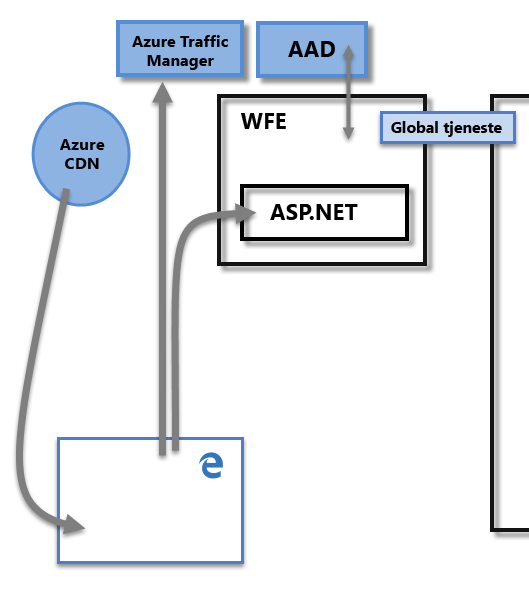
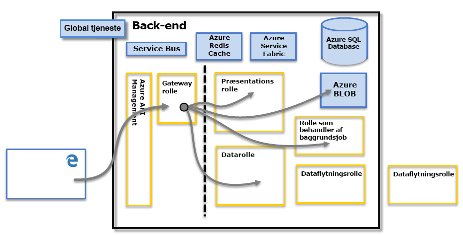

# Power BI-sikkerhed
Du kan finde en detaljeret beskrivelse af Power BI-sikkerhed ved at [downloade hvidbogen om Power BI-sikkerhed](http://go.microsoft.com/fwlink/?LinkId=829185):

Power BI-tjenesten er bygget på **Azure**, som er Microsofts Cloud Computing-infrastruktur og -platform. Power BI-tjenestens arkitektur er baseret på to klynger – Web Front End (**WFE**) og **Back-End**. WFE-klyngen administrerer den indledende forbindelse og godkendelse i forhold til Power BI-tjenesten, og når den er godkendt, håndterer Back-End alle efterfølgende brugerinteraktioner. Power BI bruger Azure Active Directory (AAD) til at gemme og administrere brugeridentiteter og administrerer lagring af data og metadata ved hjælp af henholdsvis Azure BLOB og Azure SQL Database.

## Power BI-arkitektur
Hver installation af Power BI består af to klynger – en Web Front End (**WFE**) og en **Back-End**.

**WFE**-klyngen administrerer den indledende forbindelses- og godkendelsesproces for Power BI ved hjælp af AAD for at godkende klienter og angive tokens for efterfølgende klientforbindelser til Power BI-tjenesten. Power BI bruger også **Azure Traffic Manager** (ATM) til at dirigere brugertrafik til det nærmeste datacenter, der bestemmes af DNS-posten for den klient, der forsøger at oprette forbindelse, for godkendelsesprocessen og til at downloade statisk indhold og filer. Power BI bruger **Azure Content Delivery Network** (CDN) til effektivt at distribuere det nødvendige statiske indhold og filerne til brugere baseret på geografisk placering.

**Back-End**-klyngen styrer, hvordan godkendte klienter interagerer med Power BI-tjenesten. **Back-End**-klyngen styrer visualiseringer, brugerdashboards, datasæt, rapporter, lagring af data, dataforbindelser, dataopdatering og andre aspekter, når du interagerer med Power BI-tjenesten. **Gatewayrollen** fungerer som en gateway mellem brugeranmodninger og Power BI-tjenesten. Brugere interagerer ikke direkte med nogen roller bortset fra **gatewayrollen**. **Azure API Management** vil til sidst håndtere **gatewayrollen**.

> [!IMPORTANT]
> Det er vigtigt at bemærke, at kun rollerne **Azure API Management** (APIM) og **Gateway** (GW) er tilgængelige via det offentlige internet. De leverer godkendelse, autorisation, DDoS-beskyttelse, begrænsning (throttling), justering af belastning, routing og andre funktioner.
> 
> 

## Datalagringssikkerhed
Power BI bruger to primære lagre til at gemme og administrere data: Data, der er uploadet fra brugere, sendes typisk til **Azure BLOB**-lageret, og alle metadata samt artefakter for selve systemet gemmes i **Azure SQL Database**.

Den stiplede linje i billedet herover af **Back-End**-klyngen viser grænsen mellem de to eneste komponenter, der er tilgængelige for brugere (til venstre for den stiplede linje), og roller, der kun kan tilgås af systemet. Når en godkendt bruger opretter forbindelse til Power BI-tjenesten, accepteres og administreres forbindelsen og anmodninger fra klienten af **gatewayrollen** (som til sidst skal håndteres af **Azure API Management**), som derefter interagerer på brugerens vegne med resten af Power BI-tjenesten. Når en klient f.eks. forsøger at få vist et dashboard, accepterer **gatewayrollen** den pågældende anmodning og sender derefter separat en anmodning til **præsentationsrollen** om at hente de data, der skal bruges af browseren til at gengive dashboardet.

## Brugergodkendelse
Power BI bruger Azure Active Directory ([AAD](http://azure.microsoft.com/services/active-directory/)) til at godkende brugere, der logger på Power BI-tjenesten, og bruger igen Power BI-logonoplysningerne, når en bruger forsøger at få adgang til ressourcer, som kræver godkendelse. Brugere logger på Power BI-tjenesten ved hjælp af den mailadresse, der blev brugt til at oprette deres Power BI-konto. Power BI bruger den pågældende logonmail som det *effektive brugernavn*, der videresendes til ressourcer, når en bruger forsøger at oprette forbindelse til data. Det *effektive brugernavn* knyttes derefter til en *brugers hovednavn* ([UPN](https://msdn.microsoft.com/library/windows/desktop/aa380525\(v=vs.85\).aspx)) og fortolkes til den tilknyttede Windows-domænekonto, som godkendelse gælder i forhold til.

For organisationer, der brugte arbejdsmails til at logge på Power BI (f.eks. <em>david@contoso.com</em>), er tilknytningen af det *effektive brugernavn* til UPN ligetil. For organisationer, der ikke brugte arbejdsmails til at logge på Power BI (f.eks. <em>david@contoso.onmicrosoft.com</em>), vil tilknytning mellem AAD og de lokale legitimationsoplysninger kræve [katalogsynkronisering](https://technet.microsoft.com/library/jj573653.aspx) for at fungere korrekt.

Platformssikkerhed i forbindelse med Power BI indeholder også miljøsikkerhed med flere lejere, netværkssikkerhed og mulighed for at tilføje ekstra sikkerhedsforanstaltninger baseret på AAD.

## Data- og tjenestesikkerhed
Besøg [Microsoft Trust Center](https://www.microsoft.com/trustcenter) for at få flere oplysninger.

Som beskrevet tidligere i denne artikel anvendes en brugers Power BI-logon af lokale Active Directory-servere til at blive tilknyttet et UPN for legitimationsoplysninger. Det er dog **vigtigt** at være opmærksom på, at brugerne er ansvarlige for de data, de deler: Hvis en bruger opretter forbindelse til datakilder ved hjælp af sine legitimationsoplysninger og derefter deler en rapport (eller dashboard eller datasæt) baseret på disse data, er brugere, som dashboardet deles med, ikke godkendt i forhold til den oprindelige datakilde og får tildelt adgang til rapporten.

En undtagelse er forbindelser til **SQL Server Analysis Services** ved hjælp af **datagatewayen i det lokale miljø**. Dashboards cachelagres i Power BI, men adgang til underliggende rapporter eller datasæt initierer godkendelse af den bruger, der forsøger at få adgang til rapporten (eller datasættet), og adgang tildeles kun, hvis brugeren har tilstrækkelige rettigheder til at få adgang til dataene. Du kan finde flere oplysninger i [Detaljerede oplysninger om datagateway i det lokale miljø](service-gateway-onprem-indepth.md).

