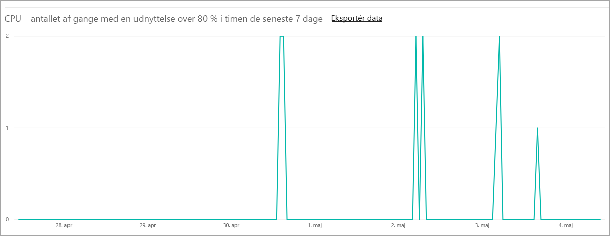
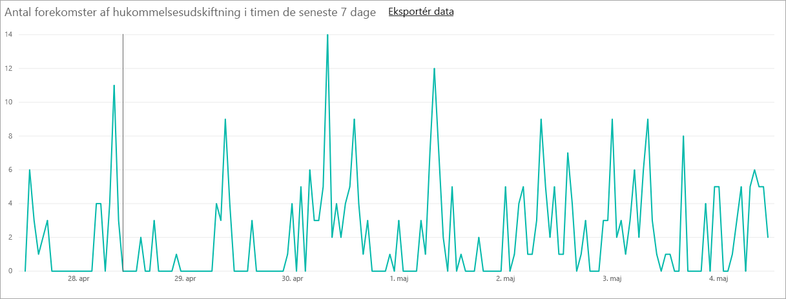
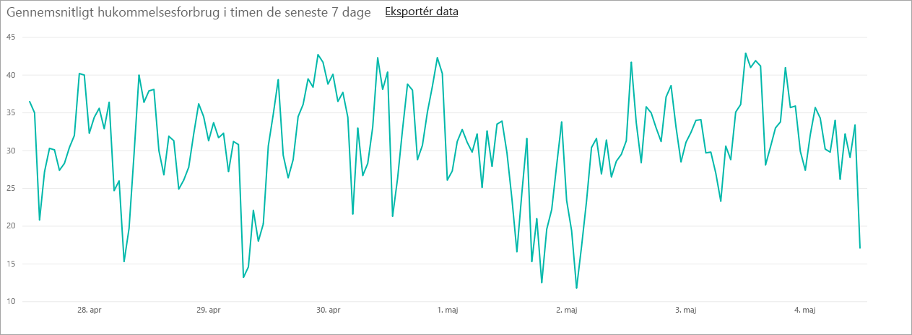

# Administrer kapaciteter i Power BI Premium og Power BI Embedded
Få mere at vide om, hvordan du kan administrere kapaciteter i Power BI Premium og Power BI Embedded, som indeholder dedikerede ressourcer til dit indhold.

Kapacitet er en grundlægende funktion i Power BI Premium og Power BI Embedded.

## Hvad er kapacitet?
Kapacitet er rækken af ressourcer, som er reserveret udelukkende til dit brug. Adgang til kapacitet giver dig mulighed for at publicere dashboards, rapporter og datasæt til brugere i hele organisationen uden at være nødt til at købe licenser til dem. Den garanterer også pålidelig, ensartet ydeevne for det indhold, der hostes i kapacitet.

Kapacitet er helt gennemskueligt for slutbrugere. De vil fortsat kunne bruge Power BI eller dit program på normal vis. De behøver ikke at være klar over, at noget (eller alt) indhold hostes af din dedikerede kapacitet. For brugerne fungerer alt helt som før.

[!INCLUDE [powerbi-premium-illustration](./includes/powerbi-premium-illustration.md)]

Du kan finde flere oplysninger i [Hvad er Power BI Premium?](service-premium.md).

## Køb kapacitet
Hvis du vil drage fordel af dedikeret kapacitet, skal du købe et abonnement på Power BI Premium i Office 365 Administration eller oprette en Power BI Embedded-ressource på Microsoft Azure-portalen. Du kan få flere oplysninger i nedenstående ressourcer:

* **Power BI Premium:** [Sådan køber du Power BI Premium](service-admin-premium-purchase.md)
* **Power BI Embedded:** [Opret Power BI Embedded-kapacitet på Azure Portal](https://docs.microsoft.com/en-us/azure/power-bi-embedded/create-capacity)

Når du køber Power BI Premium-varenumre, modtager din lejer det tilsvarende antal v-kerner til at køre kapaciteter. Køb af f.eks. Power BI Premium P3-varenumre giver lejeren adgang til 32 v-kerner.

> [!NOTE]
> Du har 30 dage med fuld adgang, når dit abonnement ophører, men herefter bliver dit indhold delt igen. Modeller, der er > 1 GB understøttes ikke af en almindelig delt licens.
>

## Kapacitetsadministratorer
> [!NOTE]
> Kapacitetsadministratorer (til Power BI Embedded-kapacitet) er defineret inden for Microsoft Azure-portalen.
>
>

Når du er tilknyttet en kapacitet som kapacitetsadministrator, så har du fuld kontrol over kapaciteten og dens administrative funktioner. Du kan tilføje flere kapacitetsadministratorer (kun Power BI Premium) eller give brugere rettigheder knyttet til kapacitetstildeling fra Power BI-administrationsportalen. Du kan massetildele arbejdsområder til en kapacitet og få vist forbrugsdata på en kapacitet.

Hver kapacitet har sine egne administratorer. Når en kapacitetsadministrator defineres til en kapacitet, så giver det ikke vedkommende adgang til alle kapaciteter i organisationen. Kapacitetsadministratorer har ikke adgang til alle områder af Power BI Administration som standard, som f.eks. forbrugsdata, overvågningslogger eller lejerindstillinger. Kapacitetsadministratorer har heller ikke tilladelse til at konfigurere nye kapaciteter eller ændre varenumrene for eksisterende kapaciteter. Kun globale administratorer eller Power BI-tjenesteadministratorer har adgang til disse elementer.

Alle Office 365 Globale administratorer og Power BI-administratorer er automatisk kapacitetsadministratorer af både Power BI Premium-kapacitet og Power BI Embedded-kapacitet.

## Administrering af kapacitet
Når du har købt kapacitetsnoder i Office 365, skal du derefter konfigurere en ny kapacitet. Dette gøres via [Power BI-administrationsportalen](service-admin-portal.md). I administrationsportalen kan du se afsnittet kaldet **Kapacitetsindstillinger**. Det er her, at du skal administrere Power BI Premium-kapaciteter for organisationen.

Hvis du vælger **Kapacitetsindstillinger**, så bliver du ført over til skærmbilledet kapacitetsadministration og standardplaceringen Power BI Premium.

### Konfiguration af en ny kapacitet (Power BI Premium)
Antallet af v-kerner afspejler det brugte antal og tilgængelige antal, der kan bruges til at oprette kapaciteter med. Mængden af tilgængelige v-kerner for organisationen er baseret på de Premium-varenumre, du har købt. Køb af en P3 og en P2 resulterer f.eks. i 48 tilgængelige kerner – 32 fra P3 og 16 fra P2.

Hvis du har tilgængelige v-kerner, skal du konfigurere en ny kapacitet på følgende måde.

1. Vælg **Konfigurer ny kapacitet**.
2. Giv din kapacitet et **navn**.
3. Definer, hvem kapacitetsadministratoren er for denne kapacitet.

    Kapacitetsadministratorer behøver ikke at være en Power BI-administrator eller en Office 365 Global administrator. Du kan finde flere oplysninger under [Power BI Premium-kapacitetsadministratorer](#capacity-admins)
4. Vælg kapacitetstørrelsen. Hvilke indstillinger, der er tilgængelige, afhænger af, hvor mange tilgængelige v-kerner du har. Du kan ikke vælge en indstilling, der er større end den, du har adgang til.

    
5. Vælg **Konfigurer**.

    

Kapacitetsadministratorer såvel som Power BI-administratorer og Office 365 Globale administratorer får derefter vist kapaciteten på oversigten i administratorportalen.

### Kapacitetsindstillinger
Du kan vælge **tandhjulsikonet (indstillinger)** under handlinger i skærmbilledet administration af Premium-kapacitet. Dette gør det muligt at omdøbe eller slette en kapacitet. Det angiver også, hvem tjenestens administratorer er, kapacitetens varenummer/størrelse og hvilken region, kapaciteten er i.

> [!NOTE]
> Power BI Embedded-kapacitetsindstillinger administreres i Microsoft Azure-portalen.
>
>

### Tilpas kapacitetsstørrelse (Power BI Premium)
Power BI-administratorer og Office 365 Globale administratorer tilpasser størrelsen af Power BI Premium-kapaciteten ved at vælge **Tilpas kapacitetsstørrelse**. Kapacitetsadministratorer, der ikke er Power BI-administrator eller Office 365 Global administrator, har ikke adgang til denne indstilling.

Skærmbilledet **Tilpas kapacitetsstørrelse** giver dig adgang til at opgradere eller nedgradere kapacitetsstørrelsen, hvis du har tilgængelige ressourcer. Administratorer kan frit oprette, tilpasse størrelsen af og slette noder, så længe de har de fornødne antal v-kerner.

P-varenumre kan ikke nedgraderes til EM-varenumre. Du kan placere markøren over deaktiverede indstillinger, som giver en forklaring.

### Kapacitetstildeling
Du kan administrere en kapacitet ved at vælge navnet på kapaciteten. Herfra bliver du ført hen til skærmbilledet med kapacitetsadministration.

Hvis der ikke er blevet tildelt nogen arbejdsområder til kapaciteten, så får du vist meddelelsen **Tildel arbejdsområder**.

#### Brugertilladelser
Du kan tildele yderligere **Kapacitetsadministratorer** til Power BI Premium-kapaciteter. Udover at tildele brugere med **kapacitetstildelingstilladelser**. Brugere, der har tildelingstilladelser, kan tildele et apparbejdsområde til kapaciteten, hvis de er administratorer af det pågældende arbejdsområde. De kan også tildele deres personlige *Mit arbejdsområde* til kapaciteten. Brugere med tildelingstilladelser har ikke adgang til administrationsportalen.

> [!NOTE]
> I forbindelse med Power BI Embedded-kapacitet tildeles kapacitetsadministratorer rettigheder inden for Microsoft Azure-portalen.
>
>

## Målinger af forbrug (Power BI Premium)
For hver kapacitet kan du se målinger af forbrug for CPU, hukommelse, hukommelsesudskiftning og direkte forespørgsel. Vi anbefaler, at disse tal overvåges for at sørge for, at brugerne oplever god ydeevne af kapaciteten:

> [!NOTE]
> Power BI Embedded-kapacitetsforbrug overvåges på Azure-portalen.

| Data | Beskrivelse |
| --- | --- |
| CPU |Det antal gange, CPU-forbruget har overskredet 80 %. |
| Hukommelsesudskiftning |Repræsenterer hukommelsesforbrug på backend-kerner. Disse data angiver specifikt, hvor mange gange datasæt ryddes fra hukommelsen pga. hukommelsesforbrug grundet brugen af flere datasæt. |
| Hukommelsesbrug |Gennemsnitligt hukommelsesforbrug vist i GB. |
| DQ/s | Det antal gange, antallet af direkte forespørgsler og direkte forbindelser har overskredet 80 % af grænsen.     * Vi begrænser det samlede antal forespørgsler i relation til DirectQuery og direkte forbindelse pr. sekund.  * Grænserne er 30/s for P1, 60/s for P2 og 120/s for P3.   * Forespørgsler i relation til DirectQuery og direkte forbindelse indgår også i de ovenstående begrænsninger. Hvis du f.eks. har 15 DirectQueries og 15 direkte forbindelser på et sekund, er grænsen nået.  * Dette gælder ligeligt for forbindelser i det lokale miljø og cloudbaserede forbindelser. |

Målepunkter afspejler udnyttelse i løbet af den seneste uge.  Hvis du vil se en mere detaljeret visning af målepunkter, kan du gøre det ved at klikke på et af oversigtsfelterne.  Derved åbnes detaljerede diagrammer over de enkelte målepunkter for din Premium-kapacitet.  Disse diagrammer opsummeres for hver time i løbet af den seneste uge og kan hjælpe med at identificere, hvornår du har haft særlige hændelser relateret til ydeevne i din Premium-kapacitet.  

Du kan også eksportere de underliggende data for et eller flere målepunkter til en CSV-fil.  Via denne eksport får du detaljerede oplysninger i tre minutters intervaller for hver dag fra den seneste uge.

## Tildel et arbejdsområde til en kapacitet
Et arbejdsområde kan tildeles en kapacitet på nogle få måder.

### Kapacitetsadministration i administrationsportalen
Udover Power BI-administratorer og Office 365 Globale administratorer kan kapacitetsadministratorer massetildele arbejdsområder inden for afsnittet med premium-kapacitetsadministration i administrationsportalen. Når du administrerer en kapacitet, får du vist et afsnit med **Arbejdsområder**, hvor du kan tildele arbejdsområder.

1. Vælg **Tildel arbejdsområder**. Dette er angivet flere steder, og udfører alle den samme opgave.
2. Vælg enten **Arbejdsområder til hele organisationen** eller **Specifikke arbejdsområder efter bruger**.

   | Markering | Beskrivelse |
   | --- | --- |
   | **Arbejdsområder til hele organisationen** |Hvis du tildeler Premium-kapacitet til arbejdsområder til hele organisationen, så tildeles alle apparbejdsområder og Mine arbejdsområder i organisationen den pågældende Premium-kapacitet. Desuden får alle aktuelle og fremtidige brugere tilladelse til at gentildele individuelle arbejdsområder til denne kapacitet. |
   | **Specifikke arbejdsområder efter bruger** |Når du tildeler arbejdsområder efter bruger eller gruppe, så tildeles alle arbejdsområder, der ejes af de pågældende brugere, Premium-kapacitet, herunder brugerens personlige arbejdsområde. Disse brugere får automatisk tilladelser til arbejdsområdetildeling. Dette omfatter arbejdsområder, der allerede er tildelt en anden kapacitet. |
3. Vælg **Anvend**.

Denne indstilling tillader ikke, at du tildeler en kapacitet til specifikke arbejdsområder.

### Indstillinger for apparbejdsområde
Du kan også tildele en Premium-kapacitet til et apparbejdsområde fra det pågældende arbejdsområdes indstillinger. Benyt følgende fremgangsmåde for at tildele et apparbejdsområde en premiumkapacitet.

For at flytte en kapacitet til et arbejdsområde skal du have administratortilladelser til det pågældende arbejdsområde og desuden have tilladelser til kapacitetstildeling for den pågældende kapacitet. Bemærk, at arbejdsområdeadministratorer altid kan fjerne et arbejdsområde fra Premium-kapacitet.

1. Rediger et apparbejdsområde ved at vælge **ellipsen (...)**  og vælge **Rediger arbejdsområde**.

    
2. I **Rediger arbejdsområde** skal du udvide **Avanceret**.
3. Hvis du har fået tildelt tilladelser til tildeling af en given kapacitet, så har du mulighed for at aktivere **Premium** for dette arbejdsområde.
4. Vælg den pågældende kapacitet, du vil tildele dette apparbejdsområde.

    
5. Vælg **Gem**.

Når du har gemt, flyttes arbejdsområdet og al dets indhold til Premium-kapacitet, uden at slutbrugerne oplever nogen tjenesteafbrydelser.

## Premium-brugergrænsefladen
I de fleste tilfælde bemærker brugere slet ikke, at de er i en Premium-kapacitet. Deres dashboards og rapporter fungerer uden problemer. Arbejdsområder, der er i Premium-kapacitet, markeres visuelt med en diamantikon ud for de pågældende arbejdsområder.

## Produktnøgle til Power BI-rapportserver
På fanen **Kapacitetsindstillinger** i Power BI-administratorportalen kan du tilgå Power BI Report Server-produktnøglen. Den kan kun tilgås af globale administratorer eller brugere tildelt Power BI-tjenesteadministratorrollen, og hvis man har erhvervet et Power BI Premium-varenummer.

Når du vælger **Power BI Report Server-nøgle** vises en dialogboks med din produktnøgle. Du kan kopiere den og bruge den med installationen.

Du kan finde flere oplysninger under [Installér Power BI-rapportserveren](report-server/install-report-server.md).

## Næste trin
Del publicerede apps med gratisbrugere, når du tildeler en Premium-kapacitet til arbejdsområdet. Du kan finde flere oplysninger under [Opret og distribuer en app i Power BI](service-create-distribute-apps.md).

Har du flere spørgsmål? [Prøv at spørge Power BI-community'et](http://community.powerbi.com/)
