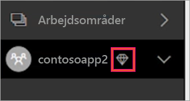
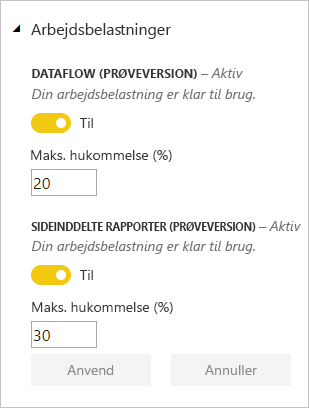

# Administrer kapaciteter i Power BI Premium og Power BI Embedded

Få mere at vide om, hvordan du administrerer Power BI Premium- og Power BI Embedded-kapaciteter, som leverer dedikerede ressourcer til dit indhold.

## Hvad er kapacitet?

*Kapacitet* er en grundlæggende funktion i Power BI Premium og Power BI Embedded. Kapacitet er en række ressourcer, som er reserveret udelukkende til din organisation. Adgang til dedikeret kapacitet giver dig mulighed for at publicere dashboards, rapporter og datasæt til brugere i hele organisationen uden at være nødt til at købe licenser til dem. Det garanterer også pålidelig, ensartet ydeevne for det indhold, der hostes i kapacitet. Du kan finde flere oplysninger i [Hvad er Power BI Premium?](service-premium.md).

### Kapacitetsadministratorer

Når du er tilknyttet en kapacitet som *kapacitetsadministrator*, har du fuld kontrol over kapaciteten og dens administrative funktioner. Du kan tilføje flere kapacitetsadministratorer eller give brugere rettigheder knyttet til kapacitetstildeling fra Power BI-administrationsportalen. Du kan massetildele arbejdsområder til en kapacitet og få vist forbrugsdata på en kapacitet.

> [!NOTE]
> Kapacitetsadministratorer til Power BI Embedded er defineret inden for Microsoft Azure-portalen.

Hver kapacitet har sine egne administratorer. Når en kapacitetsadministrator tildeles til en kapacitet, giver det ikke vedkommende adgang til alle kapaciteter i organisationen. Kapacitetsadministratorer har ikke adgang til alle områder af Power BI Administration som standard som f.eks. forbrugsdata, overvågningslogge eller lejerindstillinger. Kapacitetsadministratorer har heller ikke tilladelse til at konfigurere nye kapaciteter eller ændre varenumrene for eksisterende kapaciteter. Kun globale Office 365-administratorer eller Power BI-tjenesteadministratorer har adgang til disse elementer.

Alle globale Office 365-administratorer og Power BI-tjenesteadministratorer er automatisk kapacitetsadministratorer af både Power BI Premium-kapacitet og Power BI Embedded-kapacitet.

## Køb kapacitet

Hvis du vil drage fordel af dedikeret kapacitet, skal du købe Power BI Premium i Office 365 Administration eller oprette en Power BI Embedded-ressource i Microsoft Azure-portalen. Du kan få flere oplysninger i følgende artikler:

* **Power BI Premium:** [Sådan køber du Power BI Premium](service-admin-premium-purchase.md)

* **Power BI Embedded:** [Opret Power BI Embedded-kapacitet på Azure-portalen](https://docs.microsoft.com/azure/power-bi-embedded/create-capacity)

Når du køber Power BI Premium-varenumre eller Embedded-varenumre, modtager din lejer det tilsvarende antal v-kerner til at køre kapaciteter. Køb af f.eks. Power BI Premium P3-varenumre giver lejeren adgang til 32 v-kerner. Du kan få flere oplysninger om varenumre i [Premium-kapacitetsnoder](service-premium.md#premium-capacity-nodes).

## Premium-brugergrænsefladen

For det meste behøver brugerne ikke at få at vide, at de er i en Premium-kapacitet. Deres dashboards og rapporter fungerer uden problemer. Arbejdsområder, der er i Premium-kapacitet, markeres visuelt med et diamantikon ud for de pågældende arbejdsområder.

## Konfigurer arbejdsbelastninger

Som standard understøtter kapaciteter for Power BI Premium og Power BI Embedded kun den arbejdsbelastning, der er knyttet til Power BI-forespørgsler, som kører i cloudmiljøet. Vi tilbyder nu understøttelse af yderligere to arbejdsbelastninger: **Sideinddelte rapporter** og **Dataflow**. Du kan finde flere oplysninger under [Arbejdsbelastninger i Premium-kapacitet](service-premium.md#workloads-in-premium-capacity).

Hvis du vil aktivere arbejdsbelastninger på Power BI-administrationsportalen, skal du benytte følgende fremgangsmåde.

1. Vælg en kapacitet under **Kapacitetsindstillinger**.

1. Udvid **Arbejdsbelastninger** under **FLERE INDSTILLINGER**.

1. Aktivér en eller flere arbejdsbelastninger, og angiv en værdi for **Maks. hukommelse**.

    

1. Vælg **Anvend**.

## Overvåg kapacitetsforbrug

Power BI leverer en app til overvågning af kapacitetsbrug. Du kan finde flere oplysninger under [Overvåg Power BI Premium-kapaciteter i din organisation](service-admin-premium-monitor-capacity.md).

## Administrer kapacitet

Når du har købt kapacitetsnoder i Office 365, konfigurerer du kapaciteten i Power BI-administrationsportalen. Du kan administrere Power BI Premium-kapaciteter i afsnittet med **kapacitetsindstillinger** i portalen.

Du kan administrere en kapacitet ved at vælge navnet på kapaciteten. Herefter kommer du til skærmbilledet med kapacitetsadministration.

Hvis der ikke er blevet tildelt nogen arbejdsområder til kapaciteten, får du vist en meddelelse om [tildeling af et arbejdsområde til en kapacitet](#assign-a-workspace-to-a-capacity).

### Konfiguration af en ny kapacitet (Power BI Premium)

Administrationsportalen viser antallet af *virtuelle kerner* (v-kerner), som du har brugt, og som stadigvæk er tilgængelige. Det samlede antal virtuelle kerner er baseret på de Premium-varenumre, du har købt. Køb af en P3 og en P2 resulterer f.eks. i 48 tilgængelige kerner – 32 fra P3 og 16 fra P2.

Hvis du har tilgængelige v-kerner, skal du konfigurere en ny kapacitet på følgende måde.

1. Vælg **Konfigurer ny kapacitet**.

1. Giv din kapacitet et navn.

1. Definer, hvem administratoren er for denne kapacitet.

1. Vælg kapacitetstørrelsen. Hvilke indstillinger, der er tilgængelige, afhænger af, hvor mange tilgængelige v-kerner du har. Du kan ikke vælge en indstilling, der er større end den, du har adgang til.

    

1. Vælg **Konfigurer**.

    

Kapacitetsadministratorer såvel som Power BI-administratorer og globale Office 365-administratorer får derefter vist kapaciteten på oversigten i administratorportalen.

### Kapacitetsindstillinger

1. Vælg **tandhjulsikonet** under **Handlinger** på skærmbilledet til administration af Premium-kapaciteter for at gennemse og opdatere indstillinger. 

    

1. Du kan se, hvem tjenestens administratorer er, kapacitetens varenummer/størrelse, og hvilket område kapaciteten er i.

    

1. Du kan også omdøbe eller slette en kapacitet.

    

> [!NOTE]
> Power BI Embedded-kapacitetsindstillinger administreres i Microsoft Azure-portalen.

### Skift kapacitetsstørrelse

Power BI-administratorer og globale Office 365-administratorer kan ændre Power BI Premium-kapacitet. Kapacitetsadministratorer, der ikke er Power BI-administrator eller global Office 365-administrator, har ikke adgang til denne indstilling.

1. Vælg **Skift kapacitetsstørrelse**.

    

1. Opgrader eller nedgrader din kapacitet efter behov på skærmen **Skift kapacitetsstørrelse**.

    

    Administratorer kan frit oprette, tilpasse størrelsen af og slette noder, så længe de har de fornødne antal v-kerner.

    P-varenumre kan ikke nedgraderes til EM-varenumre. Du kan placere markøren over deaktiverede indstillinger for at få vist en forklaring.

### Administrer brugertilladelser

Du kan tildele yderligere kapacitetsadministratorer, og du kan tildele brugere, der har tilladelse til at *tildele kapacitet*. Brugere, der har tildelingstilladelser, kan tildele et apparbejdsområde til en kapacitet, hvis de er administratorer af det pågældende arbejdsområde. De kan også tildele deres personlige *Mit arbejdsområde* til kapaciteten. Brugere med tildelingstilladelser har ikke adgang til administrationsportalen.

> [!NOTE]
> Kapacitetsadministratorer til Power BI Embedded er defineret inden for Microsoft Azure-portalen.

Udvid **Brugere med tildelingstilladelser** under **Brugertilladelser**, og tilføj derefter brugere eller grupper efter behov.

## Tildel et arbejdsområde til en kapacitet

Der er to måder at tildele et arbejdsområde til en kapacitet på: i administrationsportalen og fra et apparbejdsområde.

### Tildel fra administrationsportalen

Ud over Power BI-administratorer og globale Office 365-administratorer kan kapacitetsadministratorer massetildele arbejdsområder inden for afsnittet med Premium-kapacitetsadministration i administrationsportalen. Når du administrerer en kapacitet, får du vist et afsnit med **arbejdsområder**, hvor du kan tildele arbejdsområder.

1. Vælg **Tildel arbejdsområder**. Denne indstilling er tilgængelig flere steder.

1. Vælg en indstilling for **Anvend for**.

    

   | Markering | Beskrivelse |
   | --- | --- |
   | **Arbejdsområder efter brugere** | Når du tildeler arbejdsområder efter bruger eller gruppe, så tildeles alle arbejdsområder, der ejes af de pågældende brugere, Premium-kapacitet, herunder brugerens personlige arbejdsområde. Disse brugere får automatisk tilladelser til arbejdsområdetildeling. Dette omfatter arbejdsområder, der allerede er tildelt en anden kapacitet. |
   | **Specifikke arbejdsområder** | Angiv navnet på et bestemt arbejdsområde, der skal tildeles til den valgte kapacitet. |
   | **Arbejdsområder til hele organisationen** | Hvis du tildeler Premium-kapacitet til arbejdsområder til hele organisationen, tildeles alle apparbejdsområder og Mine arbejdsområder i organisationen den pågældende Premium-kapacitet. Desuden får alle aktuelle og fremtidige brugere tilladelse til at gentildele individuelle arbejdsområder til denne kapacitet. |
   | | |

1. Vælg **Anvend**.

### Tildel fra indstillinger for apparbejdsområde

Du kan også tildele en Premium-kapacitet til et apparbejdsområde fra det pågældende arbejdsområdes indstillinger. Hvis du vil flytte en kapacitet til et arbejdsområde, skal du have administratortilladelser til det pågældende arbejdsområde og desuden have tilladelser til kapacitetstildeling for den pågældende kapacitet. Bemærk, at arbejdsområdeadministratorer altid kan fjerne et arbejdsområde fra Premium-kapacitet.

1. Rediger et apparbejdsområde ved at vælge **ellipsen (...)**  og vælge **Rediger arbejdsområde**.

    

1. Under **Rediger arbejdsområde** skal du udvide **Avanceret**.

1. Vælg den kapacitet, du vil tildele dette apparbejdsområde til.

    

1. Vælg **Gem**.

Når arbejdsområdet er gemt, flyttes det og al dets indhold til Premium-kapacitet, uden at slutbrugerne oplever nogen tjenesteafbrydelser.

## Produktnøgle til Power BI-rapportserver

På fanen **Kapacitetsindstillinger** i Power BI-administratorportalen kan du få adgang til produktnøglen til Power BI-rapportserver. Den kan kun tilgås af globale administratorer eller brugere tildelt Power BI-tjenesteadministratorrollen, og hvis man har erhvervet et Power BI Premium-varenummer.

Når du vælger **Power BI Report Server-nøgle** vises en dialogboks med din produktnøgle. Du kan kopiere den og bruge den med installationen.

Du kan finde flere oplysninger under [Installér Power BI-rapportserveren](report-server/install-report-server.md).

## Næste trin

Del publicerede apps med brugere. Du kan finde flere oplysninger under [Opret og distribuer en app i Power BI](service-create-distribute-apps.md).

Har du flere spørgsmål? [Prøv at spørge Power BI-community'et](http://community.powerbi.com/)
