# Konfigurer og administrer kapaciteter i Power BI Premium

Administration af Power BI Premium omfatter oprettelse, administration og overvågning af Premium-kapaciteter. Denne artikel indeholder en trinvis vejledning. Hvis du vil have en oversigt over kapaciteter, skal du se [Administration af Premium-kapaciteter](service-premium-capacity-manage.md).

Få mere at vide om, hvordan du administrerer Power BI Premium- og Power BI Embedded-kapaciteter, som leverer dedikerede ressourcer til dit indhold.

*Kapacitet* er en grundlæggende funktion i Power BI Premium og Power BI Embedded. Det er en række ressourcer, som er reserveret udelukkende til din organisation. Adgang til dedikeret kapacitet giver dig mulighed for at publicere dashboards, rapporter og datasæt til brugere i hele organisationen uden at være nødt til at købe licenser til dem. Det garanterer også pålidelig, ensartet ydeevne for det indhold, der hostes i kapacitet. Du kan finde flere oplysninger i [Hvad er Power BI Premium?](service-premium.md).

## Administrer kapacitet

Når du har købt kapacitetsnoder i Office 365, konfigurerer du kapaciteten i Power BI-administrationsportalen. Du kan administrere Power BI Premium-kapaciteter i afsnittet med **kapacitetsindstillinger** i portalen.

Du kan administrere en kapacitet ved at vælge navnet på kapaciteten. Herefter kommer du til skærmbilledet med kapacitetsadministration.

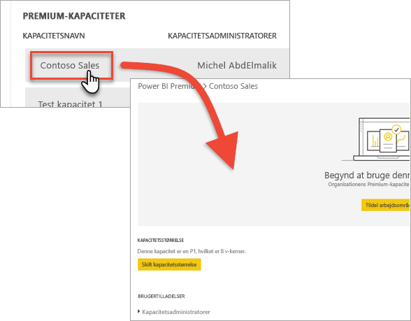

Hvis der ikke er blevet tildelt nogen arbejdsområder til kapaciteten, får du vist en meddelelse om [tildeling af et arbejdsområde til en kapacitet](#assign-a-workspace-to-a-capacity).

### Konfiguration af en ny kapacitet (Power BI Premium)

Administrationsportalen viser antallet af *virtuelle kerner* (v-kerner), som du har brugt, og som stadigvæk er tilgængelige. Det samlede antal virtuelle kerner er baseret på de Premium-varenumre, du har købt. Køb af en P3 og en P2 resulterer f.eks. i 48 tilgængelige kerner – 32 fra P3 og 16 fra P2.

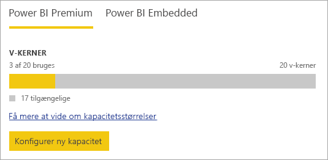

Hvis du har tilgængelige v-kerner, skal du konfigurere en ny kapacitet på følgende måde.

1. Vælg **Konfigurer ny kapacitet**.

1. Giv din kapacitet et navn.

1. Definer, hvem administratoren er for denne kapacitet.

1. Vælg kapacitetstørrelsen. Hvilke indstillinger, der er tilgængelige, afhænger af, hvor mange tilgængelige v-kerner du har. Du kan ikke vælge en indstilling, der er større end den, du har adgang til.

    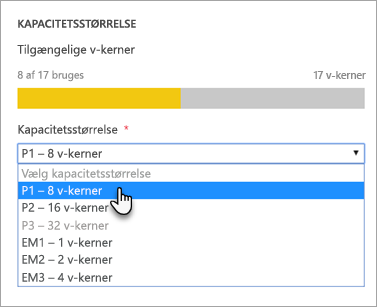

1. Vælg **Konfigurer**.

    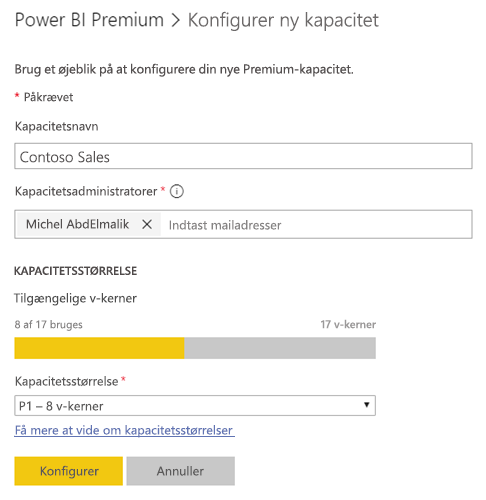

Kapacitetsadministratorer såvel som Power BI-administratorer og globale Office 365-administratorer får derefter vist kapaciteten på oversigten i administratorportalen.

### Kapacitetsindstillinger

1. Vælg **tandhjulsikonet** under **Handlinger** på skærmbilledet til administration af Premium-kapaciteter for at gennemse og opdatere indstillinger. 

    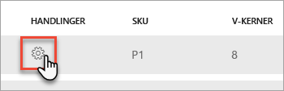

1. Du kan se, hvem tjenestens administratorer er, kapacitetens varenummer/størrelse, og hvilket område kapaciteten er i.

    

1. Du kan også omdøbe eller slette en kapacitet.

    

> [!NOTE]
> Power BI Embedded-kapacitetsindstillinger administreres i Microsoft Azure-portalen.

### Skift kapacitetsstørrelse

Power BI-administratorer og globale Office 365-administratorer kan ændre Power BI Premium-kapacitet. Kapacitetsadministratorer, der ikke er Power BI-administrator eller global Office 365-administrator, har ikke adgang til denne indstilling.

1. Vælg **Skift kapacitetsstørrelse**.

    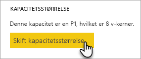

1. Opgrader eller nedgrader din kapacitet efter behov på skærmen **Skift kapacitetsstørrelse**.

    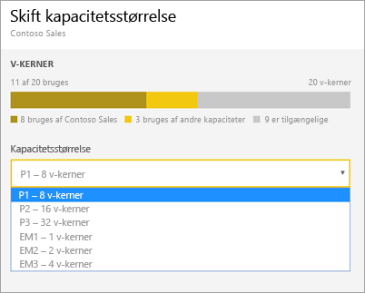

    Administratorer kan frit oprette, tilpasse størrelsen af og slette noder, så længe de har de fornødne antal v-kerner.

    P-varenumre kan ikke nedgraderes til EM-varenumre. Du kan placere markøren over deaktiverede indstillinger for at få vist en forklaring.

> [!IMPORTANT]
> Hvis der er et højt forbrug af ressourcer i din Power BI Premium-kapacitet, hvilket medfører problemer med ydeevne eller pålidelighed, kan du modtage notifikationer via mail for at identificere og løse problemet. Se [notifikationer om kapacitet og pålidelighed](service-interruption-notifications.md#capacity-and-reliability-notifications) for at få flere oplysninger.

### Administrer brugertilladelser

Du kan tildele yderligere kapacitetsadministratorer, og du kan tildele brugere, der har tilladelse til at *tildele kapacitet*. Brugere, der har tildelingstilladelser, kan tildele et arbejdsområde til en kapacitet, hvis de er administratorer af det pågældende arbejdsområde. De kan også tildele deres personlige *Mit arbejdsområde* til kapaciteten. Brugere med tildelingstilladelser har ikke adgang til administrationsportalen.

> [!NOTE]
> Kapacitetsadministratorer til Power BI Embedded er defineret inden for Microsoft Azure-portalen.

Udvid **Brugere med tildelingstilladelser** under **Brugertilladelser**, og tilføj derefter brugere eller grupper efter behov.

## Tildel et arbejdsområde til en kapacitet

Der er to måder at tildele et arbejdsområde til en kapacitet på: via administrationsportalen og fra et arbejdsområde.

### Tildel fra administrationsportalen

Ud over Power BI-administratorer og globale Office 365-administratorer kan kapacitetsadministratorer massetildele arbejdsområder inden for afsnittet med Premium-kapacitetsadministration i administrationsportalen. Når du administrerer en kapacitet, får du vist et afsnit med **arbejdsområder**, hvor du kan tildele arbejdsområder.

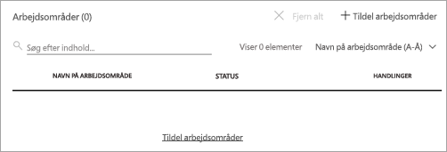

1. Vælg **Tildel arbejdsområder**. Denne indstilling er tilgængelig flere steder.

1. Vælg en indstilling for **Anvend for**.

    

   | Markering | Beskrivelse |
   | --- | --- |
   | **Arbejdsområder efter brugere** | Når du tildeler arbejdsområder efter bruger eller gruppe, så tildeles alle arbejdsområder, der ejes af de pågældende brugere, Premium-kapacitet, herunder brugerens personlige arbejdsområde. Disse brugere får automatisk tilladelser til arbejdsområdetildeling. Dette omfatter arbejdsområder, der allerede er tildelt en anden kapacitet. |
   | **Specifikke arbejdsområder** | Angiv navnet på et bestemt arbejdsområde, der skal tildeles til den valgte kapacitet. |
   | **Arbejdsområder til hele organisationen** | Hvis du tildeler Premium-kapacitet til alle organisationens arbejdsområder, tildeles alle arbejdsområder og Mine arbejdsområder i organisationen til den pågældende Premium-kapacitet. Desuden får alle aktuelle og fremtidige brugere tilladelse til at gentildele individuelle arbejdsområder til denne kapacitet. |
   | | |

1. Vælg **Anvend**.

### Tildel fra indstillinger for arbejdsområde

Du kan også tildele et arbejdsområde til en Premium-kapacitet fra det pågældende arbejdsområdes indstillinger. Hvis du vil flytte en kapacitet til et arbejdsområde, skal du have administratortilladelser til det pågældende arbejdsområde og desuden have tilladelser til kapacitetstildeling for den pågældende kapacitet. Bemærk, at arbejdsområdeadministratorer altid kan fjerne et arbejdsområde fra Premium-kapacitet.

1. Rediger et arbejdsområde ved at vælge **(...)**  og derefter vælge **Rediger arbejdsområde**.

    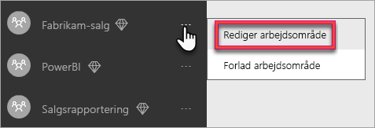

1. Under **Rediger arbejdsområde** skal du udvide **Avanceret**.

1. Vælg den kapacitet, du vil tildele dette arbejdsområde til.

    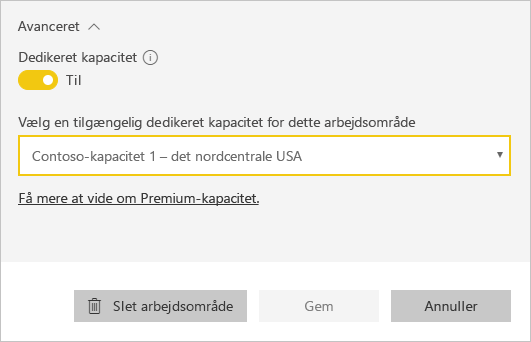

1. Vælg **Gem**.

Når arbejdsområdet er gemt, flyttes det og al dets indhold til Premium-kapacitet, uden at slutbrugerne oplever nogen tjenesteafbrydelser.

## Produktnøgle til Power BI-rapportserver

På fanen **Kapacitetsindstillinger** i Power BI-administratorportalen kan du få adgang til produktnøglen til Power BI-rapportserver. Den kan kun tilgås af globale administratorer eller brugere tildelt Power BI-tjenesteadministratorrollen, og hvis man har erhvervet et Power BI Premium-varenummer.

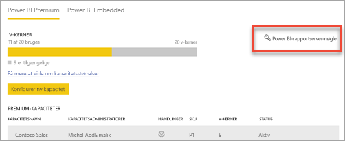

Når du vælger **Power BI Report Server-nøgle** vises en dialogboks med din produktnøgle. Du kan kopiere den og bruge den med installationen.

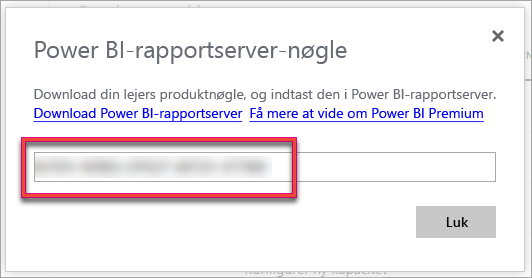

Du kan finde flere oplysninger under [Installér Power BI-rapportserveren](report-server/install-report-server.md).

## Næste trin

[Administration af Premium-kapaciteter](service-premium-capacity-manage.md)

Har du flere spørgsmål? [Prøv at spørge Power BI-community'et](https://community.powerbi.com/)
