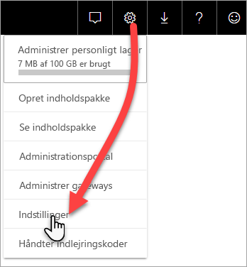
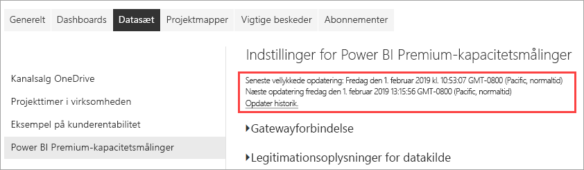

# Overvåg Premium-kapaciteter vha. programmet

Overvågning af dine kapaciteter er afgørende for at træffe beslutninger om den bedste måde, du kan udnytte dine ressourcer i Premium-kapaciteten på. Du kan overvåge kapacitet via administrationsportalen eller programmet **Power BI Premium Capacity Metrics**. Denne artikel indeholder en beskrivelse af brugen af programmet Premium Capacity Metrics. Programmet giver de mest detaljerede oplysninger om ydeevnen af dine kapaciteter. Hvis du vil have et overblik over målepunkter for den gennemsnitlige brug på et højere niveau for de seneste syv dage, skal du bruge administrationsportalen. Du kan finde flere oplysninger om overvågning på portalen under [Overvåg Premium-kapaciteter på administrationsportalen](service-admin-premium-monitor-portal.md).

Programmet opdateres jævnligt med nye funktioner og funktionalitet. Sørg for at køre den nyeste version.
**Den nyeste version af programmet er 1.10.1.1 (5. februar 2019)**.   
Hvis en tidligere version af programmet allerede er installeret, er det bedst at slette den fra dine programmer og derefter trykke på CTRL + F5 for at opdatere. 

## Installér programmet

Du kan gå direkte til [programmet Premium Capacity Metrics](https://app.powerbi.com/groups/me/getapps/services/capacitymetrics) eller installere det på samme måde som med andre programmer i Power BI.

1. I Power BI skal du klikke på **Programmer**.   
    

2. I højre side skal du klikke på **Hent programmer**.
3. I kategorien **Programmer** skal du søge efter **programmet Power BI Premium Capacity Metrics**.
4. Abonner for at installere programmet.

Vær tålmodig. Det tager nogle få minutter at installere og opdatere målepunkterne. Hvis der vises tomme målepunkter i programmet, kan du trykke på F5 for at opdatere din browser.

## Få historik over programopdateringer

Hvis du vil kontrollere, hvornår programmet Premium Capacity Metrics sidst blev opdateret, skal du klikke på **Indstillinger** > **Datasæt** > **Power BI Premium Capacity Metrics** > **Opdateringshistorik**. 

Den seneste opdatering vises. Ellers skal du klikke på **Opdateringshistorik** for at se planlagte opdateringer og opdateringer efter behov.

## Overvåg en kapacitet med programmet

Nu, hvor du har installeret programmet, kan du se målepunkter for kapaciteterne i din organisation. Lad os se nærmere på nogle af de vigtigste målepunkter, der er tilgængelige.

### Dashboardet for målepunkter

Når du åbner programmet, vises der først et dashboard med en oversigt over alle de kapaciteter, som du har administratorrettigheder til.

Dashboardet indeholder følgende målepunkter:

| **Rapportafsnit** | **Målepunkter** |
| --- | --- |
| **Systemoversigt** |  Programmets version   Antallet af kapaciteter, som du er administrator for   Antallet af arbejdsområder i dine kapaciteter, som rapporterer målepunkter   Det gennemsnitlige hukommelsesforbrug i GB inden for de seneste syv dage   Det maksimale hukommelsesforbrug i GB inden for de seneste syv dage   Lokalt tidspunkt, hvor der har været maksimal hukommelsesforbrug   Antallet af gange, hvor CPU'en overskred 80 % af tærsklen inden for de seneste syv dage, opdelt i buckets på tre minutter   De fleste gange, hvor CPU'en overskred 80 % inden for de seneste syv dage, opdelt i buckets på 1 time   Lokalt tidspunkt, hvor CPU'en overskred 80 % flest gange på én time |
| **Oversigt over datasæt** |  Det samlede antal datasæt på tværs af alle arbejdsområder i dine kapaciteter   Antallet af gange, hvor forbindelser via direkte forespørgsler/direkte forbindelser overskred 80 % af tærsklerne inden for de seneste syv dage, opdelt i buckets på tre minutter   De fleste gange, hvor forbindelser via direkte forespørgsler/direkte forbindelser overskred 80 % inden for de seneste syv dage, opdelt i buckets på én time   Lokalt tidspunkt, hvor direkte forespørgsler/direkte forbindelser overskred 80 % flest gange på én time   Det samlede antal opdateringer i løbet af de seneste syv dage   Den gennemsnitlige ventetid for opdateringer – den gennemsnitlige mellemliggende tid mellem det planlagte tidspunkt og opdateringen i minutter   Den gennemsnitlige varighed af opdateringer – den tid, det tager at fuldføre opdateringen, i minutter   Det samlede antal forespørgsler, der er kørt i løbet af de seneste syv dage   Den gennemsnitlige ventetid for forespørgsler – den tid, en forespørgsel har ventet på systemressourcer, før udførelsen startes, i millisekunder   Den gennemsnitlige varighed af forespørgsler – den tid, det tager at fuldføre forespørgslen, i millisekunder   Det samlede antal modeller, der fjernes på grund af for stort hukommelsesforbrug   Den gennemsnitlige størrelse af datasæt    Det gennemsnitlige antal datasæt, der indlæses i hukommelsen |
| **Oversigt over dataflow** |  Det samlede antal dataflow på tværs af alle arbejdsområder i dine kapaciteter   Det samlede antal opdateringer i løbet af de seneste syv dage   Den gennemsnitlige ventetid for opdateringer – den gennemsnitlige mellemliggende tid mellem det planlagte tidspunkt og opdateringen i minutter   Den gennemsnitlige varighed af opdateringer – den tid, det tager at fuldføre opdateringen, i minutter |
| **Oversigt over sideinddelt rapport** |  Det samlede antal sideinddelte rapporter på tværs af alle arbejdsområder i dine kapaciteter   Det samlede antal gange, som alle rapporter er blevet set af brugere   Det samlede antal rækker med data i alle rapporter   Den samlede tid, det tager for alle faser (datahentning, -behandling og -gengivelse) i alle rapporter, i millisekunder |
|  |  |

### Rapport over målepunkter

Klik på dashboardet for at gå til den underliggende rapport. Nederst i rapporten er der fem faner:

* [**Datasæt**](#datasets) – Giver detaljerede målepunkter for tilstanden af Power BI-datasættene i dine kapaciteter.

* [**Sideinddelte rapporter**](#paginated-reports) – Giver detaljerede målepunkter for tilstanden af sideinddelte rapporter i dine kapaciteter.

* [**Dataflow**](#dataflows) – Giver detaljerede målepunkter for opdatering af dataflow i dine kapaciteter.

* [**Ressourceforbrug**](#resource-consumption) – Giver overordnede målepunkter for kapacitet, herunder hukommelse og højt CPU-forbrug.

* [**Id'er og oplysninger**](#ids-and-info) – Indeholder navne, id'er og ejere for kapaciteter, arbejdsområder og arbejdsbelastninger.

På hver fane kan du filtrere målepunkter efter kapacitet og datointerval. Hvis der ikke er valgt nogen filtre, viser rapporten som standard målepunkter for den seneste uge for alle kapaciteter, der rapporterer målepunkter. 

#### Datasæt

Brug knapperne øverst på fanen **Datasæt** for at navigere til forskellige områder: **Opdateringer**, **Varighed af forespørgsler**, **Ventetid for forespørgsler** og **Datasæt**.

##### Området Opdateringer

Området **Opdateringer** indeholder følgende målepunkter.

| **Rapportafsnit** | **Målepunkter** |
| --- | --- |
| **Opdateringspålidelighed** |  Antal i alt: Det samlede antal opdateringer for hvert datasæt   Pålidelighed: Antal fuldførte opdateringer i procent for hvert datasæt   Gennemsnitlig ventetid: Den gennemsnitlige mellemliggende tid mellem det planlagte tidspunkt og starten af en opdatering for datasættet i minutter   Maksimal ventetid: Den maksimale ventetid for datasættet i minutter    Gennemsnitlig varighed: Den gennemsnitlige varighed af opdateringen af datasættet i minutter   Maksimal varighed: Varigheden af den længstvarende opdatering af datasættet i minutter |
| **Top 5-datasæt efter Gennemsnitlig opdateringsvarighed** |  De fem datasæt med den længstvarende gennemsnitlige opdateringsvarighed i minutter |
| **Top 5 datasæt efter Gennemsnitlig ventetid** |  De fem datasæt med den længstvarende gennemsnitlige opdateringsventetid i minutter |
| **Gennemsnitlige opdateringsventetider pr. time** |  Den gennemsnitlige opdateringsventetid opdelt i buckets på 1 time, rapporteret i lokaltid. Flere tilfælde af høje opdateringsventetider kan være tegn på, at kapaciteten snart er brugt op. |
| **Opdateringsantal og hukommelsesforbrug pr. time** |  Succeser, fejl og hukommelsesforbrug opdelt i buckets på 1 time, rapporteret i lokaltid |
|  |  |

##### Område for forespørgselsvarigheder

Området **Forespørgselsvarigheder** indeholder følgende målepunkter.

| **Rapportafsnit** | **Målepunkter** |
| --- | --- |
| **Forespørgselsvarigheder** |  Data i dette afsnit er opdelt i udsnit efter datasæt, arbejdsområde og buckets pr. time for de seneste syv dage   I alt: Det samlede antal forespørgsler, der er kørt for datasættet   Gennemsnit: Den gennemsnitlige varighed af forespørgsler for datasættet i millisekunder   Maksimum: Varigheden af den længstvarende forespørgsel i datasættet i millisekunder|
| **Distribution af forespørgselsvarighed** |  Histogrammet med forespørgselsvarighed er opdelt i buckets efter forespørgselsvarigheder (i millisekunder) i følgende kategorier: intervaller af < = 30 ms, 30-100 ms, 100-300 ms, 300 ms-1 sek., 1-3 sek., 3-10 sek., 10-30 sek. og > 30 sek. Lange forespørgselsvarigheder og lange ventetider betyder, at kapaciteten er overbelastet. Det kan også betyde, at et enkelt datasæt forårsager problemer, og at der er behov for yderligere undersøgelser. |
| **Top 5-datasæt efter Gennemsnitlig varighed** |  De fem datasæt med den længstvarende gennemsnitlige forespørgselsvarighed i millisekunder |
| **Direkte forespørgsel/liveforbindelser (> 80 % udnyttelse)** |  De gange, en direkte forespørgsel eller direkte forbindelse har overskredet CPU-udnyttelsen på 80 % opdelt i buckets på 1 time, rapporteret i lokaltid |
| **Distributioner af forespørgselsvarighed pr. time** |  Antallet af forespørgsler og gennemsnitlig varighed (i millisekunder) i forhold til hukommelsesforbrug i GB opdelt i buckets på 1 time, rapporteret i lokaltid |
|  |  |

##### Område for ventetider for forespørgsler

Området **Forespørgselsventetider** indeholder følgende målepunkter.

| **Rapportafsnit** | **Målepunkter** |
| --- | --- |
| **Forespørgselsventetider** |  Data i dette afsnit er opdelt i udsnit efter datasæt, arbejdsområde og buckets pr. time for de seneste syv dage   I alt: Det samlede antal forespørgsler, der er kørt for datasættet   Antal ventende: Antallet af forespørgsler i datasættet, der har ventet på systemressourcer, før udførelsen startes    Gennemsnit: Den gennemsnitlige ventetid for forespørgsler for datasættet i millisekunder   Maksimum: Varigheden af den længstventende forespørgsel i datasættet i millisekunder|
| **Distribution af ventetid** |  Histogrammet med forespørgselsvarighed er opdelt i buckets efter forespørgselsvarigheder (i millisekunder) i følgende kategorier: intervaller af <= 50 ms, 50-100 ms, 100-200 ms, 200-400 ms, 400 ms-1 sek., 1-5 sek. og > 5 sek. |
| **Top 5 datasæt efter Gennemsnitlig ventetid** |  De fem datasæt med den længstvarende gennemsnitlige ventetid inden udførelsen af en forespørgsel i millisekunder |
| **Antal forespørgselsventetider og tidspunkter pr. time** |  Antal forespørgsler og den gennemsnitlige ventetid (i millisekunder) i forhold til hukommelsesforbrug i GB, opdelt i buckets på 1 time, rapporteret i lokaltid |
|  |  |

##### Området Datasæt

Området **Datasæt** indeholder følgende målepunkter.

| **Rapportafsnit** | **Målepunkter** |
| --- | --- |
| **Antal datasætfjernelser** |  I alt: Det samlede antal *fjernelser* af datasættet for hver enkelt kapacitet. Når en kapacitet står over for øget hukommelsesforbrug, fjerner noden et eller flere datasæt fra hukommelsen. Datasæt, der er inaktive (uden forespørgsels-/opdateringshandlinger, der udføres i øjeblikket), ryddes først. Derefter er fjernelsesrækkefølgen baseret på en måling af 'mindst brugt for nylig'.|
| **Datasætfjernelser og hukommelsesforbrug pr. time** |  Datasætfjernelser i forhold til hukommelsesforbrug i GB opdelt i buckets på 1 time, rapporteret i lokaltid |
| **Antal indlæste datasæt pr. time** |  Antal datasæt, der er indlæst i hukommelsen i forhold til hukommelsesforbrug i GB opdelt i buckets på 1 time, rapporteret i lokaltid |
| **Procentdel af forbrugt hukommelse** |  Samlet antal aktive datasæt i hukommelsen som en procentdel af den samlede hukommelse. Delta mellem Aktiv og Alle definerer datasæt, der kan fjernes. Vises pr. time for de seneste syv dage. |
| **Datastørrelser**  |  Maksimumstørrelse: Den maksimale størrelse af datasættet i MB for den viste periode |
|  |  |

#### Sideinddelte rapporter

Fanen **Sideinddelte rapporter** viser detaljerede målepunkter for tilstanden for sideinddelte rapporter i dine kapaciteter.

| **Rapportafsnit** | **Målepunkter** |
| --- | --- |
| **Samlet forbrug** |  Visninger i alt: Antallet af gange, som rapporten er blevet set af brugere   Rækkeantal: Antallet af rækker med data i rapporten   Hentning (gns.): Den gennemsnitlige mængde tid, det tager at hente data til rapporten, i millisekunder. Lange varigheder kan være et tegn på langsomme forespørgsler eller andre datakildeproblemer.    Behandling (gns.): Den gennemsnitlige mængde tid, det tager at behandle dataene til rapporten, i millisekunder  Gengivelse (gns.): Den gennemsnitlige mængde tid, det tager at gengive en rapport i browseren, i millisekunder   Tid i alt: Den mængde tid, det tager for alle faserne i rapporten, i millisekunder|
| **Top 5-rapporter efter Gennemsnitlig datahentningstid** |  De fem rapporter med den længstvarende gennemsnitlige datahentningstid i millisekunder |
| **Top 5-rapporter efter Gennemsnitlig rapportbehandlingstid** |  De fem rapporter med den længstvarende gennemsnitlige rapportbehandlingstid i millisekunder |
| **Varigheder pr. time** |  Datahentning i forhold til behandlings- og gengivelsestid opdelt i buckets på 1 time, rapporteret i lokaltid |
| **Resultater pr. time** |  Succeser, fejl og hukommelsesforbrug opdelt i buckets på 1 time, rapporteret i lokaltid |
|  |  |

#### Dataflow

Fanen **Dataflow** viser detaljerede opdateringsmålepunkter for dataflow i dine kapaciteter.

| **Rapportafsnit** | **Målepunkter** |
| --- | --- |
| **Opdatering** |  I alt: Det samlede antal opdateringer for hvert dataflow   Pålidelighed: Antal fuldførte opdateringer i procent for hvert dataflow   Gennemsnitlig ventetid: Den gennemsnitlige mellemliggende tid mellem det planlagte tidspunkt og starten af en opdatering for dataflowet i minutter   Maksimal ventetid: Den maksimale ventetid for dataflowet i minutter    Gennemsnitlig varighed: Den gennemsnitlige varighed af opdateringen af dataflowet i minutter   Maksimal varighed: Varigheden af den længstvarende opdatering af dataflowet i minutter |
| **Top 5-dataflow efter Gennemsnitlig opdateringsvarighed** |  De fem dataflow med den længstvarende gennemsnitlige opdateringsvarighed i minutter |
| **Top 5-dataflow efter Gennemsnitlig ventetid** |  De fem dataflow med den længstvarende gennemsnitlige opdateringsventetid i minutter |
| **Gennemsnitlige opdateringsventetider pr. time** |  Den gennemsnitlige opdateringsventetid opdelt i buckets på 1 time, rapporteret i lokaltid. Flere tilfælde af høje opdateringsventetider kan være tegn på, at kapaciteten snart er brugt op. |
| **Opdateringsantal og hukommelsesforbrug pr. time** |  Succeser, fejl og hukommelsesforbrug opdelt i buckets på 1 time, rapporteret i lokaltid |
|  |  |

#### Ressourceforbrug

På fanen **Ressourceforbrug** kan du se CPU- og hukommelsesforbrug på tværs af alle kapaciteter og arbejdsbelastninger.

| **Rapportafsnit** | **Målepunkter** |
| --- | --- |
| **CPU-forbrug** |  Forbrug efter arbejdsbelastning som en procentdel af den samlede CPU-kapacitet. Vises pr. time for de seneste syv dage. |
| **Hukommelsesforbrug** |  Hukommelsesforbrug i GB efter arbejdsbelastning (hele linjer) overlejret af grænser for arbejdsbelastning (stiplede linjer). Vises pr. time for de seneste syv dage. |
|  |  |

#### Id'er og Oplysninger

Fanen **Id'er og oplysninger** indeholder navne, id'er og ejere for kapaciteter, arbejdsområder og arbejdsbelastninger.

## Overvåg Power BI Embedded-kapacitet

Du kan bruge programmet Power BI Premium Capacity Metrics til at overvåge *A SKU*-kapaciteter i Power BI Embedded. Disse kapaciteter vises i rapporten, hvis du er administrator af kapaciteten. Men opdatering af rapporten mislykkes, medmindre du tildeler visse tilladelser til Power BI på dine A SKU'er:

1. Åbn din kapacitet på Azure-portalen.

1. Klik på **Adgangskontrol (IAM)**, og føj programmet "Power BI Premium" til læserrollen. Hvis du ikke kan finde programmet ved hjælp af navnet, du kan også tilføje det ved hjælp af klient-id'et: cb4dc29f-0bf4-402a-8b30-7511498ed654.

    

> [!NOTE]
> Du kan overvåge Power BI Embedded-kapacitetsforbrug i programmet eller på Azure-portalen, men ikke på Power BI-administrationsportalen.

## Næste trin

> [!div class="nextstepaction"]
> [Administration og optimering af ressourcer med Power BI Premium-kapacitet](service-premium-understand-how-it-works.md)
