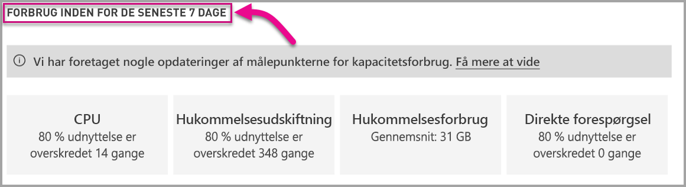

# Overvåg kapaciteter i Power BI Premium og Power BI Embedded

Denne artikel indeholder en oversigt over overvågning af målepunkter for dine Power BI Premium-kapaciteter. Ved at overvåge kapacitetsforbrug kan du træffe mere velovervejede beslutninger, når du administrerer dine kapaciteter.

Du kan overvåge kapacitet med Power BI Premium-appen Capacity Metrics eller i administrationsportalen. Vi anbefaler appen, fordi den giver mange flere detaljer, men i denne artikel beskrives begge muligheder.

## Installér Premium-appen Capacity Metrics

Du kan gå direkte til [Premium-appen Capacity Metrics](https://app.powerbi.com/groups/me/getapps/services/capacitymetrics) eller installere den, som du plejer med andre apps i Power BI.

1. I Power BI skal du klikke på **Apps**.

    

2. I højre side skal du klikke på **Hent apps**.

3. I kategorien **Apps** skal du søge efter **Power BI-appen Capacity Metrics**.

4. Abonner for at installere appen.

Nu, hvor du har installeret appen, kan du se målepunkter for kapaciteterne i din organisation. Lad os se nærmere på nogle af de vigtigste målepunkter, der er tilgængelige.

## Brug målepunktsappen

Når du åbner appen, viser den først et dashboard med en oversigt over alle de kapaciteter, som du har administratorrettigheder til.

### Filtrering

Under fanen **Filtre, der anvendes på alle sider** kan du vælge en kapacitet, et datasæt og/eller et datointerval inden for de seneste syv dage. Disse filtre anvender markeringen på alle relevante sider og dele i denne rapport. Hvis der ikke er markeret noget, viser rapporten som standard målepunkter for den seneste uge for hver kapacitet, du ejer.

### Fanen Oversigt

Under fanen **Oversigt** vises der et overblik over kapaciteten baseret på objekter, system og datasæt.

| **Område** | **Målepunkter** |
| --- | --- |
| **Objekter** | * Antallet af kapaciteter, som du ejer  * Det specifikke antal datasæt i din kapacitet  * Det specifikke antal arbejdsområder i din kapacitet |
| **System** | * Det gennemsnitlige hukommelsesforbrug i GB over de seneste syv dage  * Højeste hukommelsesforbrug i GB i løbet af de seneste syv dage og den lokale tid, forbruget opstod  * Det antal gange, CPU'en har overskredet 80 % af tærsklerne i løbet af de seneste syv dage opdelt i buckets på tre minutter  * De fleste gange, CPU'en har overskredet 80 % i løbet af de seneste syv dage opdelt i buckets på én time og den lokale tid, det opstod  * Det antal gange, forbindelser via direkte forespørgsler/direkte forbindelser har overskredet 80 % af tærsklerne i løbet af de seneste syv dage opdelt i buckets på tre minutter  * De fleste gange, forbindelser via direkte forespørgsler/direkte forbindelser har overskredet 80 % i løbet af de seneste syv dage opdelt i buckets på én time og den lokale tid, det opstod |
| **Arbejdsbelastninger for datasæt** | * Det samlede antal opdateringer i løbet af de seneste syv dage  * Det samlede antal vellykkede opdateringer i løbet af de seneste syv dage  * Det samlede antal mislykkede opdateringer i løbet af de seneste syv dage  * Det samlede antal mislykkede opdateringer, der skyldes manglende hukommelse  * Den gennemsnitlige varighed af opdateringer måles i minutter – den tid, det tager at udføre handlingen  * Den gennemsnitlige ventetid for opdateringer måles i minutter – den gennemsnitlige mellemliggende tid mellem det planlagte tidspunkt og starten af handlingen  * Det samlede antal forespørgsler, der er kørt i løbet af de seneste syv dage  * Det samlede antal vellykkede forespørgsler i løbet af de seneste syv dage  * Det samlede antal mislykkede forespørgsler i løbet af de seneste syv dage  * Den gennemsnitlige varighed af forespørgsler måles i minutter – den tid, det tager at udføre handlingen  * Det samlede antal modeller, der fjernes på grund af for stort hukommelsesforbrug |
|  |  |

### Fanen Opdateringer

Under fanen **Opdateringer** vises de fuldførte opdateringer, målinger af vellykkede opdateringer, den gennemsnitlige/maksimale ventetid for opdateringer og den gennemsnitlige/maksimale varighed af opdateringer opdelt efter datasæt i løbet af de seneste syv dage. I de to diagrammer nederst vises opdateringer i forhold til hukommelsesforbrug i GB og de gennemsnitlige ventetider opdelt i buckets på én time og rapporteret i lokaltid. I de øverste søjlediagrammer vises de fem øverste datasæt efter den samlede maksimale tid, det tog at fuldføre datasættet, der skulle opdateres (opdateringens varighed), og den maksimale ventetid for opdateringen. Hvis der er flere høje ventetider for opdateringer, kan det være tegn på, at kapaciteten snart er brugt op.

### Fanen Datasæt

Under fanen **Datasæt** vises fuldførte datasæt, der er fjernet på grund af stort hukommelsesforbrug pr. time.

### Fanen System

Under fanen **System** vises den høje CPU-udnyttelse (det antal gange, udnyttelsen på 80 % er overskredet), høj udnyttelse af forbindelser via direkte forespørgsler/dynamiske forbindelser og hukommelsesforbrug.

## Overvåg Power BI Embedded-kapacitet

Du kan også bruge Power BI Premium-appen Capacity Metrics til at overvåge *A SKU*-kapaciteter i Power BI Embedded. Disse kapaciteter vises i rapporten, hvis du er administrator af kapaciteten. Men opdatering af rapporten mislykkes, medmindre du tildeler visse tilladelser til Power BI på dine A SKU'er:

1. Åbn din kapacitet på Azure-portalen.
1. Klik på **Adgangskontrol (IAM)**, og føj appen "Power BI Premium" til læserrollen. Hvis du ikke kan finde appen ved hjælp af navnet, du kan også tilføje den ved hjælp af klient-id'et: cb4dc29f-0bf4-402a-8b30-7511498ed654.

    

> [!NOTE]
> Du kan overvåge Power BI Embedded-kapacitetsforbrug i appen eller på Azure-portalen, men ikke på Power BI-administrationsportalen.

## Grundlæggende overvågning på administrationsportalen

Området **Kapacitetsindstillinger** på administrationsportalen indeholder fire målere, der angiver de placerede belastninger og de ressourcer, der er brugt af din kapacitet i løbet af de seneste syv dage. Disse fire felter arbejder på timebasis og angiver, hvor mange timer i løbet af de seneste syv dage det tilknyttede målepunkt oversteg 80 %. Dette målepunkt angiver en potentiel forringelse af slutbrugerens oplevelse.

| **Målepunkt** | **Beskrivelse** |
| --- | --- |
| CPU |Det antal gange, CPU-forbruget har overskredet 80 %. |
| Hukommelsesudskiftning |Repræsenterer hukommelsesforbrug på backend-kerner. Disse data angiver specifikt, hvor mange gange datasæt ryddes fra hukommelsen pga. hukommelsesforbrug grundet brugen af flere datasæt. |
| Hukommelsesbrug |Gennemsnitligt hukommelsesforbrug vist i GB. |
| DQ/s | Det antal gange, antallet af direkte forespørgsler og direkte forbindelser har overskredet 80 % af grænsen.   * Vi begrænser det samlede antal forespørgsler i relation til DirectQuery og direkte forbindelse pr. sekund.* Grænserne er 30/s for P1, 60/s for P2 og 120/s for P3. * Forespørgsler i relation til DirectQuery og direkte forbindelse indgår også i de ovenstående begrænsninger. Hvis du f.eks. har 15 direkte forspørgsler og 15 direkte forbindelser på et sekund, er grænsen nået * Dette gælder ligeligt for forbindelser i det lokale miljø og cloudbaserede forbindelser. |
|  |  |

Målepunkter afspejler udnyttelse i løbet af den seneste uge.  Hvis du vil se en mere detaljeret visning af målepunkter, kan du gøre det ved at klikke på et af oversigtsfelterne.  Derved åbnes detaljerede diagrammer over de enkelte målepunkter for din Premium-kapacitet. I følgende diagram vises der oplysninger om CPU-målepunktet.

Disse diagrammer opsummeres for hver time i løbet af den seneste uge og kan hjælpe med at identificere, hvornår du har haft særlige hændelser relateret til ydeevne i din Premium-kapacitet.

Du kan også eksportere de underliggende data for et eller flere målepunkter til en CSV-fil.  Via denne eksport får du detaljerede oplysninger i tre minutters intervaller for hver dag fra den seneste uge.

## Næste trin

Nu, hvor du har en forståelse af, hvordan du overvåger Power BI Premium-kapaciteter, kan du få mere at vide om optimering af kapaciteter.

> [!div class="nextstepaction"]
> [Administration og optimering af ressourcer med Power BI Premium-kapacitet](service-premium-understand-how-it-works.md)
