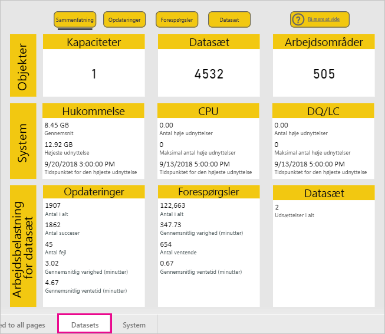
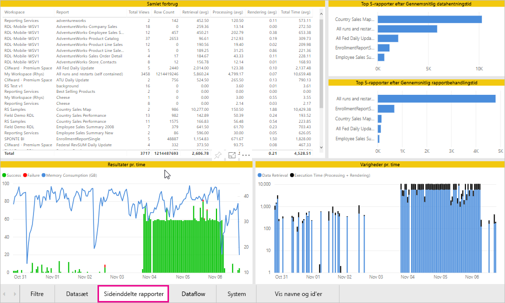
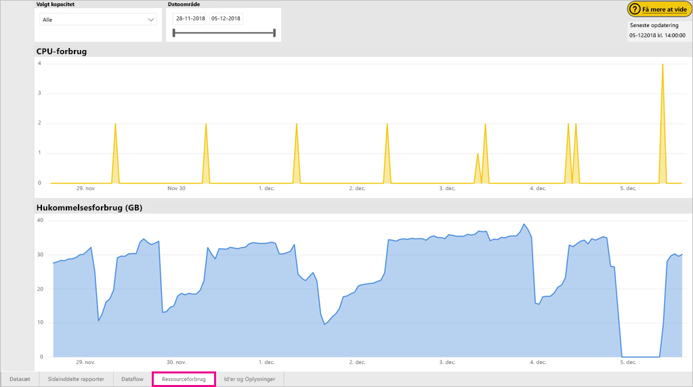
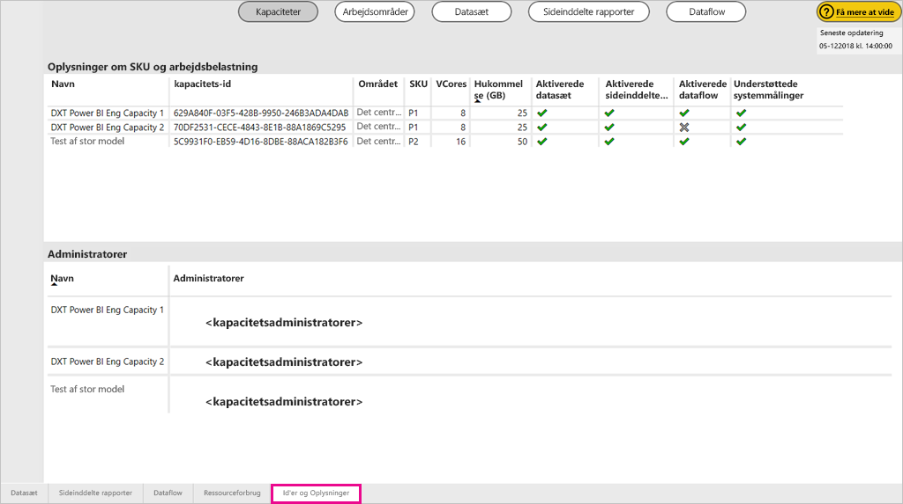

# Overvåg kapaciteter i Power BI Premium og Power BI Embedded

Denne artikel indeholder en oversigt over overvågning af målepunkter for dine Power BI Premium-kapaciteter. Ved at overvåge kapacitetsforbrug kan du træffe mere velovervejede beslutninger, når du administrerer dine kapaciteter.

Du kan overvåge kapacitet med Power BI Premium-appen Capacity Metrics eller i administrationsportalen. Vi anbefaler appen, fordi den giver mange flere detaljer, men i denne artikel beskrives begge muligheder.

**Den aktuelle version af appen er 1.10 (udgivet d. 13. december 2018).**

.

<iframe width="560" height="315" src="https://www.youtube.com/embed/UgsjMbhi_Bk?rel=0&amp;showinfo=0" frameborder="0" allowfullscreen></iframe>

## Installér Premium-appen Capacity Metrics

Du kan gå direkte til [Premium-appen Capacity Metrics](https://app.powerbi.com/groups/me/getapps/services/capacitymetrics) eller installere den, som du plejer med andre apps i Power BI.

1. I Power BI skal du klikke på **Apps**.

    

1. I højre side skal du klikke på **Hent apps**.

1. I kategorien **Apps** skal du søge efter **Power BI-appen Capacity Metrics**.

1. Abonner for at installere appen.

Nu, hvor du har installeret appen, kan du se målepunkter for kapaciteterne i din organisation. Lad os se nærmere på nogle af de vigtigste målepunkter, der er tilgængelige.

## Brug målepunktsappen

### Dashboardet for målepunkter

Når du åbner appen, viser den først et dashboard med en oversigt over alle de kapaciteter, som du har administratorrettigheder til.

Dashboardet indeholder følgende målepunkter.

| **Rapportafsnit** | **Målepunkter** |
| --- | --- |
| **Systemoversigt** | * Programmets version  * Antallet af kapaciteter, som du er administrator for  * Antallet af arbejdsområder i dine kapaciteter, som rapporterer målepunkter  * Det gennemsnitlige hukommelsesforbrug i GB inden for de seneste syv dage  * Det maksimale hukommelsesforbrug i GB inden for de seneste syv dage  * Lokalt tidspunkt, hvor der har været maksimal hukommelsesforbrug  * Antallet af gange, hvor CPU'en overskred 80 % af tærsklen inden for de seneste syv dage, opdelt i buckets på tre minutter  * De fleste gange, hvor CPU'en overskred 80 % inden for de seneste syv dage, opdelt i buckets på 1 time  * Lokalt tidspunkt, hvor CPU'en overskred 80 % flest gange på én time |
| **Oversigt over datasæt** | * Det samlede antal datasæt på tværs af alle arbejdsområder i dine kapaciteter  * Antallet af gange, hvor forbindelser via direkte forespørgsler/direkte forbindelser overskred 80 % af tærsklerne inden for de seneste syv dage, opdelt i buckets på tre minutter  * De fleste gange, hvor forbindelser via direkte forespørgsler/direkte forbindelser overskred 80 % inden for de seneste syv dage, opdelt i buckets på én time  * Lokalt tidspunkt, hvor direkte forespørgsler/direkte forbindelser overskred 80 % flest gange på én time  * Det samlede antal opdateringer i løbet af de seneste syv dage  * Den gennemsnitlige ventetid for opdateringer – den gennemsnitlige mellemliggende tid mellem det planlagte tidspunkt og opdateringen i minutter  * Den gennemsnitlige varighed af opdateringer – den tid, det tager at fuldføre opdateringen, i minutter  * Det samlede antal forespørgsler, der er kørt i løbet af de seneste syv dage  * Den gennemsnitlige ventetid for forespørgsler – den tid, en forespørgsel har ventet på systemressourcer, før udførelsen startes, i millisekunder  * Den gennemsnitlige varighed af forespørgsler – den tid, det tager at fuldføre forespørgslen, i millisekunder  * Det samlede antal modeller, der fjernes på grund af for stort hukommelsesforbrug  * Den gennemsnitlige størrelse af datasæt   * Det gennemsnitlige antal datasæt, der indlæses i hukommelsen |
| **Oversigt over dataflow** | * Det samlede antal dataflow på tværs af alle arbejdsområder i dine kapaciteter  * Det samlede antal opdateringer i løbet af de seneste syv dage  * Den gennemsnitlige ventetid for opdateringer – den gennemsnitlige mellemliggende tid mellem det planlagte tidspunkt og opdateringen i minutter  * Den gennemsnitlige varighed af opdateringer – den tid, det tager at fuldføre opdateringen, i minutter |
| **Oversigt over sideinddelt rapport** | * Det samlede antal sideinddelte rapporter på tværs af alle arbejdsområder i dine kapaciteter  * Det samlede antal gange, som alle rapporter er blevet set af brugere  * Det samlede antal rækker med data i alle rapporter  * Den samlede tid, det tager for alle faser (datahentning, -behandling og -gengivelse) i alle rapporter i millisekunder |
|  |  |

### Rapport over målepunkter

Klik på dashboardet for at gå til den underliggende rapport. Rapporten indeholder fem faner, der beskrives mere detaljeret i følgende afsnit.

* **Datasæt**: Giver detaljerede målepunkter for tilstanden for Power BI-datasættene i dine kapaciteter.

* **Sideinddelte rapporter**: Giver detaljerede målepunkter for tilstanden af sideinddelte rapporter i dine kapaciteter.

* **Dataflow**: Giver detaljerede opdateringsmålepunkter for dataflow i dine kapaciteter.

* **Ressourceforbrug**: Giver overordnede målepunkter for kapacitet, herunder hukommelse og højt CPU-forbrug.

* **Id'er og oplysninger**: Indeholder navne, id'er og ejere for kapaciteter, arbejdsområder og arbejdsbelastninger.

På hver fane kan du filtrere målepunkter efter kapacitet og datointerval. Hvis der ikke er valgt nogen filtre, viser rapporten som standard målepunkter for den seneste uge for alle kapaciteter, der rapporterer målepunkter.

#### Fanen Datasæt

Brug knapperne øverst på fanen **Datasæt** for at navigere til forskellige områder: **Oversigt**, **Opdateringer**, **Varighed af forespørgsel**, **Ventetid for forespørgsel** og **Datasæt**.

##### Området Opdateringer

Området **Opdateringer** indeholder følgende målepunkter.

| **Rapportafsnit** | **Målepunkter** |
| --- | --- |
| **Opdateringspålidelighed** | * Samlet antal: Det samlede antal opdateringer for hvert datasæt  * Pålidelighed: Den fuldførte opdateringsandel for hvert enkelt datasæt i procent  * Gennemsnitlig ventetid: Den gennemsnitlige mellemliggende tid mellem det planlagte tidspunkt og starten af en opdatering for datasættet i minutter  * Maksimal ventetid: Den maksimale ventetid for datasættet i minutter   * Gennemsnitlig varighed: Den gennemsnitlige varighed af opdateringen af datasættet i minutter  * Maksimal varighed: Varigheden af den længstvarende opdatering af datasættet i minutter |
| **Top 5-datasæt efter Gennemsnitlig opdateringsvarighed** | * De fem datasæt med den længstvarende gennemsnitlige opdateringsvarighed i minutter |
| **Top 5 datasæt efter Gennemsnitlig ventetid** | * De fem datasæt med den længstvarende gennemsnitlige opdateringsventetid i minutter |
| **Gennemsnitlige opdateringsventetider pr. time** | * Den gennemsnitlige opdateringsventetid opdelt i 1-times buckets, rapporteret i lokaltid. Flere tilfælde af høje opdateringsventetider kan være tegn på, at kapaciteten snart er brugt op. |
| **Opdateringsantal og hukommelsesforbrug pr. time** | * Succeser, fejl og hukommelsesforbrug opdelt i 1-times buckets, rapporteret i lokaltid |
|  |  |

##### Område for forespørgselsvarigheder

Området **Forespørgselsvarigheder** indeholder følgende målepunkter.

| **Rapportafsnit** | **Målepunkter** |
| --- | --- |
| **Forespørgselsvarigheder** | * Data i dette afsnit er opdelt i udsnit efter datasæt, arbejdsområde og buckets pr. time for de seneste syv dage  * I alt: Det samlede antal forespørgsler, der er kørt for datasættet  * Gennemsnit: Den gennemsnitlige varighed af forespørgsler for datasættet i millisekunder  * Maksimum: Varigheden af den længstvarende forespørgsel i datasættet i millisekunder|
| **Distribution af forespørgselsvarighed** | * Histogrammet med forespørgselsvarighed er inddelt i buckets efter forespørgselsvarigheder (i millisekunder) i følgende kategorier: intervaller af < = 30 ms, 30-100 ms, 100-300 ms, 300 ms-1 sek., 1-3 sek., 3-10 sek., 10-30 sek. og > 30 sek. Lange forespørgselsvarigheder og lange ventetider betyder, at kapaciteten er overbelastet. Det kan også betyde, at et enkelt datasæt forårsager problemer, og at der er behov for yderligere undersøgelser. |
| **Top 5-datasæt efter Gennemsnitlig varighed** | * De fem datasæt med den længstvarende gennemsnitlige forespørgselsvarighed i millisekunder |
| **Direkte forespørgsel/liveforbindelser (> 80 % udnyttelse)** | * De gange, en direkte forespørgsel eller liveforbindelse har overskredet CPU-udnyttelsen på 80 % opdelt i 1-times buckets, rapporteret i lokaltid |
| **Distributioner af forespørgselsvarighed pr. time** | * Antallet af forespørgsler og gennemsnitlig varighed (i millisekunder) vs. hukommelsesforbrug i GB opdelt i 1-times buckets, rapporteret i lokaltid |
|  |  |

##### Område for ventetider for forespørgsler

Området **Forespørgselsventetider** indeholder følgende målepunkter.

| **Rapportafsnit** | **Målepunkter** |
| --- | --- |
| **Forespørgselsventetider** | * Data i dette afsnit er opdelt i udsnit efter datasæt, arbejdsområde og buckets pr. time for de seneste syv dage  * I alt: Det samlede antal forespørgsler, der er kørt for datasættet  * Antal ventende: Antallet af forespørgsler i datasættet, der har ventet på systemressourcer, før udførelsen startes   * Gennemsnit: Den gennemsnitlige ventetid for forespørgsler for datasættet i millisekunder  * Maksimum: Varigheden af den længstventende forespørgsel i datasættet i millisekunder|
| **Distribution af ventetid** | * Histogrammet med forespørgselsvarighed er inddelt i buckets efter forespørgselsvarigheder (i millisekunder) i følgende kategorier: intervaller af <= 50 ms, 50-100 ms, 100-200 ms, 200-400 ms, 400 ms-1 sek., 1-5 sek. og > 5 sek. |
| **Top 5 datasæt efter Gennemsnitlig ventetid** | * De fem datasæt med den længste gennemsnitlige ventetid inden udførelsen af en forespørgsel i millisekunder |
| **Antal forespørgselsventetider og tidspunkter pr. time** | * Antal forespørgsler og den gennemsnitlige ventetid (i millisekunder) vs. hukommelsesforbrug i GB, opdelt i 1-times buckets, rapporteret i lokaltid |
|  |  |

##### Området Datasæt

Området **Datasæt** indeholder følgende målepunkter.

| **Rapportafsnit** | **Målepunkter** |
| --- | --- |
| **Antal datasætfjernelser** | * I alt: Det samlede antal *fjernelser* af datasættet for hver enkelt kapacitet. Når en kapacitet står over for øget hukommelsesforbrug, fjerner noden et eller flere datasæt fra hukommelsen. Datasæt, der er inaktive (uden forespørgsels-/opdateringshandlinger, der udføres i øjeblikket), ryddes først. Derefter er fjernelsesrækkefølgen baseret på en måling af 'mindst brugt for nylig'.|
| **Datasætfjernelser og hukommelsesforbrug pr. time** | * Datasætfjernelser i forhold til hukommelsesforbrug i GB opdelt i 1-times buckets, rapporteret i lokaltid |
| **Antal indlæste datasæt pr. time** | * Antal datasæt, der er indlæst i hukommelsen i forhold til hukommelsesforbrug i GB opdelt i 1-times buckets, rapporteret i lokaltid |
| **Datastørrelser**  | * Maksimumstørrelse: Den maksimale størrelse af datasættet i MB for den viste periode |
|  |  |

#### Fanen Sideinddelte rapporter

Fanen **Sideinddelte rapporter** viser detaljerede målepunkter for tilstanden for sideinddelte rapporter i dine kapaciteter.

Fanen **Sideinddelte rapporter** indeholder følgende målepunkter.

| **Rapportafsnit** | **Målepunkter** |
| --- | --- |
| **Samlet forbrug** | * Visninger i alt: Antallet af gange, som rapporten er blevet set af brugere  * Rækkeantal: Antallet af rækker med data i rapporten  * Hentning (gns.): Den gennemsnitlige mængde tid, det tager at hente data til rapporten, i millisekunder. Lange varigheder kan være et tegn på langsomme forespørgsler eller andre datakildeproblemer.   * Behandling (gns.): Den gennemsnitlige mængde tid, det tager at behandle dataene til rapporten, i millisekunder * Gengivelse (gns.): Den gennemsnitlige mængde tid, det tager at gengive en rapport i browseren, i millisekunder  * Tid i alt: Den mængde tid, det tager for alle faserne i rapporten, i millisekunder|
| **Top 5-rapporter efter Gennemsnitlig datahentningstid** | * De fem rapporter med den længste gennemsnitlige datahentningstid i millisekunder |
| **Top 5-rapporter efter Gennemsnitlig rapportbehandlingstid** | * De fem rapporter med den længste gennemsnitlige rapportbehandlingstid i millisekunder |
| **Varigheder pr. time** | * Datahentning i forhold til behandlings- og gengivelsestid opdelt i 1-times buckets, rapporteret i lokaltid |
| **Resultater pr. time** | * Succeser, fejl og hukommelsesforbrug opdelt i 1-times buckets, rapporteret i lokaltid |
|  |  |

#### Fanen Dataflow

Fanen **Dataflow** viser detaljerede opdateringsmålepunkter for dataflow i dine kapaciteter.

Fanen **Dataflow** indeholder følgende målepunkter.

| **Rapportafsnit** | **Målepunkter** |
| --- | --- |
| **Opdatering** | * I alt: Det samlede antal opdateringer for hvert dataflow  * Pålidelighed: Den fuldførte opdateringsandel for hvert enkelt dataflow i procent  * Gennemsnitlig ventetid: Den gennemsnitlige mellemliggende tid mellem det planlagte tidspunkt og starten af en opdatering for dataflowet i minutter  * Maksimal ventetid: Den maksimale ventetid for dataflowet i minutter   * Gennemsnitlig varighed: Den gennemsnitlige varighed af opdateringen af dataflowet i minutter  * Maksimal varighed: Varigheden af den længstvarende opdatering af dataflowet i minutter |
| **Top 5-dataflow efter Gennemsnitlig opdateringsvarighed** | * De fem dataflow med den længstvarende gennemsnitlige opdateringsvarighed i minutter |
| **Top 5-dataflow efter Gennemsnitlig ventetid** | * De fem dataflow med den længstvarende gennemsnitlige opdateringsventetid i minutter |
| **Gennemsnitlige opdateringsventetider pr. time** | * Den gennemsnitlige opdateringsventetid opdelt i 1-times buckets, rapporteret i lokaltid. Flere tilfælde af høje opdateringsventetider kan være tegn på, at kapaciteten snart er brugt op. |
| **Opdateringsantal og hukommelsesforbrug pr. time** | * Succeser, fejl og hukommelsesforbrug opdelt i 1-times buckets, rapporteret i lokaltid |
|  |  |

#### Fanen Ressourceforbrug

På fanen **Ressourceforbrug** kan du se CPU- og hukommelsesforbrug på tværs af alle kapaciteter og arbejdsbelastninger.

Fanen **Ressourceforbrug** indeholder følgende målepunkter.

| **Rapportafsnit** | **Målepunkter** |
| --- | --- |
| **CPU-forbrug** | * Det antal gange, CPU'en har overskredet 80 % af tærsklerne i løbet af de seneste syv dage opdelt i buckets på tre minutter |
| **Hukommelsesforbrug** | * Hukommelsesforbrug i de seneste syv dage opdelt i 3-minutters buckets |
|  |  |

#### Fanen Id'er og Oplysninger

Fanen **Id'er og oplysninger** indeholder navne, id'er og ejere for kapaciteter, arbejdsområder og arbejdsbelastninger.

## Overvåg Power BI Embedded-kapacitet

Du kan også bruge Power BI Premium-appen Capacity Metrics til at overvåge *A SKU*-kapaciteter i Power BI Embedded. Disse kapaciteter vises i rapporten, hvis du er administrator af kapaciteten. Men opdatering af rapporten mislykkes, medmindre du tildeler visse tilladelser til Power BI på dine A SKU'er:

1. Åbn din kapacitet på Azure-portalen.

1. Klik på **Adgangskontrol (IAM)**, og føj appen "Power BI Premium" til læserrollen. Hvis du ikke kan finde appen ved hjælp af navnet, du kan også tilføje den ved hjælp af klient-id'et: cb4dc29f-0bf4-402a-8b30-7511498ed654.

    

> [!NOTE]
> Du kan overvåge Power BI Embedded-kapacitetsforbrug i appen eller på Azure-portalen, men ikke på Power BI-administrationsportalen.

## Grundlæggende overvågning på administrationsportalen

Området **Kapacitetsindstillinger** på administrationsportalen indeholder fire målere, der angiver de placerede belastninger og de ressourcer, der er brugt af din kapacitet i løbet af de seneste syv dage. Disse fire felter arbejder på timebasis og angiver, hvor mange timer i løbet af de seneste syv dage det tilknyttede målepunkt oversteg 80 %. Dette målepunkt angiver en potentiel forringelse af slutbrugerens oplevelse.

| **Målepunkt** | **Beskrivelse** |
| --- | --- |
| CPU |Det antal gange, CPU-forbruget har overskredet 80 %. |
| Hukommelsesudskiftning |Repræsenterer hukommelsesforbrug på backend-kerner. Disse data angiver specifikt, hvor mange gange datasæt ryddes fra hukommelsen pga. hukommelsesforbrug grundet brugen af flere datasæt. |
| Hukommelsesforbrug |Gennemsnitligt hukommelsesforbrug vist i GB. |
| DQ/s | Det antal gange, antallet af direkte forespørgsler og direkte forbindelser har overskredet 80 % af grænsen.   * Vi begrænser det samlede antal forespørgsler i relation til DirectQuery og direkte forbindelse pr. sekund.* Grænserne er 30/s for P1, 60/s for P2 og 120/s for P3. * Forespørgsler i relation til DirectQuery og direkte forbindelse indgår også i de ovenstående begrænsninger. Hvis du f.eks. har 15 direkte forspørgsler og 15 direkte forbindelser på et sekund, er grænsen nået * Dette gælder ligeligt for forbindelser i det lokale miljø og cloudbaserede forbindelser. |
|  |  |

Målepunkter afspejler udnyttelse i løbet af den seneste uge.  Hvis du vil se en mere detaljeret visning af målepunkter, kan du gøre det ved at klikke på et af oversigtsfelterne.  Derved åbnes detaljerede diagrammer over de enkelte målepunkter for din Premium-kapacitet. I følgende diagram vises der oplysninger om CPU-målepunktet.

Disse diagrammer opsummeres for hver time i løbet af den seneste uge og kan hjælpe med at identificere, hvornår du har haft særlige hændelser relateret til ydeevne i din Premium-kapacitet.

Du kan også eksportere de underliggende data for et eller flere målepunkter til en CSV-fil.  Via denne eksport får du detaljerede oplysninger i tre minutters intervaller for hver dag fra den seneste uge.

## Næste trin

Nu, hvor du har en forståelse af, hvordan du overvåger Power BI Premium-kapaciteter, kan du få mere at vide om optimering af kapaciteter.

> [!div class="nextstepaction"]
> [Administration og optimering af ressourcer med Power BI Premium-kapacitet](service-premium-understand-how-it-works.md)
