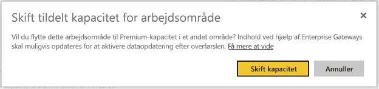

# Multi-Geo-understøttelse af Power BI Premium (prøveversion)

Multi-Geo er en Power BI Premium-funktion, som hjælper multinationale kunder med at opfylde regionale, industrispecifikke eller organisatoriske krav til dataopbevaring. Som en Power BI Premium-kunde kan du udrulle indhold til datacentre i andre områder end i Power BI-lejerens lokalområde. Et geografisk område (geografi) kan dække mere end ét område. F.eks. er USA et geografisk område, og det vestlige centrale USA og det sydlige centrale USA er områder i USA. Du kan vælge at udrulle indhold til en af de følgende geografiske områder:

- USA
- Canada
- Storbritannien
- Brasilien
- Europa
- Japan
- Indien
- Asien og Stillehavsområdet
- Australien

Multi-Geo fås ikke til Power BI Germany, Power BI China drevet af 21Vianet eller Power BI til myndigheder i USA.

Multi-Geo er nu også tilgængelig i Power BI Embedded. Læs mere på [Multi-Geo-understøttelse i Power BI Embedded (prøveversion)](developer/embedded-multi-geo.md).

## Sådan bruges Multi-Geo

Nye kapaciteter tilgås ved at aktivere Multi-Geo og vælge et andet område end standardområdet på rullelisten.  Hver tilgængelige kapacitet viser området, hvor den aktuelt er placeret, som f.eks. **det vestlige centrale USA**.

Når du har oprettet kapacitet, forbliver den i det pågældende område, og alle oprettede arbejdsområder får deres indhold lagret i dette område. Du kan overføre arbejdsområder fra ét område til et andet via rullelisten på indstillingsskærmen for arbejdsområde.

Du ser denne meddelelse, så du kan bekræfte ændringen.

Du behøver ikke at nulstille gateway-legitimationsoplysningerne under en overførsel på dette tidspunkt.  Når de er lagret i området Premium-kapacitet, skal du nulstille dem ved overførsel.

Under overførsel kan det være, at visse handlinger mislykkes, såsom udgivelse af nye datasæt eller planlagt opdatering af data.  

Følgende elementer er gemt i Premium-området, når Multi-Geo er aktiveret:

- Modeller (.ABF-filer) til import og Direct Query-datasæt
- Forespørgselscache
- R-billeder

Disse elementer forbliver i lejerens lokalområde:

- Push-datasæt
- Excel-projektmapper
- Dashboard/report metadata: e.g., feltnavne, feltforespørgsler
- Tjenestebusser til gateway-forespørgsler eller planlagt opdatering af jobs
- Tilladelser
- Datasæts legitimationsoplysninger

## Få vist kapacitetsområder

Du kan i Administrationsportalen få vist alle kapaciteterne for din Power BI-lejer og de områder, hvor de er placeret i øjeblikket.

 

## Skift område for eksisterende indhold

Hvis du vil ændre området for eksisterende indhold, så har du to valgmuligheder.

- Opret endnu en kapacitet, og flyt arbejdsområder. Gratisbrugere oplever ikke nogen nedetid, så længe lejeren har ledige v-kerner.
- Hvis oprettelse af endnu en kapacitet ikke er en mulighed, kan du midlertidigt flytte indhold tilbage til delt kapacitet for Premium. Du behøver ikke ekstra v-kerner, men gratisbrugere vil opleve noget nedetid.

## Flyt indhold ud af Multi-Geo  

Du kan fjerne arbejdsområder fra Multi-Geo-kapacitet på to måder:

- Slet den aktuelle kapacitet, hvor arbejdsområdet er placeret.  Derved flyttes arbejdsområdet tilbage til delt kapacitet i det lokale område.
- Overfør individuelle arbejdsområder tilbage til Premium-kapacitet, der er placeret i den lokale lejer.

## Begrænsninger og overvejelser

- Bekræft, at enhver bevægelse, du indleder mellem områder, opfylder alle erhvervs- og myndighedsbestemmelser før igangsætning af dataoverførslen.
- En cachelagret forespørgsel, der er gemt i et fjernområde, forbliver i dette område som inaktive data. Dog kan andre data under overførsel føres frem og tilbage mellem flere geografiske områder.
- Når du flytter data fra ét område til et andet i et Multi-Geo-miljø, kan kildedataene forblive i det område, hvorfra dataene blev flyttet, i op til 30 dage. I denne periode har slutbrugere ikke adgang til dem. De fjernes fra det pågældende område og destrueres i løbet perioden på 30 dage.
- Multi-Geo medfører ikke en forbedring af ydeevnen generelt set. Indlæsning af rapporter og dashboards omfatter stadig anmodninger til det lokale område for metadata.
- Funktionen [Dataflow](service-dataflows-overview.md) (i prøveversion) understøttes ikke på Multi-GEO i øjeblikket.

## Næste trin

- [Power BI Premium: Hvad er det?](service-premium.md)
- [Multi-Geo til Power BI Embedded-kapaciteter](developer/embedded-multi-geo.md)

Har du flere spørgsmål? [Prøv at spørge Power BI-community'et](http://community.powerbi.com/)
