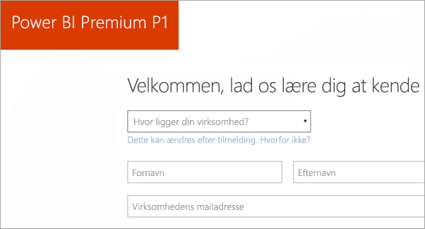
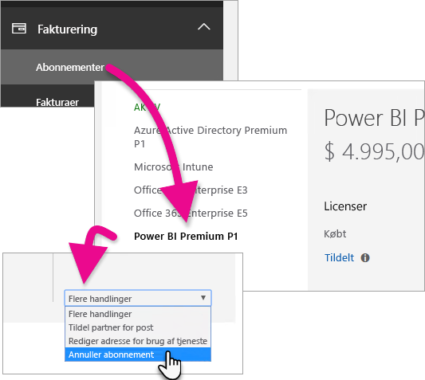
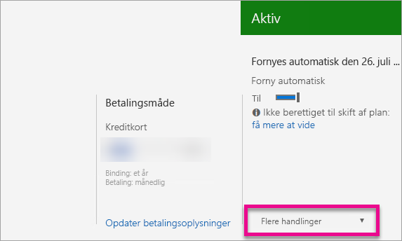

# Sådan køber du Power BI Premium

I denne artikel beskrives, hvordan du køber Power BI Premium-kapacitet til din organisation. Du kan købe Power BI Premium-kapacitet via Office 365 Administration, og du [administrerer dine kapaciteter](service-admin-premium-manage.md) på Power BI-administrationsportalen.

<iframe width="640" height="360" src="https://www.youtube.com/embed/NkvYs5Qp4iA?rel=0&amp;showinfo=0" frameborder="0" allowfullscreen></iframe>

Du kan finde flere oplysninger om Power BI Premium under [Hvad er Power BI Premium?](service-premium.md). Du kan finde aktuelle priser og oplysninger om planlægning på [siden Priser for Power BI](https://powerbi.microsoft.com/pricing/) og under [Power BI Premium-beregner](https://powerbi.microsoft.com/calculator/).

> [!IMPORTANT]
> Forfattere af indhold skal stadig have en Power BI Pro-licens, også selvom organisationen bruger Power BI Premium. Sørg for at købe mindst én Power BI Pro-licens til din organisation.
>
>Hvis et Premium-abonnement udløber, har du 30 dages fuld adgang til din kapacitet. Derefter vil dit indhold igen blive en delt kapacitet. Modeller, der er > 1 GB, understøttes ikke i delt kapacitet.

## Opret en ny lejer med Power BI Premium P1

Hvis du ikke har en eksisterende lejer og vil oprette en, kan du købe Power BI Premium samtidigt. Følgende link fører dig gennem processen med at oprette en ny lejer og giver dig mulighed for at købe Power BI Premium: [tilbud om Power BI Premium P1](https://signup.microsoft.com/Signup?OfferId=b3ec5615-cc11-48de-967d-8d79f7cb0af1).

Når du opretter din lejer, får du automatisk tildelt rollen Global administrator for Office 365 for den pågældende lejer.

## Køb Power BI Premium-kapacitet til en eksisterende organisation

Hvis der allerede er registreret en organisation, skal du have rollen Global administrator eller Faktureringsadministrator for Office 365 for at købe abonnementer og licenser. Du kan finde flere oplysninger i [Om Office 365-administratorroller](https://support.office.com/article/About-Office-365-admin-roles-da585eea-f576-4f55-a1e0-87090b6aaa9d).

Følg disse trin for at købe Premium-kapacitet.

1. Vælg Office 365-appvælgeren i Power BI-tjenesten, og vælg derefter **Administrator**.

    

    Du kan også navigere til Office 365 Administration. Du kan komme dertil ved at gå til https://portal.office.com og vælge **Administrator**.

1. Vælg **Fakturering** > **Køb tjenester**.

1. Se efter Power BI Premium-tilbud under **Andre planer**. Det vises som P1 til P3, EM3 og P1 (for hver måned).

1. Hold over ellipsen (**...**), og vælg derefter **Køb nu**.

    

1. Følg trinnene for at gennemføre købet.

Du kan også vælge et af følgende links for at gå direkte til siden for køb af den pågældende SKU. Du kan finde flere oplysninger om disse SKU'er under [Hvad er Power BI Premium?](service-premium.md#premiumskus)

> [!IMPORTANT]
> Hvis du ikke har rollen Global administrator eller Faktureringsadministrator i Office 365, vil du opleve en fejl, når du klikker på et af linkene.

| Direkte links til køb |
| --- |
| [EM3 (for hver måned) SKU](https://portal.office.com/commerce/completeorder.aspx?OfferId=4004702D-749C-4F74-BF47-3048F1833780&adminportal=1) |
| [P1 SKU](https://portal.office.com/commerce/completeorder.aspx?OfferId=b3ec5615-cc11-48de-967d-8d79f7cb0af1&adminportal=1) |
| [P1 (for hver måned) SKU](https://portal.office.com/commerce/completeorder.aspx?OfferId=E4C8EDD3-74A1-4D42-A738-C647972FBE81&adminportal=1) |
| [P2 SKU](https://portal.office.com/commerce/completeorder.aspx?OfferId=062F2AA7-B4BC-4B0E-980F-2072102D8605&adminportal=1) |
| [P3 SKU](https://portal.office.com/commerce/completeorder.aspx?OfferId=40c7d673-375c-42a1-84ca-f993a524fed0&adminportal=1) |

Når du har gennemført købet, kan du på siden **Køb tjenester** se, at elementet er købt og aktivt.

## Køb ekstra kapacitet

Nu, hvor du har en kapacitet, kan du tilføje mere, i takt med at dit behov vokser. Du kan også bruge en hvilken som helst kombination af SKU'er for Premium-kapacitet (P1 til P3) i din organisation. De forskellige SKU'er giver forskellige ressourcemuligheder.

1. I Office 365 Administration skal du vælge **Fakturering** > **Køb tjenester**.

1. Find det Power BI Premium-element, du vil købe flere af, under **Andre planer**.

1. Peg på **ellipsen (...)** , og vælg derefter **Rediger licensantal**.

    

1. Ret det antal forekomster, du vil have til dette element. Vælg derefter **Send**, når du er færdig.

   > [!IMPORTANT]
   > Hvis du vælger **Send**, opkræves det registrerede kreditkort.

Siden **Køb tjenester** angiver derefter det antal forekomster, som du har. I Power BI-administrationsportalen under **Kapacitetsindstillinger**, afspejler de tilgængelige v-kerner den nye kapacitet, der er købt.

## Opsig dit abonnement

Du kan opsige dit abonnementet fra Office 365 Administration. Gør følgende for at opsige dit Premium-abonnement.

1. Naviger til Office 365 Administration.

1. Vælg **Fakturering** > **Abonnementer**.

1. Vælg dit Power BI Premium-abonnement på listen.

1. Vælg **Annuller abonnement** på rullelisten **Flere handlinger**.

    

1. Siden **Annuller abonnement** angiver, om du skal betale et [gebyr for tidlig opsigelse](https://support.office.com/article/early-termination-fees-6487d4de-401a-466f-8bc3-c0beb5cc40d3). På denne side får du også besked, når dataene slettes for abonnementet.

1. Læs oplysningerne igennem, og vælg **Annuller abonnement**, hvis du vil fortsætte.

## Næste trin

[Siden Priser for Power BI](https://powerbi.microsoft.com/pricing/)
[Power BI Premium-beregner](https://powerbi.microsoft.com/calculator/)
[Hvad Power BI Premium?](service-premium.md)
[Ofte stillede spørgsmål om Power BI Premium](service-premium-faq.md)
[Hvidbog om Microsoft Power BI Premium](https://aka.ms/pbipremiumwhitepaper)
[Hvidbog om planlægning af en udrulning af Power BI Enterprise](https://aka.ms/pbienterprisedeploy)

Har du flere spørgsmål? [Prøv at spørge Power BI-community'et](http://community.powerbi.com/)