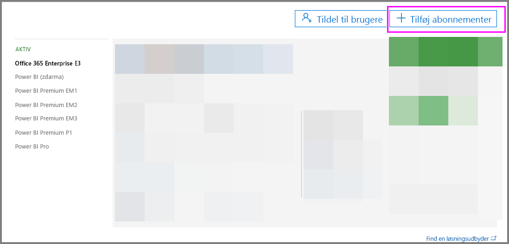
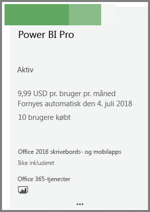
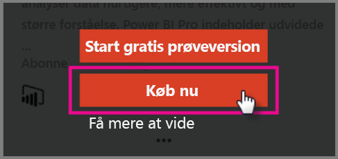
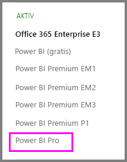

# Hurtig introduktion: Køb Power BI Pro-licenser

Power BI Pro er en individuel licens, der giver adgang til alt indhold og alle funktioner i Power BI-tjenesten, herunder muligheden for at dele indhold og samarbejde med andre Pro-brugere. Det er kun Pro-brugere, der kan udgive og forbruge indhold fra apparbejdsområder, dele dashboards og abonnere på dashboards og rapporter. I denne artikel beskrives det, hvordan du kan købe Power BI Pro-licenser i Office 365.

## Forudsætninger

Du skal være medlem af rollen [**Global administrator** eller **Faktureringsadministrator**](https://support.office.com/article/about-office-365-admin-roles-da585eea-f576-4f55-a1e0-87090b6aaa9d?ui=en-US&rs=en-US&ad=US) i Office 365. 

## Køb Power BI Pro-licenser via Office 365

Køb Power BI Pro-licenser ved at benytte følgende fremgangsmåde:

1. Åbn [Office 365 Administration](https://portal.office.com/adminportal/home#/homepage).

2. Vælg **Fakturering** > **Abonnementer** i den venstre navigationsrude.

    

3. Vælg **Tilføj abonnementer** i øverste højre hjørne på siden **Abonnementer**.

    

4. Find det ønskede abonnement:

    Vælg **Office 365 Enterprise E5** under **Enterprise Suite**.

    

    Vælg **Power BI Pro** under **Andre planer**.

    

5. Peg på ellipsen (…) for det ønskede abonnement, og vælg **Køb nu**.

    

6. Vælg **Betal en gang om måneden** eller **Betal for et helt år** afhængigt af dine ønsker.

7. Angiv det ønskede antal licenser under **Hvor mange brugere ønsker du?**, og vælg derefter **Gå til kassen** for at gennemføre transaktionen.

8. Kontrollér, at abonnementet nu vises på siden **Abonnementer**.

   

9. Hvis du vil tilføje flere licenser efter det første køb, skal du vælge **Power BI Pro** på siden **Abonnementer** og derefter vælge **Tilføj/fjern licenser**.

## Næste trin

Nu, hvor du har købt licenser, kan du tildele dem til brugerne i din lejer.

[Tildel licenser til brugere i Office 365](service-admin-assigning-power-bi-pro-licenses.md)

[Tildel licenser til brugere i Azure](service-admin-assigning-power-bi-pro-licenses-azure.md)

[Power BI-priser](https://powerbi.microsoft.com/en-us/pricing/)
