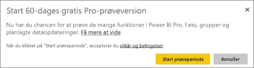

# Køb Power BI Pro
Power BI Pro er til brugere, der publicerer rapporter, deler dashboards, samarbejder med kolleger i arbejdsområder og er engageret i andre relaterede aktiviteter – og gør det muligt at:

* Analysere data i Excel eller Power BI Desktop
* Dele med understøttelse af Excel Web App
* Dele dashboards og samarbejde med apparbejdsområder
* Få vist delt indhold
* Integrere indhold med Microsoft Teams

It-administratorer har nogle forskellige muligheder for at bruge Power BI Pro i din organisation. Du kan købe Power BI Pro gennem Office 365 Administration eller gennem din Microsoft-repræsentant eller -partner. I denne artikel ser vi på de to mulige prøveversioner af Power BI Pro, og hvordan man køber som en organisation.

Du kan få mere at vide om Power BI Premium, og hvordan Power BI Pro passer til Premium-tilbudene, under [Power BI Premium – Hvad er det?](service-premium.md).

## Priser
Under [Priser på Power BI](https://powerbi.microsoft.com/pricing/) finder du de nyeste oplysninger om priser på Power BI Pro samt en tabel over de medfølgende funktioner.

## Power BI Pro i fuld drift i en 60-dages prøveperiode for enkeltpersoner
Når du har tilmeldt dig din gratis konto, kan du også vælge at prøve Pro gratis i 60 dage. Du får adgang til alle Pro-funktionerne i hele prøveperioden. Power BI Pro har alle funktionerne fra den gratis version af Power BI samt yderligere funktioner til deling og samarbejde. Se [Priser på Power BI](https://powerbi.microsoft.com/pricing), hvis du vil have mere at vide. Log på Power BI for at få en 60-dages gratis prøveversion af Power BI Pro, og prøv én af disse Power BI Pro-funktioner:

* [Opret et apparbejdsomåde](service-create-distribute-apps.md)
* [Del et dashboard](service-share-dashboards.md)

Når du prøver en af disse funktioner, bliver du bedt om at starte din gratis prøveversion. Du kan også vælge at bruge den ved at gå til tandhjulsikonet og vælge **Administrer personligt lager**. Vælg derefter **Prøv Pro gratis** til højre.

Derefter kan du vælge **Start prøveperiode**.

> [!NOTE]
> Brugere, der benytter sig af denne Power BI Pro-prøveversion inde i produktet, vises ikke i Office 365-administrationsportalen som Power BI Pro-prøvebrugere (de vises som gratis Power BI-brugere). De vises dog som Power BI Pro-prøvebrugere på siden **Administrer lager** i Power BI.

> [!NOTE]
> Hvis du er it-administrator og ønsker at hente og installere Power BI-prøvelicenser til flere brugere i din organisation, uden at de enkelte brugere skal acceptere vilkårene, kan du tilmelde dig et [Power BI Pro-prøveabonnement](https://portal.office.com/Signup/MainSignup15.aspx?OfferId=d59682f3-3e3b-4686-9c00-7c7c1c736085&dl=POWER_BI_PRO). Du skal være global administrator eller faktureringsadministrator i Office 365, eller du skal oprette en ny lejer for at tilmelde dig en administratorprøveversion. Du kan få mere at vide under [Køb af Power BI Pro](service-admin-purchasing-power-bi-pro.md).

> [!NOTE]
> Med tilgængeligheden af Power BI Premium og ændringerne i tilbuddet om det gratis Power BI 1. juni 2017, er du muligvis berettiget til en udvidet Pro-prøveversion. Du kan få mere at vide under [Aktivering af udvidet Pro-prøveversion](service-extended-pro-trial.md).

### Sådan ser det ud i tjenesten
Når du befinder dig i tjenesten, kan du bekræfte, at du har en Pro-prøvekonto, ved at gå til **tandhjulsikonet* og vælge og køre **Administrer personligt lager**.

## Prøveabonnement i Office 365
Du kan få Power BI Pro som en prøveversion til din organisation. Når du har abonnementet, kan du tildele Power BI Pro-licenser til dine brugere. Du kan få mere at vide om, hvordan du tildeler licenser, under [Tildel licenser til brugere i Office 365](https://support.office.com/article/Assign-or-unassign-licenses-for-Office-365-for-business-997596b5-4173-4627-b915-36abac6786dc).

> [!NOTE]
> Der er en grænse på én organisationsprøveversion pr. lejer. Det betyder, at hvis en person allerede har anvendt Power BI Pro (prøveversion) på din lejer, kan du ikke gøre det igen. Hvis du har brug for hjælp til dette, kan du kontakte [Office 365-faktureringssupport](https://support.office.microsoft.com/article/Contact-Office-365-for-business-support-Admin-Help-32a17ca7-6fa0-4870-8a8d-e25ba4ccfd4b?CorrelationId=552bbf37-214f-4202-80cb-b94240dcd671&ui=en-US&rs=en-US&ad=US#BKMK_call_support).
> 

1. Naviger til [Office 365 Administration](https://portal.office.com/admin/default.aspx).
2. I den venstre navigationsrude skal du vælge Fakturering > Abonnementer.
3. Vælg Tilføj abonnementer + i højre side.
4. Under Andre planer skal du holde musemarkøren over ellipsen (…) til Power BI Pro og vælge Start gratis prøveversion.
   
    
5. Vælg Prøv nu på bekræftelsesskærmbilledet.
6. Vælg Fortsæt på ordrekvitteringen.

Under **Fakturering** > **Abonnementer** kan du se **Power BI Pro (prøveversion)** angivet med 25 tilgængelige licenser. Dette er prøveperiode på én måned.

### Sådan ser det ud i tjenesten
Når du befinder dig i tjenesten, kan du bekræfte, at du har en Pro-konto, ved at gå til **tandhjulsikonet** og vælge og køre **Administrer personligt lager**. Der er ingen angivelse af, at dette er en prøveversionsbruger.

## Køb abonnement i Office 365
Du kan købe Power BI Pro til din organisation via Office 365 Administration. Når du har abonnementet, kan du tildele Power BI Pro-licenser til dine brugere. Du kan få mere at vide om, hvordan du tildeler licenser, under [Tildel licenser til brugere i Office 365](https://support.office.com/article/Assign-or-unassign-licenses-for-Office-365-for-business-997596b5-4173-4627-b915-36abac6786dc).

1. Naviger til [Office 365 Administration](https://portal.office.com/admin/default.aspx).
2. I den venstre navigationsrude skal du vælge Fakturering > Abonnementer.
3. Vælg Tilføj abonnementer + i højre side.
4. Under Andre planer skal du føre musen over ellipsen (…) for Power BI Pro og vælge Køb nu.
   
    
5. Angiv det antal licenser, du vil tilføje, og vælg derefter Gå til kassen eller Føj til indkøbskurv.
   
   > [!NOTE]
   > Du kan tilføje mere på et senere tidspunkt, hvis det er nødvendigt.
   > 
   > 
6. Angiv de nødvendige oplysninger i udtjekningsflowet.

> [!NOTE]
> Hvis du allerede har Power BI Pro (prøveversion), kommer du direkte til kasseskærmbilledet, hvor du bliver bedt om at angive det ønskede antal licenser.
> 
> 

Under **Fakturering** > **Abonnementer** vil du kunne se **Power BI Pro** angivet. Hvis du beslutter senere, at du vil tilføje flere licenser, kan du gå tilbage til **Tilføj abonnementer** og vælge **Rediger licensantal**.

### Sådan ser det ud i tjenesten
Når du befinder dig i tjenesten, kan du bekræfte, at du har en Pro-konto, ved at gå til **tandhjulsikonet** og vælge og køre **Administrer personligt lager**.

## Næste trin
[Tilmelding via selvbetjening til Power BI](service-self-service-signup-for-power-bi.md)  
[Power BI (gratis) i din organisation](service-admin-service-free-in-your-organization.md)  
[Aktivering af den udvidede Pro-prøveversion](service-extended-pro-trial.md)  
[Power BI Premium – hvad er det?](service-premium.md)  
[Sådan køber du Power BI Premium](service-admin-premium-purchase.md)  
[Whitepaper om Power BI Premium](https://aka.ms/pbipremiumwhitepaper)  

Har du flere spørgsmål? [Prøv at spørge Power BI-community'et](http://community.powerbi.com/)

