# Køb og tildel Power BI Pro-licenser

Power BI Pro er en individuel licens, der giver adgang til alt indhold og alle funktioner i Power BI-tjenesten, herunder muligheden for at dele indhold og samarbejde med andre Pro-brugere. Det er kun Pro-brugere, der kan udgive og forbruge indhold fra apparbejdsområder, dele dashboards og abonnere på dashboards og rapporter. Se [Funktioner i Power BI efter licenstype](service-features-license-type.md) for at få flere oplysninger.

I denne artikel beskrives det først, hvordan du kan købe Power BI Pro-licenser i Office 365. I artiklen beskrives derefter de to muligheder, du har for at tildele disse licenser til individuelle brugere: Office 365 og Azure (vælg én indstilling).

## Forudsætninger

Du skal være medlem af rollen [**Global administrator** eller **Faktureringsadministrator**](https://support.office.com/article/about-office-365-admin-roles-da585eea-f576-4f55-a1e0-87090b6aaa9d) i Office 365.

Du skal være ejer af det Azure-abonnement, som Power BI bruger til opslag i Active Directory, for at tildele licenser i Azure.

## Køb licenser i Office 365

Køb Power BI Pro-licenser ved at benytte følgende fremgangsmåde:

1. Åbn [Microsoft 365 Administration](https://portal.office.com/adminportal/home#/homepage).

2. Vælg **Fakturering** > **Abonnementer** i den venstre navigationsrude.

    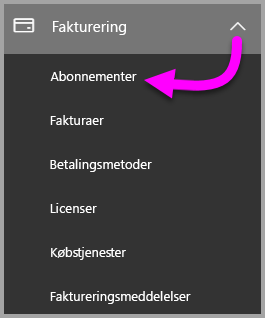

3. Vælg **Tilføj abonnementer** i øverste højre hjørne på siden **Abonnementer**.

    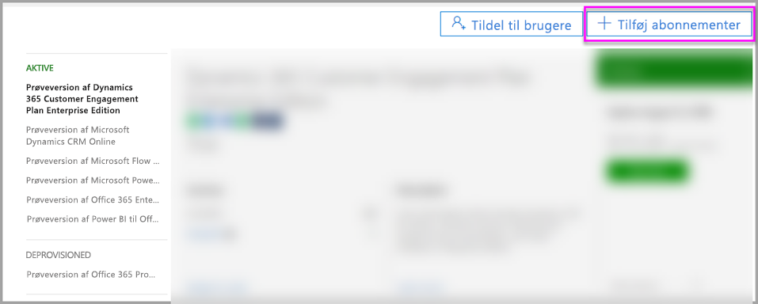

4. Find det ønskede abonnement:

    Vælg **Office 365 Enterprise E5** under **Enterprise Suite**.

    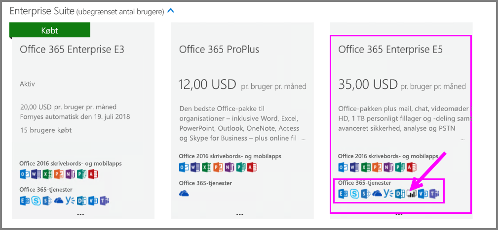

    Vælg **Power BI Pro** under **Andre planer**.

    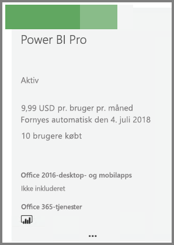

5. Hold musemarkøren over ellipsen **(…)** for det ønskede abonnement, og vælg **Køb nu**.

    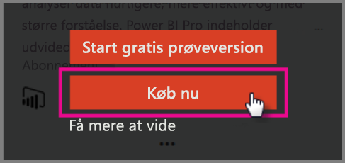

6. Vælg **Betal en gang om måneden** eller **Betal for et helt år** afhængigt af dine ønsker.

7. Angiv det ønskede antal licenser under **Hvor mange brugere ønsker du?** , og vælg derefter **Gå til kassen** for at gennemføre transaktionen.

8. Kontrollér, at abonnementet nu vises på siden **Abonnementer**.

   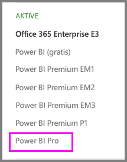

9. Hvis du vil tilføje flere licenser efter det første køb, skal du vælge **Power BI Pro** på siden **Abonnementer** og derefter vælge **Tilføj/fjern licenser**.

## Tildel licenser i Office 365

Benyt følgende fremgangsmåde for at tildele Power BI Pro-licenser til individuelle brugerkonti:

1. Åbn [Microsoft 365 Administration](https://portal.office.com/adminportal/home#/homepage).

2. Udvid **Brugere** i navigationsruden til venstre, og vælg derefter **Aktive brugere**.

    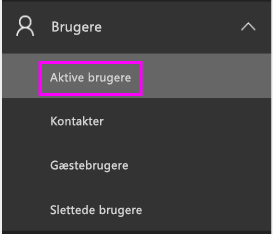

3. Vælg en bruger, og vælg derefter **Rediger** under **Produktlicenser**.

    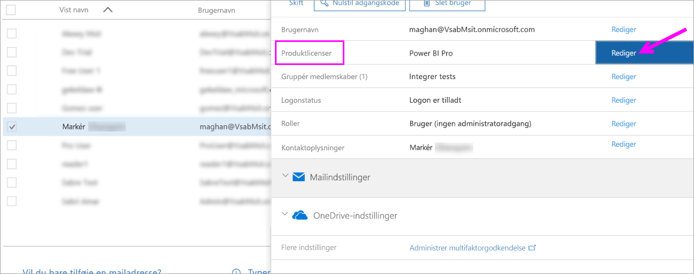

4. Skift indstillingen til **Til** under **Power BI Pro**, og vælg derefter **Gem**.

    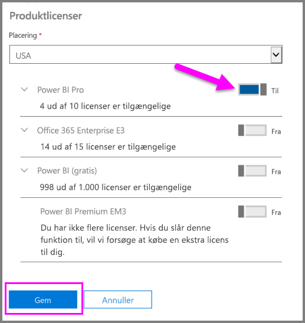

5. Under **Status** for den valgte konto skal du kontrollere, at Power BI Pro-licensen er blevet tildelt.

    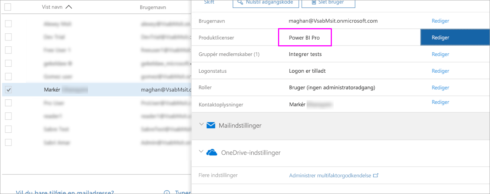

## Tildel licenser i Azure

Benyt følgende fremgangsmåde for at tildele Power BI Pro-licenser til individuelle brugerkonti:

1. Åbn [Azure-portalen](https://ms.portal.azure.com/#@microsoft.onmicrosoft.com/dashboard/private/39bc3cf7-31a4-43f6-954c-f2d69ca2f0).

2. Vælg **Azure Active Directory** på navigationslinjen til venstre.

    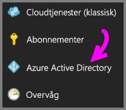

3. Under **Azure Active Directory** skal du vælge **Licenser**.

    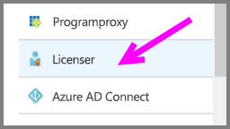

4. Vælg **Alle produkter** under **Licenser**, og vælg derefter **Power BI Pro** for at få vist en liste over brugere med licens.

    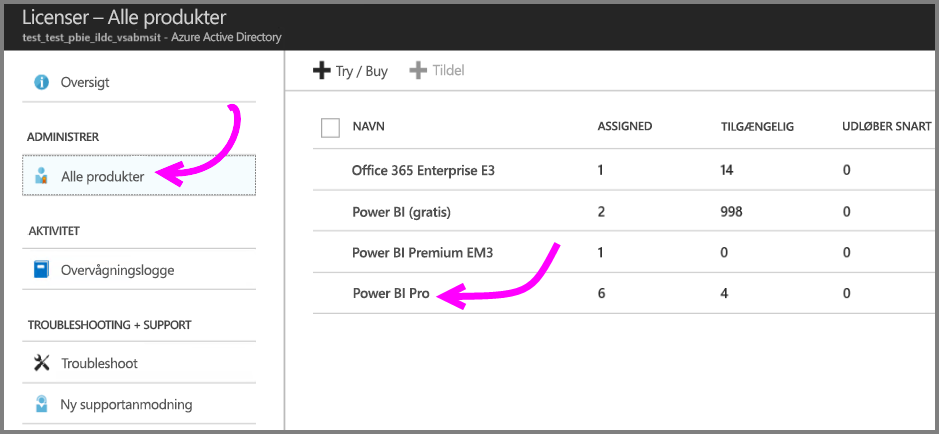

5. Vælg **Tildel** for at føje en Power BI Pro-licens til en brugerkonto.

    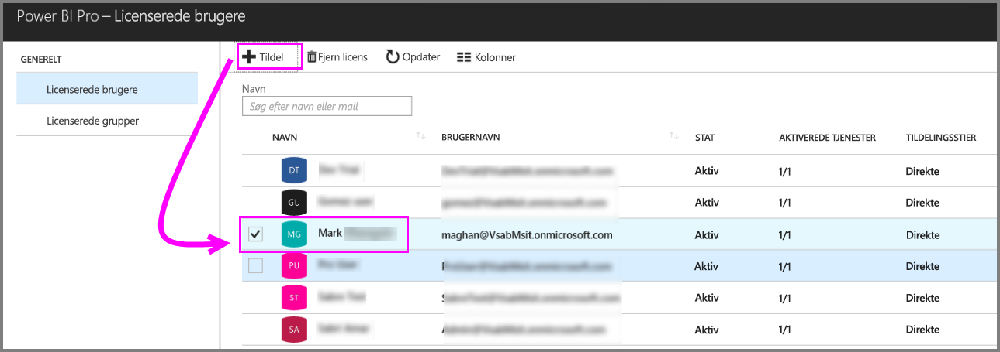

## Næste trin

Nu, hvor du har tildelt licenser, kan du få mere at vide om Power BI Pro.

[Power BI-licenser i din organisation](service-admin-licensing-organization.md)

[Find Power BI-brugere, der er logget på](service-admin-access-usage.md)

Har du flere spørgsmål? [Prøv at spørge Power BI-community'et](https://community.powerbi.com/)
