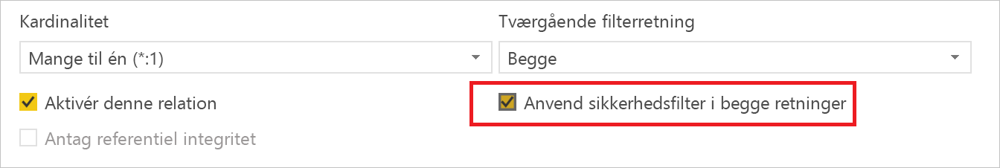
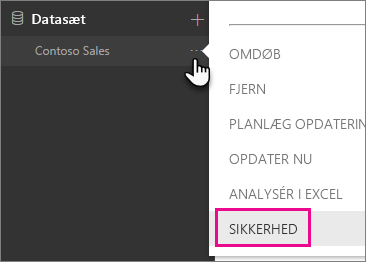
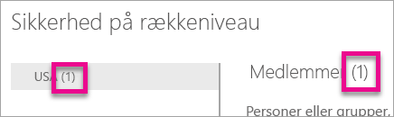
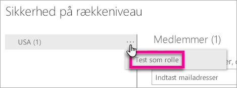

# Sikkerhed på rækkeniveau (RLS) med Power BI

Sikkerhed på rækkeniveau (RLS) med Power BI kan bruges til at begrænse adgang til datakilder for bestemte brugere. Filtre begrænser adgangen til data på rækkeniveau, og du kan definere filtre inden for roller. Vær opmærksom på, at i Power BI-tjenesten har medlemmer af et arbejdsområde adgang til datasæt i arbejdsområdet. Sikkerhed på rækkeniveau (RLS) begrænser ikke adgangen til data.

Du kan konfigurere sikkerhed på rækkeniveau for datamodeller, der er importeret til Power BI, med Power BI Desktop. Du kan også konfigurere sikkerhed på rækkeniveau for datasæt, der anvender DirectQuery, f.eks. SQL Server. Tidligere kunne du kun implementere sikkerhed på rækkeniveau i Analysis Services-modeller i det lokale miljø uden for Power BI. I forbindelse med liveforbindelser i Analysis Services kan du konfigurere sikkerhed på rækkeniveau for modellen i det lokale miljø. Sikkerhedsindstillingen vises ikke for datasæt med liveforbindelse.

[!INCLUDE [include-short-name](./includes/rls-desktop-define-roles.md)]

Som standard bruger filtrering af sikkerhed på rækkeniveau envejsfiltre, uanset om relationerne er angivet til envejs eller tovejs. Du kan aktivere tovejskrydsfiltrering med sikkerhed på rækkeniveau manuelt ved at vælge relationen og markere afkrydsningsfeltet **Anvend sikkerhedsfilter i begge retninger**. Du skal markere dette afkrydsningsfelt, når du implementerer [dynamisk sikkerhed på rækkeniveau](https://docs.microsoft.com/sql/analysis-services/supplemental-lesson-implement-dynamic-security-by-using-row-filters), hvor du kan angive sikkerhed på rækkeniveau, baseret på brugernavn eller logon-id.

Du kan finde flere oplysninger på [Tovejskrydsfiltrering ved hjælp af DirectQuery i Power BI Desktop](desktop-bidirectional-filtering.md) og den tekniske artikel [Sikring af modellen for tabellarisk BI-semantik](http://download.microsoft.com/download/D/2/0/D20E1C5F-72EA-4505-9F26-FEF9550EFD44/Securing%20the%20Tabular%20BI%20Semantic%20Model.docx).

[!INCLUDE [include-short-name](./includes/rls-desktop-view-as-roles.md)]

## Administrer sikkerheden for din model

Hvis du vil administrere sikkerheden på din datamodel, skal du gøre følgende.

1. Vælg **ellipsen (…)** for et datasæt.
2. Vælg **Sikkerhed**.
   
   

Så kommer du til RLS-siden, hvor du skal føje medlemmer til en rolle, du har oprettet i Power BI Desktop. Kun ejerne af datasættet får vist indstillingen Sikkerhed. Hvis datasættet er i en gruppe, kan kun administratorer af gruppen se sikkerhedsindstillingen. 

Du kan kun oprette eller redigere roller i Power BI Desktop.

## Arbejd med medlemmer

### Tilføj medlemmer

Du kan føje et medlem til rollen ved at skrive mailadressen eller navnet på den bruger, sikkerhedsgruppe eller distributionsliste, du vil tilføje. Dette medlem skal tilhøre din organisation. Du kan ikke tilføje grupper, der er oprettet i Power BI.

Du kan også se, hvor mange medlemmer der er en del af rollen, ud fra tallet i parentes ud for rollenavnet eller ud for Medlemmer.

### Fjern medlemmer

Du kan fjerne medlemmer ved at vælge X ud for medlemmets navn. 

## Validering af rollen i Power BI-tjenesten

Du kan bekræfte, at den rolle, du har defineret, fungerer korrekt, ved at teste rollen. 

1. Vælg **ellipsen (...)** ud for rollen.
2. Vælg **Test data som rolle**

Derefter får du vist rapporter, der er tilgængelige for denne rolle. Dashboards vises ikke i denne visning. Du får vist, hvad der anvendes, i den blå bjælke ovenfor.

Du kan teste andre roller eller en kombination af roller ved at vælge **Får nu vist som**.

Du kan vælge at få vist data som en bestemt person, eller du kan vælge en kombination af tilgængelige roller for at bekræfte, om de fungerer. 

Hvis du vil vende tilbage til normal visning, skal du vælge **Tilbage til sikkerhed på rækkeniveau**.

[!INCLUDE [include-short-name](./includes/rls-usernames.md)]

## Brug RLS sammen med apparbejdsområder i Power BI

Hvis du publicerer din Power BI Desktop-rapport i et apparbejdsområde i Power BI-tjenesten, anvendes rollerne på medlemmer, som kun har tilladelse til at få vist indhold. Du skal angive, at medlemmer kan få vist Power BI-indhold, i indstillingerne for apparbejdsområdet.

> [!WARNING]
> Hvis du har konfigureret apparbejdsområdet, således at medlemmerne har redigeringstilladelse, anvendes RLS-rollerne ikke på dem. Brugerne vil kunne se alle dataene.

[!INCLUDE [include-short-name](./includes/rls-limitations.md)]

[!INCLUDE [include-short-name](./includes/rls-faq.md)]

## Næste trin
[Sikkerhed på rækkeniveau med Power BI Desktop](desktop-rls.md)  

Har du flere spørgsmål? [Prøv at spørge Power BI-community'et](http://community.powerbi.com/)