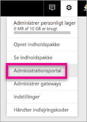
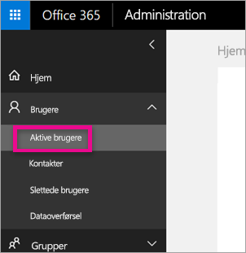
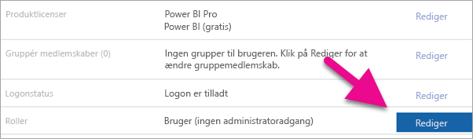
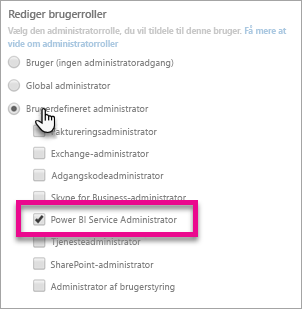
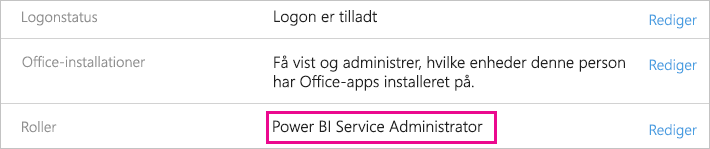

# <a name="understanding-the-power-bi-admin-role"></a>Beskrivelse af rollen som Power BI-administrator
Få mere at vide om, hvordan du kan bruge Power BI-administratorrollen i organisationen.

<iframe width="640" height="360" src="https://www.youtube.com/embed/PQRbdJgEm3k?showinfo=0" frameborder="0" allowfullscreen></iframe>

Rollen som Power BI-tjenesteadministrator kan tildeles til brugere, som skal have adgang til Power BI-administrationsportalen uden også at tildele dem nogen anden administrativ adgang i Office 365. F.eks. rollen som Global administrator. Den er beregnet til brugere, der har til opgave at administrere Power BI i deres organisation.

Office 365-brugeradministratorer kan tildele brugere rollen som Power BI-administratorer inden for Office 365 Administration eller via PowerShell-script. Når en bruger er tildelt, kan vedkommende tilgå [Power BI-administrationsportalen](service-admin-portal.md). Her kan vedkommende tilgå lejerbaserede forbrugsdata og kan kontrollere lejerbaseret forbrug af Power BI-funktioner.



## <a name="using-the-office-365-admin-center-to-assign-a-role"></a>Brug af Office 365 Administration til at tildele en rolle
Hvis du vil tildele brugere rollen som Power BI-administrator i Office 365 Administration, kan du gøre følgende.

1. Gå til Office 365 Administration, og vælg **Brugere** > **Aktive brugere**.
   
    
2. Vælg den bruger, du vil tildele rollen.
3. Vælg **Rediger** for roller.
   
    
4. Vælg **Brugerdefineret administrator** > **Power BI-tjenesteadministrator**
   
    
5. Vælg **Gem**.

Du bør se, at den pågældende bruger er tildelt rollen **Power BI-tjenesteadministrator** på oversigten. Vedkommende har nu adgang til [Power BI-administrationsportalen](service-admin-portal.md).



## <a name="using-powershell-to-assign-a-role"></a>Brug af PowerShell til at tildele en rolle
Hvis du vil køre PowerShell-kommandoen, skal du have Azure Active Directory PowerShell-modulet installeret.

### <a name="download-azure-ad-powershell-module"></a>Download Azure AD PowerShell-modulet
[Download Azure Active Directory PowerShell Version 2](https://github.com/Azure/azure-docs-powershell-azuread/blob/master/Azure%20AD%20Cmdlets/AzureAD/index.md)

[Download Azure Active Directory PowerShell Version 1.1.166.0 GA](http://connect.microsoft.com/site1164/Downloads/DownloadDetails.aspx?DownloadID=59185)

### <a name="command-to-add-role-to-member"></a>Kommando til at føje en rolle til et medlem
**Azure AD PowerShell v2-kommando**

Du skal bruge **ObjectId** til rollen som **Power BI-tjenesteadministrator**. Du kan køre [Get-AzureADDirectoryRole](https://docs.microsoft.com/powershell/azuread/v2/get-azureaddirectoryrole) for at hente **ObjectId**

```
PS C:\Windows\system32> Get-AzureADDirectoryRole

ObjectId                             DisplayName                        Description
--------                             -----------                        -----------
00f79122-c45d-436d-8d4a-2c0c6ca246bf Power BI Service Administrator     Full access in the Power BI Service.
250d1222-4bc0-4b4b-8466-5d5765d14af9 Helpdesk Administrator             Helpdesk Administrator has access to perform..
3ddec257-efdc-423d-9d24-b7cf29e0c86b Directory Synchronization Accounts Directory Synchronization Accounts
50daa576-896c-4bf3-a84e-1d9d1875c7a7 Company Administrator              Company Administrator role has full access t..
6a452384-6eb9-4793-8782-f4e7313b4dfd Device Administrators              Device Administrators
9900b7db-35d9-4e56-a8e3-c5026cac3a11 AdHoc License Administrator        Allows access manage AdHoc license.
a3631cce-16ce-47a3-bbe1-79b9774a0570 Directory Readers                  Allows access to various read only tasks in ..
f727e2f3-0829-41a7-8c5c-5af83c37f57b Email Verified User Creator        Allows creation of new email verified users.
```

I dette tilfælde er rollens objectid 00f79122-c45d-436d-8d4a-2c0c6ca246bf.

Du har også brug for at kende brugerens **ObjectID**. Det finder du ved at køre [Get-AzureADUser](https://docs.microsoft.com/powershell/azuread/v2/get-azureaduser).

```
PS C:\Windows\system32> Get-AzureADUser -SearchString 'tim@contoso.com'

ObjectId                             DisplayName UserPrincipalName      UserType
--------                             ----------- -----------------      --------
6a2bfca2-98ba-413a-be61-6e4bbb8b8a4c Tim         tim@contoso.com        Member
```

For at føje medlemmet til rollen skal du køre [Add-AzureADDirectoryRoleMember](https://docs.microsoft.com/powershell/azuread/v2/add-azureaddirectoryrolemember).

| Parameter | Beskrivelse |
| --- | --- |
| ObjectId |Rollen ObjectId. |
| RefObjectId |Medlemmernes ObjectId. |

```
Add-AzureADDirectoryRoleMember -ObjectId 00f79122-c45d-436d-8d4a-2c0c6ca246bf -RefObjectId 6a2bfca2-98ba-413a-be61-6e4bbb8b8a4c
```

**Azure AD PowerShell v1-kommando**

Hvis du vil føje et medlem til en rolle ved hjælp af Azure AD v1-cmdlet'er, skal du køre kommandoen [Add-MsolRoleMember](https://docs.microsoft.com/powershell/msonline/v1/add-msolrolemember).

```
Add-MsolRoleMember -RoleMemberEmailAddress "tim@contoso.com" -RoleName "Power BI Service Administrator"
```

## <a name="limitations-and-considerations"></a>Begrænsninger og overvejelser
Rollen som Power BI-tjenesteadministrator giver ikke adgang til følgende.

* Mulighed for at ændre brugere og licenser i Office 365 Administration
* Adgang til overvågningslogge. Du kan finde flere oplysninger under [Brug af overvågning i din organisation](service-admin-auditing.md).

## <a name="next-steps"></a>Næste trin
[Power BI-administrationsportal](service-admin-portal.md)  
[Add-AzureADDirectoryRoleMember](https://docs.microsoft.com/powershell/azuread/v2/add-azureaddirectoryrolemember)  
[Add-MsolRoleMember](https://docs.microsoft.com/powershell/msonline/v1/add-msolrolemember)  
[Overvågning af Power BI i din organisation](service-admin-auditing.md)  
[Administrering af Power BI i din organisation](service-admin-administering-power-bi-in-your-organization.md)  

Har du flere spørgsmål? [Prøv at spørge Power BI-community'et](http://community.powerbi.com/)

