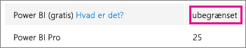
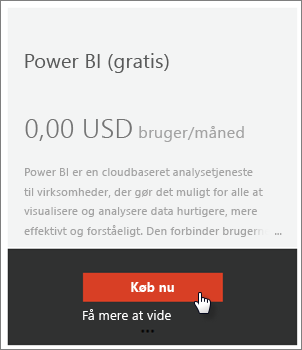
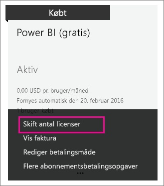

# Power BI (gratis) i din organisation
Her ser vi på, hvordan du kan bruge Power BI-tilbuddet (gratis) i din organisation. En organisation betyder, at du har en lejer og kan administrere brugere og tjenester inden for denne lejer. Som administrator kan du styre licenstildeling, eller du kan tillade, at brugere tilmelder sig som enkeltpersoner. Vi skal se på licensen til Power BI (gratis), og hvordan du kan styre individuelle tilmeldinger.

## Individuel tilmelding over for licenstildeling
Brugerne i organisationen kan få adgang til Power BI på to forskellige måder. De kan selv tilmelde sig Power BI, eller du kan tildele dem en Power BI-licens på Office 365-administrationsportalen.

Det betyder mindre arbejde for organisationens administratorer, hvis de brugere, der er interesseret i Power BI, selv tilmelder sig.

Du kan få mere kontrol ved at blokere individuel tilmelding og selv tildele Power BI-licenser i Office 365 Administration. Det giver dig mulighed for specifikt at bestemme, hvem der har adgang til hvilke tjenester i din organisation. Det er også en god mulighed, hvis du skal håndtere overvågning og har brug for præcist at vide, hvem der kan bruge hvad.

## Sådan får du den ubegrænsede licensblok
I Office 365 Administration under **Fakturering** > **Licenser** kan du muligvis se Power BI (gratis) med ubegrænsede licenser.

Denne blok af licenser vises, når en person første gang har tilmeldt sig Power BI som enkeltperson. Under denne proces bliver licensblokken knyttet til din organisation, og en licens tildeles den bruger, der tilmelder sig.

Hvis du blokerer individuel brugertilmelding, og ingen har tilmeldt sig, får du ikke vist denne licensblok. Du kan enten tillade, at brugerne selv tilmelder sig, og få én brugertilmelding, eller du kan få gratis licenser via Office 365-abonnementsflowet, som er det næste, vi taler om.

Når Power BI-licensblokken (gratis) er tilgængelig, kan du tildele disse licenser til dine brugere. Du kan finde flere oplysninger om, hvordan du tildeler licenser, under [Tildel licenser til brugere i Office 365](https://support.office.com/article/Assign-or-unassign-licenses-for-Office-365-for-business-997596b5-4173-4627-b915-36abac6786dc).

## Hent gratis licenser via Tilføj abonnement i Office 365
1. Naviger til [Office 365 Administration](https://portal.office.com/admin/default.aspx).
2. Vælg **Fakturering** > **Abonnementer** i den venstre navigationsrude.
3. Vælg **Tilføj abonnementer +** i højre side.
4. Under Andre planer skal du føre musen over **ellipsen (…)** til Power BI (gratis) og vælge **Køb nu**.
   
    
5. Angiv det antal licenser, du vil tilføje, og vælg derefter **Gå til kassen nu** eller **Føj til indkøbskurv**.
   
   > [!NOTE]
   > Du kan tilføje flere på et senere tidspunkt, hvis det er nødvendigt.
   > 
   > 
6. Angiv de nødvendige oplysninger, når du går til kassen.

Der er ikke noget køb, når denne fremgangsmåde benyttes, selvom du enten skal angive kreditkortoplysninger til fakturering eller vælge at blive faktureret.

Hvis du beslutter senere, at du vil tilføje flere licenser, kan du gå tilbage til **Tilføj abonnementer** og vælge **Rediger licensantal** til Power BI (gratis).

Du kan nu tildele disse licenser til dine brugere. Du kan finde flere oplysninger om, hvordan du tildeler licenser, under [Tildel licenser til brugere i Office 365](https://support.office.com/article/Assign-or-unassign-licenses-for-Office-365-for-business-997596b5-4173-4627-b915-36abac6786dc).

## Aktivér eller deaktiver individuel brugertilmelding i Azure Active Directory
Som administrator kan du vælge at aktivere eller deaktivere individuelle brugertilmeldinger som en del af Azure Active Directory (AAD). Hvis du ved, hvordan du bruger AAD PowerShell-kommandoer, kan du selv aktivere eller deaktivere ad hoc-abonnementer. [Få mere at vide](https://technet.microsoft.com/library/jj151815.aspx)

AAD-indstillingen, der styrer dette, er **AllowAdHocSubscriptions**. For de fleste lejere vil denne indstilling være indstillet til sand, hvilket betyder, at den er aktiveret. Hvis du har købt Power BI via en partner, kan denne indstilling som standard være indstillet til falsk, hvilket betyder, at den er deaktiveret.

1. Du skal først logge på Azure Active Directory ved hjælp af dine legitimationsoplysninger til Office 365. Den første linje beder dig om dine legitimationsoplysninger. Den anden linje opretter forbindelse til Azure Active Directory.
   
     $msolcred = get-credential   connect-msolservice -credential $msolcred
   
   
2. Når du er logget på, kan du udstede følgende kommando for at se, hvad din lejer i øjeblikket er konfigureret til.
   
     Get-MsolCompanyInformation | fl AllowAdHocSubscriptions
3. Du kan bruge denne kommando til at aktivere ($true) eller deaktivere ($false) AllowAdHocSubscriptions.
   
     Set-MsolCompanySettings -AllowAdHocSubscriptions $true

> [!NOTE]
> Denne blokering forhindrer, at nye brugere i din organisation kan tilmelde sig Power BI. Brugere, der tilmelder sig Power BI før deaktivering af nye tilmeldinger, vil stadig have deres licenser.
> 
> 

## Næste trin
[Tilmelding via selvbetjening til Power BI](service-self-service-signup-for-power-bi.md)  
[Køb Power BI Pro](service-admin-purchasing-power-bi-pro.md)  
[Tilmeld dig Power BI (gratis) med en brugerdefineret Azure Active Directory-lejer](developer/create-an-azure-active-directory-tenant.md)  
[Power BI Premium – hvad er det?](service-premium.md)  
[Hvidbog til Power BI Premium](https://aka.ms/pbipremiumwhitepaper)  

Flere spørgsmål? [Prøv at spørge Power BI-community'et](http://community.powerbi.com/)

