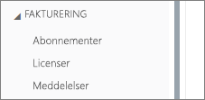
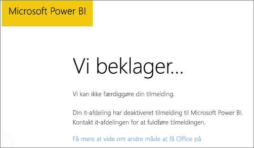
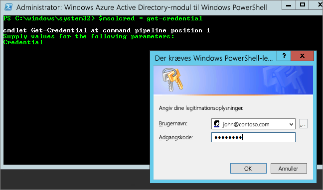

# <a name="unable-to-add-power-bi-to-office-365-partner-subscription"></a>Det var ikke muligt at føje Power BI til en partners Office 365-abonnement

Office 365 giver firmaer mulighed for at forhandle Office 365 samlet og integreret med deres egne løsninger, hvilket giver slutkunderne et enkelt kontaktpunkt for køb, fakturering og support.

Hvis du er interesseret i at købe Power BI sammen med dit Office 365-abonnement, anbefaler vi, at du kontakter din partner for at gøre det. Hvis din partner ikke tilbyder Power BI i øjeblikket, har du andre muligheder, du kan benytte dig af.

## <a name="work-with-your-partner-to-purchase-power-bi"></a>Arbejd sammen med din partner om at købe Power BI

Hvis du vil købe et abonnement på Power BI Pro eller Power BI Premium, skal du i samarbejde med din partner overveje, hvilke muligheder du har:

* Din partner kan acceptere at føje Power BI til sin portefølje, så du kan købe af den pågældende partner.

* Din partner kan lade dig overgå til en model, hvor du kan købe Power BI direkte af Microsoft eller en anden partner, som tilbyder Power BI.

## <a name="purchase-from-microsoft-or-another-channel"></a>Køb fra Microsoft eller en anden kanal

Afhængigt af relationen med din partner kan du muligvis købe Power BI direkte fra Microsoft eller en anden partner. Du kan kontrollere, om du kan tilføje Power BI-abonnementer på Office 365 Administrationsportal (kræver medlemskab med rollen Global administrator eller Faktureringsadministrator).

1. Gå til [Office 365 Administrationsportal](https://admin.microsoft.com/AdminPortal/Home#/homepage).

1. Åbn **Fakturering** i menuen til venstre:

    * Hvis du kan se **Abonnementer**, kan du købe tjenesten direkte fra Microsoft, eller du kan kontakte en anden partner, der tilbyder Power BI.

        

    * Hvis du ikke kan se **Abonnementer**, kan du ikke købe direkte fra Microsoft eller en anden partner.

Hvis din partner ikke tilbyder Power BI, og du ikke kan købe direkte fra Microsoft eller en anden partner, kan du overveje at tilmelde dig en gratis prøveversion.

## <a name="sign-up-for-a-free-trial"></a>Tilmeld dig en gratis prøveversion

Du kan tilmelde dig en gratis prøveversion af Power BI Pro. Hvis du ikke køber Power BI Pro i slutningen af prøveperioden, har du stadig en gratis licens, der indeholder mange af funktionerne i Power BI. Se [Funktioner i Power BI efter licenstype](service-features-license-type.md) for at få flere oplysninger.

### <a name="enable-ad-hoc-subscriptions"></a>Aktivér ad hoc-abonnementer

Individuelle tilmeldinger (også kaldet ad hoc-abonnementer) er som standard deaktiveret. I dette tilfælde kan du se følgende meddelelse, når du forsøger at tilmelde dig: *Din it-afdeling har deaktiveret tilmelding til Microsoft Power BI*.



Hvis du vil aktivere ad hoc-abonnementer, kan du kontakte din partner og anmode om at få aktiveret dem. Hvis du er administrator for din lejer og ved, hvordan du bruger Azure Active Directory PowerShell-kommandoer, kan du selv aktivere ad hoc-abonnementer. [Azure Active Directory PowerShell til Graph](/powershell/azure/active-directory/install-adv2/)

1. Log på Azure Active Directory ved hjælp af dine legitimationsoplysninger til Office 365. I den første linje i nedenstående script bliver du bedt om dine legitimationsoplysninger. Den anden linje opretter forbindelse til Azure Active Directory.

    ```powershell
    $msolcred = get-credential
    connect-msolservice -credential $msolcred
    ```

    

1. Når du er logget på, kan du køre følgende kommando for at kontrollere den aktuelle indstilling for `AllowAdHocSubscriptions`.

    ```powershell
    Get-MsolCompanyInformation
    ```

1. Kør følgende kommando for at aktivere gratis tilmeldinger.

    ```powershell
    Set-MsolCompanySettings -AllowAdHocSubscriptions $true
    ```

## <a name="next-steps"></a>Næste trin

[Power BI-licenser i din organisation](service-admin-licensing-organization.md)

Har du flere spørgsmål? [Prøv at spørge Power BI-community'et](http://community.powerbi.com/)