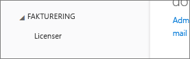

# Det var ikke muligt at føje Power BI til en partners Office 365-abonnement
Office 365 giver virksomheder mulighed for at forhandle Office 365 samlet og integreret med deres egne løsninger, hvorved slutkunder får adgang til et enkelt kontaktpunkt for køb, fakturering og support.

Hvis du er interesseret i at købe Power BI sammen med dit Office 365-abonnement, så anbefaler vi dig at kontakte din partner i denne forbindelse. Hvis din partner ikke tilbyder Power BI, så kan du benytte dig af nogle andre muligheder.

1. Du kan købe tjenesten via en anden kanal, enten direkte fra Microsoft eller en anden partner. Denne mulighed er ikke tilgængelig for alle kunder, alt afhængigt af deres relation til partneren. Du kan bekræfte dette ved at gå til **Office 365-administrationsportalen** > **Fakturering** > **Abonnementer**. Hvis du får vist **Abonnementer**, kan du købe tjenesten direkte af Microsoft, eller du kan også kontakte en partner, der tilbyder Power BI.
   
    
2. Hvis **Abonnementer** ikke er angivet under **Fakturering**, kan du ikke købe direkte fra Microsoft eller nogen anden partner. 
   
   

Hvis du ikke kan købe Power BI direkte, og alt afhængigt af hvilken type af Power BI-abonnement du er interesseret i, kan du stadig benytte dig af visse muligheder.

[Power BI (gratis)](#power-bi-free)

[Power BI Pro og Premium](#power-bi-pro-and-premium)

## Power BI (gratis)
Hvis du er tilfreds med den gratis version af Power BI, kan du tilmelde dig den gratis tjeneste. Som standard er individuelle tilmeldinger, også kaldet ad-hoc-abonnementer, deaktiveret. Når du forsøger at tilmelde dig Power BI, får du vist en meddelelse om, at it-afdelingen har slået tilmelding til Microsoft Power BI fra.

    Your IT department has turned off signup for Microsoft Power BI.

Hvis du vil aktivere ad hoc-abonnementer, kan du kontakte din partner og anmode om at få aktiveret dem. Hvis du er administrator for din lejer, og du ved, hvordan du benytter Azure Active Directory PowerShell-kommandoer, så kan du selv aktivere ad-hoc-abonnementer. [Få mere at vide](https://technet.microsoft.com/library/jj151815.aspx)

1. Du skal først logge på Azure Active Directory ved hjælp af dine legitimationsoplysninger til Office 365. Den første linje beder dig om dine legitimationsoplysninger. Den anden linje opretter forbindelse til Azure Active Directory.
   
        $msolcred = get-credential
        connect-msolservice -credential $msolcred
   
    
2. Når du er logget på, kan du udstede følgende kommando for at aktivere gratis tilmeldinger.
   
        Set-MsolCompanySettings -AllowAdHocSubscriptions $true

## Power BI Pro og Premium
Hvis du vil købe et abonnement af Power BI Pro eller Power BI Premium, skal du i samarbejde med din partner overveje dine muligheder.

* Din partner kan acceptere at føje Power BI til sin portefølje, så du kan købe af den pågældende partner.
* Din partner kan lade dig overgå til en model, hvor du kan købe Power BI direkte af Microsoft eller en anden partner, som tilbyder Power BI.

## Næste trin
[Administrer Azure AD ved hjælp af Windows PowerShell](https://technet.microsoft.com/library/jj151815.aspx)  
[Hvad er Power BI Premium?](service-premium.md)

Har du flere spørgsmål? [Prøv at spørge Power BI-community'et](http://community.powerbi.com/)

