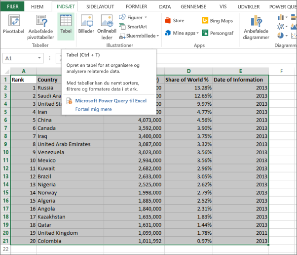
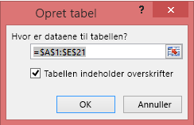
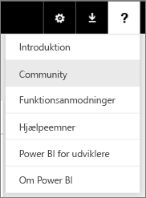

# Fejl: Der blev ikke fundet nogen data i din Excel-projektmappe

>[!NOTE]  
>Denne artikel gælder for Excel 2007 og nyere.

Når du importerer en Excel-projektmappe til Power BI, kan du se følgende fejl:

*Fejl: Vi kunne ikke finde nogen data, der er formateret som en tabel. Hvis du vil importere fra Excel til Power BI-tjenesten, skal du formatere dataene som en tabel. Markér alle de data, du vil have i tabellen, og tryk på CTRL + T.*

## Hurtig løsning
1. Rediger din projektmappe i Excel.
2. Markér det celleområde, der indeholder dataene. Den første række skal indeholde kolonneoverskrifterne (kolonnenavnene).
3. Tryk på **Ctrl + T** for at oprette en tabel.
4. Gem projektmappen.
5. Vend tilbage til Power BI, og importér projektmappen igen, eller hvis du arbejder i Excel 2016, og du har gemt projektmappen på OneDrive for Business, skal du i Excel klikke på Filer > Udgiv.

## Detaljer
### Årsag
I Excel kan du oprette en **tabel** ud af et celleområde, som gør det nemmere at sortere, filtrere og formatere data.

Når du importerer en Excel-projektmappe, leder Power BI efter disse tabeller og importerer dem til et datasæt. Hvis der ikke findes nogen tabeller, vises denne fejlmeddelelse.

### Løsning
1. Åbn din projektmappe i Excel. 
    >[!NOTE]
    >Billederne her er til Excel 2013. Hvis du bruger en anden version, kan det se lidt anderledes ud, men trinnene er de samme.
    
    
2. Markér det celleområde, der indeholder dataene. Den første række skal indeholde kolonneoverskrifterne (kolonnenavnene):
   
    
3. Klik på **Tabel** på båndet under fanen **INDSÆT**. (Eller som en genvej kan du trykke på **Ctrl + T**).
   
    
4. Du kan se følgende dialogboks. Sørg for, at **Tabellen indeholder overskrifter** er markeret, og vælg **OK**:
   
    
5. Nu er dataene formateret som en tabel:
   
    
6. Gem projektmappen.
7. Vend tilbage til Power BI. Vælg Hent data nederst i navigationsruden.
   
    
8. Vælg **Hent** i feltet **Filer**.
   
    
9. Importér Excel-projektmappen igen. Denne gang bør importen finde tabellen.
   
    Hvis importen stadig mislykkes, kan du give os besked ved at klikke på **Community ** i menuen Hjælp:
   
    
