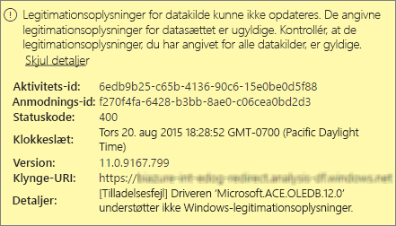
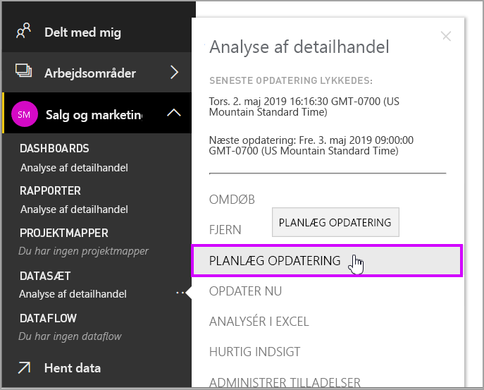
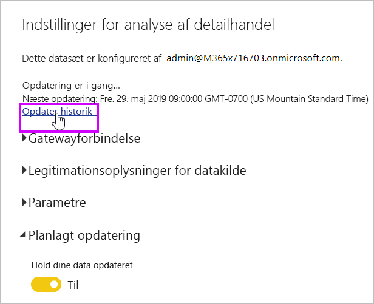
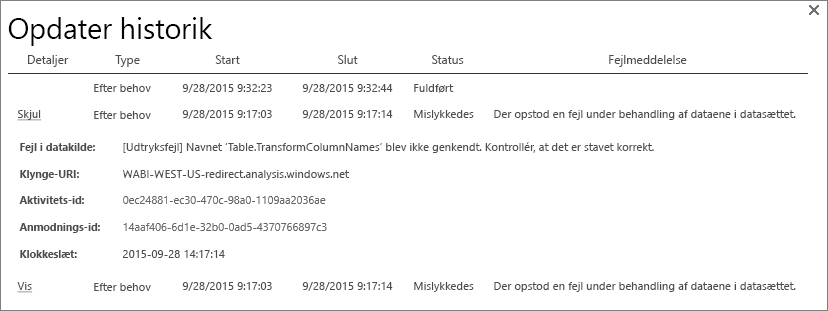
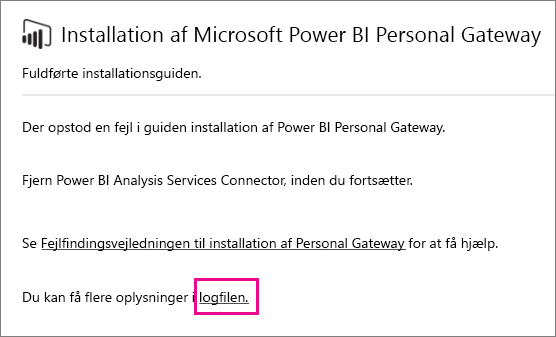
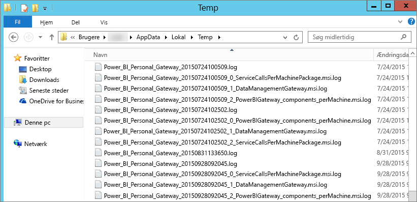

# Fejlfinding af Power BI Gateway – Personal
Nedenfor gennemgås nogle almindelige problemer, der kan opstå, når du bruger Power BI Gateway – Personal.

> [!NOTE]
> Den aktuelle version af gatewayen til personlig brug er **datagateway i det lokale miljø (personlig)**. Opdater din installation, hvis du vil bruge denne version.
> 
> 

## Opdater til den nyeste version
Der kan opstå mange problemer, hvis gatewayversionen er forældet.  Det er generelt en god idé at sikre, at du anvender den nyeste version.  Hvis du ikke har opdateret gateway'en i en måned eller mere, bør du overveje at installere den nyeste version af gateway'en, og se, om du kan genskabe problemet.

## Installation
**Personlig gateway er 64-bit** – Hvis computeren er på 32-bit, kan du ikke installere den personlige gateway. Dit operativsystem skal være 64-bit. Du skal installere en 64-bit version af Windows eller installere den personlige gateway på en 64-bit-computer.

**Personlig gateway kan ikke installere en tjeneste, selvom du er en lokal administrator på computeren** – Installationen kan mislykkes, hvis brugeren er i computerens lokale Administratorgruppe, men gruppepolitikken ikke tillader det pågældende brugernavn at logge på som en tjeneste.  I øjeblikket skal du sørge for, at gruppepolitikken tillader en bruger at logge på som en tjeneste. Vi arbejder på at finde en rettelse på problemet. [Få mere at vide](https://technet.microsoft.com/library/cc739424.aspx)

**Handlingen fik timeout** – Dette forekommer tit, hvis computeren (fysisk maskine eller VM), du installerer den personlige gateway på, har en enkeltkerne-processor. Luk alle programmer, afbryd alle ikke-essentielle processer, og prøv at installere igen.

**Datastyringsgateway eller Analysis Services-forbindelseskomponent kan ikke være installeret på samme computer som en personlig gateway** – Hvis du allerede har en Analysis Services-forbindelseskomponent eller Datastyringsgateway installeret, skal du først fjerne installationen af forbindelseskomponenten eller gateway'en og derefter prøve at installere den personlige gateway.

> [!NOTE]
> Hvis du støder på et problem under installationen, kan du muligvis få oplysninger om, hvordan du udbedrer problemet i installationslogfilerne. Se [Installationslogfiler](#SetupLogs) for at få flere oplysninger.
> 
> 

 **Proxykonfiguration** Du kan støde på problemer med at konfigurere den personlige gateway, hvis dit miljø kræver, at du bruger en proxy. Hvis du vil vide mere om, hvordan du konfigurerer proxyoplysninger, skal du se [Konfiguration af proxyindstillinger til Power BI Gateways](service-gateway-proxy.md)

## Planlægning af en opdatering
**Fejl: De cloudlagrede legitimationsoplysninger mangler.**

Du kan få denne fejl i Indstillinger for \<datasæt\>, hvis du har en planlagt opdatering og derefter har installeret og geninstalleret den personlige gateway. Når du fjerner installationen af en personlig gateway, så fjernes legitimationsoplysninger for datakilden knyttet til datasæt, der er blevet konfigureret til opdatering, fra Power BI-tjenesten.

**Svaret:** I Power BI skal du gå til opdateringsindstillingerne for et datasæt. I Administrer datakilder skal du for alle relevante datakilder med fejl klikke på Rediger legitimationsoplysninger og logge på datakilden igen.

**Fejl: De angivne legitimationsoplysninger for datasættet er ugyldige. Opdater legitimationsoplysningerne ved at opdatere eller vælge at fortsætte på dialogskærmen Indstillinger for datakilde.**

**Svaret**: Hvis du får vist en meddelelse om legitimationsoplysninger, skal du muligvis:

* Kontrollere, at brugernavne og adgangskoder, der bruges til at logge på datakilder, er opdaterede. I Power BI skal du gå til opdateringsindstillingerne for datasættet. Klik på Rediger legitimationsoplysninger for at opdatere legitimationsoplysningerne for datakilden under Administrer datakilder.
* Miks af en cloudbaseret datakilde og en datakilde i det lokale miljø, i en enkelt forespørgsel, kan ikke opdateres i den personlige gateway, hvis en af kilderne bruger OAuth til godkendelse. Et eksempel på dette er et miks af CRM Online og en lokal SQL Server. Dette vil mislykkes, fordi CRM Online kræver OAuth.
  
  Dette er et kendt problem, som der kigges på. Du kan løse problemet ved at have en separat forespørgsel for cloudkilden og kilden i det lokale miljø og ved at bruge en forespørgsel om at flette eller tilføje for at kombinere dem.

**Fejl: Ikke-understøttet datakilde.**

**Svaret:** Hvis du får en meddelelse om en ikke-understøttet datakilde i Planlægning af en opdatering-indstillingerne, kan det betyde følgende: 

* Datakilden understøttes i øjeblikket ikke mht. opdatering i Power BI. 
* Excel-projektmappen indeholder ikke en datamodel, men kun regnearksdata. Power BI understøtter i øjeblikket kun opdatering, hvis den uploadede Excel-projektmappe indeholder en datamodel. Når du importerer data ved hjælp af Power-forespørgsel i Excel, skal du vælge funktionen til indlæsning af data i datamodellen. Dette sikrer, at data importeres i en datamodel. 

**Fejl: [Dataene kan ikke kombineres] &lt;forespørgselsdel&gt;/&lt;... &gt;/&lt;...&gt; får adgang til datakilder med niveauer for beskyttelse af personlige oplysninger, der ikke kan bruges sammen. Genopbyg denne datakombination.**

**Svaret**: Denne fejl opstår på grund begrænsninger for niveauet for beskyttelse af personlige oplysninger og typerne af datakilder, du bruger. [Få mere at vide](refresh-enable-fast-combine.md)

**Fejl: Fejl i datakilde: Vi kan ikke konvertere værdien "\[Tabel\]" til typen Tabel.**

**Svaret**: Denne fejl opstår på grund begrænsninger for niveauet for beskyttelse af personlige oplysninger og typerne af datakilder, du bruger. [Få mere at vide](refresh-enable-fast-combine.md)

**Fejl: Der er ikke tilstrækkelig plads til denne række.**

Dette sker, hvis du har en enkelt række, der er større end 4 MB. Du er nødt til at afgøre, hvilken række der er fra din datakilde og forsøge at filtrere den ud eller mindske den pågældende rækkes størrelse.

## Datakilder
**Manglende dataudbyder** – den personlige gateway er kun 64-bit. Du skal bruge en 64-bit-version af dataudbyderne, for at de kan installeres på den samme computer, som den personlige gateway er installeret. Hvis datakilden i datasættet f.eks. er Microsoft Access, skal du installere 64-bit-ACE-udbyderen på den samme computer, som du har installeret den personlige gateway.  

>[!NOTE]
>Hvis du har 32-bit.Excel, kan du ikke installere en 64-bit-ACE-udbyder på den samme computer.

**Windows-godkendelse understøttes ikke for Access-databaser** – Power BI understøtter for øjeblikket kun anonymt for Access-databaser. Vi arbejder på at aktivere Windows-godkendelse for Access-databaser.

**Logonfejl ved angivelse af legitimationsoplysninger for en datakilde** – Hvis du modtager en fejl, der svarer til denne, når du angiver Windows-legitimationsoplysningerne for en datakilde, så benytter du muligvis stadig en ældre version af den personlige gateway. [Installér den nyeste version af Power BI Gateway – Personal](https://powerbi.microsoft.com/gateway/).

  

**Fejl: Logonfejl, når du vælger Windows-godkendelse for en datakilde ved hjælp af ES OLEDB** – Hvis du modtager den følgende fejl, når du angiver legitimationsoplysninger til datakilden med ES OLEDB-udbyderen:

Power BI understøtter i øjeblikket ikke Windows-godkendelse for en datakilde ved hjælp af ACE OLEDB-udbyder.

**Svaret:** For at omgå fejlen skal du kan vælge anonym godkendelse. For ældre ACE OLEDB-udbydere svarer anonyme legitimationsoplysninger til Windows-legitimationsoplysninger.

## Feltopdatering
Hvis du får vist en fejl, der opstår ved opdatering af dashboardfelter, så skal du se den følgende artikel.

[Fejlfinding af feltfejl](refresh-troubleshooting-tile-errors.md)

## Værktøjer til fejlfinding
### Opdateringshistorik
**Opdateringshistorikken** kan hjælpe dig med at se, hvilke fejl der er opstået, såvel som at vise nyttige data, hvis du får brug for at oprette en supportanmodning. Du kan få vist både planlagte opdateringer samt opdateringer efter behov. Sådan får du vist **Opdater historik**.

1. I Power BI-navigationsruden i **Datasæt** skal du vælge et datasæt &gt; Åbn menu &gt; **Planlæg opdatering**.
   
2. I **Indstillinger for...** &gt; **Planlæg opdatering**, vælg **Opdateringshistorik**.  
   
   
   

### Hændelseslogge
Der er adskillelige hændelseslogge, som kan levere oplysninger. De første to, **Datastyringsgateway** og **PowerBIGateway**, vises, hvis du er administrator på computeren.  Hvis du ikke er administrator, og du bruger den personlige gateway, får du vist logposterne i **Program**-loggen.

Loggene **Datastyringsgateway** og **PowerBIGateway** findes under **Program- og tjenestelogfiler**.

### Fiddler-sporing
[Fiddler](http://www.telerik.com/fiddler) er et gratis værktøj fra Telerik, der overvåger HTTP-trafik.  Du kan se det, der sendes frem og tilbage vha. Power BI-tjenesten fra klientcomputeren. Dette kan vise fejl og andre relaterede oplysninger.

### Installationslogge
Hvis den **personlige gateway** ikke kan installeres, så modtager du et link til visning af installationsloggen. Her kan du få vist oplysninger om fejlen. Disse er Windows-installationslogge, også kaldet MSI-logge. De kan være ret komplekse og svære at læse. Den resulterende fejl vises typisk i bunden, men det er ikke let at finde årsagen til fejlen. Der kan være tale om resultatet af fejl i en anden log eller resultatet af en fejl højere oppe i loggen.

Du kan alternativt gå til **Temp-mappen** (% temp %) og søge efter filer, der starter med **Power\_BI\_**.

> [!NOTE]
> Når du går til %temp%, kan du blive ført til en undermappe i temp.  **Power\_BI\_**-filerne ligger i roden af temp-mappen.  Du skal muligvis gå et niveau eller to op.
> 
> 

## Næste trin
[Konfiguration af proxyindstillinger for Power BI Gateways](service-gateway-proxy.md)  
[Opdatering af data](refresh-data.md)  
[Power BI-gateway – personal](personal-gateway.md)  
[Fejlfinding af feltfejl](refresh-troubleshooting-tile-errors.md)  
[Fejlfinding af datagateway i det lokale miljø](service-gateway-onprem-tshoot.md)  
Har du flere spørgsmål? [Prøv at spørge Power BI-community'et](http://community.powerbi.com/)

