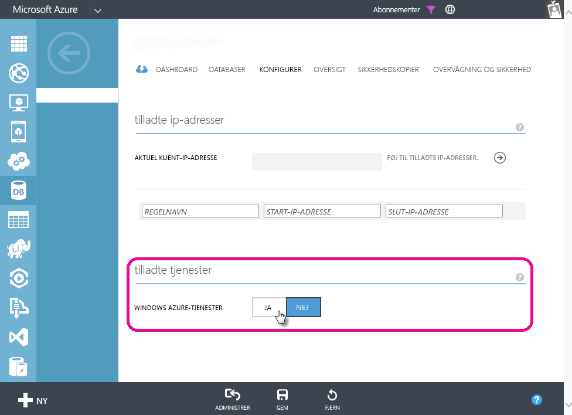

# Fejlfinding i forbindelse med planlagt opdatering af Azure SQL Databases i Power BI
Du kan finde detaljerede oplysninger om konfiguration af planlagt opdatering under [Opdater data i Power BI](refresh-data.md).

Hvis du får vist en fejl med fejlkoden 400 under redigering af legitimationsoplysningerne, kan du under konfigurationen af den planlagte opdatering af Azure SQL Database prøve følgende for at konfigurere den relevante firewallregel:

1. Log på din Azure-administrationsportalen
2. Gå til den Azure SQL-server, du konfigurerer opdateringen for
3. Slå 'Windows Azure-tjenester' til i sektionen om tilladte tjenester

  

Har du flere spørgsmål? [Prøv at spørge Power BI-community'et](http://community.powerbi.com/)

