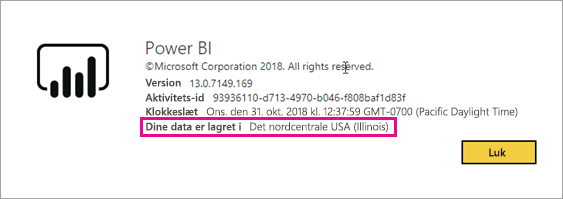

# Hvor er min Power BI-lejer placeret?

<iframe width="560" height="315" src="https://www.youtube.com/embed/0fOxaHJPvdM?showinfo=0" frameborder="0" allowfullscreen></iframe>

Find ud af, hvor din Power BI-lejer er placeret, og hvordan denne placering markeres. Learning placeringen er vigtigt, da det kan påvirke interaktionerne har du med tjenesten.

## Sådan afgør du, hvor din Power BI-lejer er placeret

Følg disse trin, for at finde det område din lejer befinder sig i.

1. Vælg hjælp ( **?** ) i den øverste menu i Power BI, og vælg derefter **Om Power BI**.

1. Søg efter værdien ud for **Dine data er lagret i**. Det er det område, hvor din lejer er placeret. Værdien, der er også det område, hvor dine data er gemt, medmindre du bruger dedikerede kapaciteter i forskellige områder for dine arbejdsområder.

    

## Sådan vælges dataområdet

Dataområdet er baseret på det land, du vælger, når du opretter lejeren. Markeringen gælder for at tilmelde dig til både Office 365 og Power BI, da disse oplysninger deles. Hvis dette er en ny lejer, skal du vælge det relevante land på listen, når du tilmelder dig.

Powerbi vælger et dataområde, der er tættest på dine valg, der bestemmer, hvor data lagres i din lejer.

> [!IMPORTANT]
> Du kan ikke ændre valget, når du opretter lejeren.

Har du flere spørgsmål? [Prøv at spørge Power BI-community'et](http://community.powerbi.com/)

