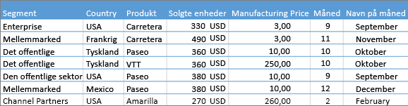
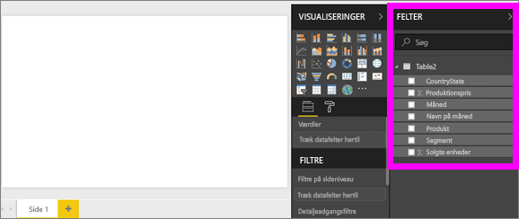
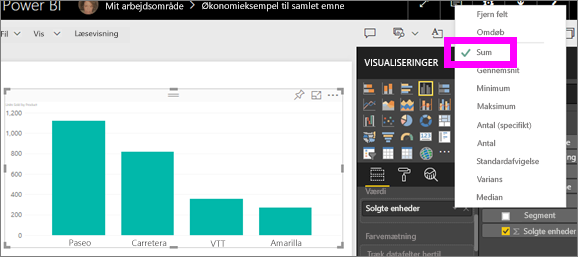
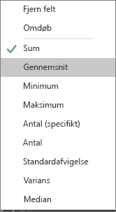
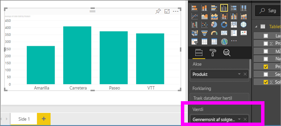
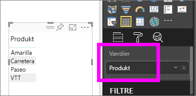
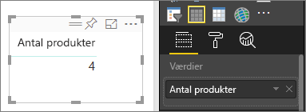
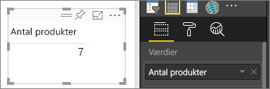

# Aggregeringer i Power BI-visualiseringer
## Hvad er en aggregering?
Du kan sommetider få brug for matematisk at kombinere værdier i dine data. Den matematiske handling kan f.eks. være sum, gennemsnit, maksimum, antal, osv. Når du kombinerer værdier i dine data, kaldes det *aggregering*. Resultatet af den matematiske handling er en *aggregering*. 

Når Power BI-tjenesten og Power BI Desktop opretter visualiseringer, aggregerer de muligvis dine data. Ofte er aggregeringen lige hvad du har brug for, men andre gange vil du måske aggregere værdierne på en anden måde.  F.eks. en sum i forhold til et gennemsnit. Der er flere forskellige måder at administrere og ændre den aggregering på, som bruges i en visualisering.

Lad os først se på *datatyper*, fordi datatypen bestemmer, hvordan og om den kan aggregeres.

## Datatyper
De fleste datasæt har mere end én type data. På det mest grundlæggende niveau er dataene enten  numeriske, eller også er de ikke. Numeriske data kan aggregeres ved hjælp af en sum, et gennemsnit, antal, minimum, varians og meget mere. Selv tekstdata, ofte kaldet *kategoriske* data, kan aggregeres. Hvis du prøver at aggregere et kategorisk felt (ved at placere det i et udelukkende numerisk interval, som f.eks. **Værdier** eller **Værktøjstip**), vil Power BI tælle forekomsterne af hver kategori eller tælle de særskilte forekomster af hver kategori. Og særlige datatyper, som datoer, har et par af deres egne aggregerede indstillinger: tidligste, seneste, første og sidste. 

I eksemplet nedenfor:
- **Solgte enheder** og **Produktionspris** er kolonner, der indeholder numeriske data
-  **Segment**, **Land**, **Produkt**, **Måned** og **Månedsnavn** indeholder kategoriske data

   

Når du opretter en visualisering i Power BI, aggregeres numeriske felter (standarden er *sum*) over nogle kategorifelter.  For eksempel "Solgte enheder ***efter produkt***,"Solgte  enheder ***efter måned***"og "Produktionspris ***efter Segment***. Nogle numeriske felter kaldes også for **mål**. Det er nemt at identificere mål i Power BI-rapporteditoren – mål vises med symbolet ∑ på listen Felter. Du kan finde flere oplysninger under [Rapporteditoren... få en introduktion](service-the-report-editor-take-a-tour.md).

## Hvorfor fungerer aggregeringer ikke, som jeg vil have dem til?
Arbejdet med aggregeringer i Power BI kan være forvirrende; måske har du et numerisk felt, og Power BI vil ikke lade dig ændre aggregeringen. Eller måske har du et felt, som f.eks. et år, som du ikke vil aggregere, men kun vil tælle antallet af forekomster af.

Kilden til problemet er oftest måden, hvorpå feltet er defineret i datasættet. Måske er feltet defineret som tekst, hvilket forklarer, hvorfor sammenlægning eller beregning af gennemsnit ikke virker. Desværre [kan kun datasættets ejer ændre måden, hvorpå et felt er kategoriseret](desktop-measures.md). Så du kan løse problemet, hvis du har ejertilladelser til datasættet, enten i Desktop eller det program, der blev brugt til at oprette datasættet (f.eks. Excel). Ellers skal du kontakte ejeren af datasættet for at få hjælp.  

Du kan med fordel bruge det særlige afsnit sidst i denne artikel kaldet **Tip og fejlfinding** for at få hjælp til at skære igennem forvirringen.  Hvis du ikke kan finde løsningen her, kan du stille dit spørgsmål i [Power BI-community-forummet](http://community.powerbi.com) for at få et hurtigt svar fra Power BI-teamet.

## Tilpas måden, hvorpå et numerisk felt aggregeres
Lad os antage, at du har et diagram, der sammenlægger solgte enheder for forskellige produkter, men du hellere vil beregne gennemsnittet. 

1. Opret et diagram, der bruger en kategori og en måling. I dette eksempel bruger vi Solgte enheder efter Produkt.  Som standard opretter Power BI et diagram, der sammenlægger solgte enheder, (mål i værdibrønden) for hvert produkt (kategori i aksebrønden).

   

2. Højreklik på målenheden i ruden Visualiseringer, og vælg den aggregeringstype, du skal bruge. I dette tilfælde vælger vi Gennemsnit. Hvis du ikke ser den aggregering, du skal bruge, kan du se "Tip og fejlfinding" nedenfor.  
   
   
   
   > [!NOTE]
   > De tilgængelige indstillinger i rullemenuen varierer afhængig af 1) det valgte felt og 2) måden, som feltet er kategoriseret på af datasættets ejer.
   > 
3. Din visualisering bruger nu aggregeret efter gennemsnit.

   

##    Metoder til at aggregere dine data

Nedenfor følger nogen af indstillingerne, der kan være tilgængelige ved aggregering af et felt:

* **Opsummer ikke**. Når du har valgt denne indstilling, bliver hvert felt behandlet særskilt og opsummeres ikke. Denne indstilling bruges ofte, hvis du har en numerisk id-kolonne, der ikke skal summeres.
* **Sum**. Dette lægger alle værdier i feltet sammen.
* **Gennemsnit**. Beregner et matematisk gennemsnit af værdierne.
* **Minimum**. Viser den mindste værdi.
* **Maksimum**. Viser den største værdi.
* **Antal (ikke tomme)**. Tæller antallet af værdier i feltet, der ikke er tomme.
* **Antal (distinkt).** Denne indstilling tæller antallet af forskellige værdier i feltet.
* **Standardafvigelse.**
* **Varians**.
* **Median**.  Viser median (middel)-værdien. Dette er den værdi, der har det samme antal elementer, over og under.  Hvis der er to medianer, beregner Power BI gennemsnittet af dem.

F.eks. disse data:

| Land | Antal |
|:--- |:--- |
| USA |100 |
| Storbritannien |150 |
| Canada |100 |
| Tyskland |125 |
| Frankrig | |
| Japan |125 |
| Australien |150 |

Giver de følgende resultater:

* **Opsummer ikke**: Hver værdi vises særskilt
* **Sum**: 750
* **Gennemsnit**: 125
* **Maksimum**:  150
* **Minimum**: 100
* **Antal (ikke tomme)**: 6
* **Antal (distinkt)**: 4
* **Standardafvigelse**: 20.4124145...
* **Varians**: 416.666...
* **Median**: 125

## Opret en aggregering ved hjælp af et kategorifelt (tekstfelt)
Du kan også aggregere et felt, der ikke er et numerisk felt. Hvis du f.eks. har et felt med produktnavn, kan du tilføje det som en værdi og derefter indstille det til **Antal** **Adskilt antal**, **Første** eller **Sidste**. 

1. I dette eksempel har vi trukket feltet **Produkt** til værdibrønden. Værdibrønden bruges typisk til numeriske felter. Power BI genkender, at dette er et tekstfelt, angiver aggregeringen til **Opsummer ikke** og giver os en tabel med én kolonne.
   
   
2. Hvis vi ændrer aggregeringen fra standarden **Opsummer ikke** til **Antal (adskilt)**, tæller Power BI antallet af forskellige produkter. I dette tilfælde er der 4.
   
   
3. Og hvis vi ændrer aggregeringen til **Antal**, tæller Power BI det samlede antal. I dette tilfælde er der 7 poster for **Produkt**. 
   
   

4. Ved at trække det samme felt (i dette tilfælde **Produkt**) til værdibrønden og lade standardaggregeringen være **Opsummer ikke**, opdeler Power BI antallet af produkter.

   

## Overvejelser og fejlfinding
Sp: Hvorfor har jeg ikke en **Opsummer ikke**-indstilling?

Sv: Det felt, du har valgt, er sandsynligvis et beregnet mål eller avanceret mål, der er oprettet i Excel eller [Power BI Desktop](desktop-measures.md). Hvert beregnede mål har sin egen hard-coded formel. Du kan ikke ændre den aggregering, der bruges.  F.eks, hvis det er en sum, kan den kun være en sum. På listen Felter vises *beregnede mål* med lommeregnersymbolet.

Sp: Mit felt **er** numerisk, så hvorfor kan jeg kun vælge **Antal** og **Distinkt antal**?

Sv. 1: Den sandsynlige forklaring er, at datasættets ejer, utilsigtet eller bevidst, *ikke* har klassificeret feltet som et tal. Hvis et datasæt for eksempel har et felt med **år**, så kan datasættets ejer kategorisere det som tekst, fordi der er større sandsynlighed for, at feltet **år** bliver talt (dvs. antallet af personer født i 1974), og ikke at det bliver opsummeret eller gennemsnitsberegnet. Hvis du er ejeren, kan du åbne datasættet i Power BI Desktop og bruge fanen **Udformning** for at ændre datatypen.  

Sv. 2: Hvis feltet har et lommeregnerikon, er det et *beregnet mål*, og hvert beregnede mål har sin egen hard-coded formel, der kun kan ændres af en datasætejer. Den benyttede beregning kan være en simpel aggregering, som f.eks. et gennemsnit eller en sum, men det kan også være noget mere kompliceret, som f.eks. en "procentdel af bidraget til forældrekategori" eller "løbende totalværdi siden årets begyndelse". I Power BI bliver der ikke opsummeret eller beregnet gennemsnit af resultaterne, men blot udført en genberegning (vha. den hard-coded formel) for hvert datapunkt.

Sv. 3:  En anden mulighed er, at du tabte feltet i en *bucket*, der kun tillader kategoriske værdier.  Hvis dette er tilfældet, så har du kun adgang til antal og distinkt antal.

Sv. 4: En tredje mulighed er, at du bruger feltet for en akse. Eksempelvis på en akse i et søjlediagram – her vises én søjle i Power BI for hver distinkte værdi – her vises slet ikke aggregerede feltværdier. 

>[!NOTE]
>Undtagelsen for denne regel er punktdiagrammer, som *kræver* aggregerede værdier for X- og Y-akserne.

Sp: Jeg har et punktdiagram, og jeg vil *ikke* have, at mit felt aggregerer.  Hvordan gør jeg det?

Sv: Føj feltet til intervallet **Oplysninger** og ikke til intervallerne X- eller Y-akser.

Sp: Når jeg føjer et tekstfelt til en visualisering, så indstilles de fleste af dem automatisk til sum, men nogle indstilles automatisk til gennemsnit eller antal eller en anden aggregering.  Hvorfor er standardakkumuleringen ikke altid den samme?

Sv: Datasætejere har mulighed for at indstille standardopsummeringen for hvert felt. Hvis du er ejer af et datasæt, skal du ændre standardopsummeringen på fanen **Udformning** i Power BI Desktop.

Sp: Jeg er datasætejer, og jeg vil gerne sikre, at et felt aldrig bliver aggregeret.

Sv: I Power BI Desktop, på fanen **Uformning**, skal du indstille **Datatype** til **Tekst**.

Sp: Jeg kan ikke se **Opsummer ikke** på rullelisten.

Sv: Prøv at fjerne feltet og tilføje det igen.

Har du flere spørgsmål? [Prøv at spørge Power BI-community'et](http://community.powerbi.com/)

