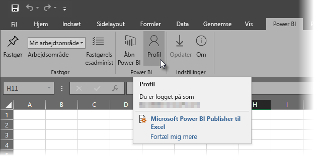

# Analysér i Excel
Der er tidspunkter, hvor du måske vil bruge Excel til at få vist og interagere med et datasæt, du har i Power BI. Det kan du gøre med **Analysér i Excel**, og du kan få adgang til pivottabel-, diagram- og udsnitsfunktioner i Excel, der er baseret på datasættet, der findes i Power BI.

## Krav
Der er et par krav til brugen af **Analysér i Excel**:

* **Analysér i Excel** understøttes for Microsoft Excel 2010 SP1 og nyere.
* Pivottabeller i Excel understøtter ikke træk og slip-sammenlægning af numeriske felter. Dit datasæt i Power BI *skal have foruddefinerede målinger*.
* Nogle organisationer har muligvis gruppepolitikregler, der forhindrer installation af de krævede **Analysér i Excel**-opdateringer i Excel. Hvis du ikke kan installere opdateringerne, skal du kontakte din administrator.
* **Analysér i Excel** kræver, at datasættet er i Power BI Premium, eller at brugeren har en Power BI Pro-licens. Hvis du vil vide mere om forskellene i funktionaliteten mellem licenstyper, kan du se [Power BI-funktioner efter licenstype](service-features-license-type.md). 
* Brugere kan oprette forbindelse til datasæt via Analysér i Excel, hvis de har læsetilladelse til det underliggende datasæt.  En bruger kan have dette på flere måder: Brugeren kan f.eks. være medlem af det arbejdsområde, der indeholder datasættet. Der kan deles en rapport eller et dashboard, hvor datasættet bruges, med brugeren. Eller brugeren kan have tilladelse til en app, der indeholder datasættet.

## Hvordan fungerer det?
Når du vælger **Analysér i Excel** i menuen med tre prikker (...), der er tilknyttet et datasæt eller en rapport i **Power BI**, opretter Power BI en .ODC-fil og downloader den fra browseren til din computer.

Når du åbner filen i Excel, vises en tom **Pivottabel**- og **Felter**-liste med tabeller, felter og målinger fra Power BI-datasættet. Du kan oprette pivottabeller og diagrammer og analysere dette datasæt på samme måde, som du ville arbejde med et lokalt datasæt i Excel.

. ODC-filen indeholder en MSOLAP-forbindelsesstreng, der opretter forbindelse til dit datasæt i Power BI. Når du analyserer eller arbejder med dataene, forespørger Excel på dette datasæt i Power BI og returnerer resultaterne til Excel. Hvis dette datasæt opretter forbindelse til en direkte datakilde ved hjælp af DirectQuery, forespørger Power BI på datakilden og returnerer resultatet til Excel.

**Analysér i Excel** er meget brugbart til de datasæt og rapporter, der opretter forbindelse til *Tabel til Analysis Services* eller *flerdimensionelle* databaser, eller fra Power BI Desktop-filer eller Excel-projektmapper med datamodeller, der har fået oprettet modelmålinger ved hjælp af DAX (Data Analysis Expressions).

## Kom i gang med Analysér i Excel
I Power BI skal du vælge menuen med tre prikker ud for en rapport eller et datasæt (... ud for rapport- eller datasætnavnet), og i menuen, der vises, skal du vælge **Analysér i Excel**.

### Installer opdateringer til Excel
Når du bruger **Analysér i Excel** for første gang, skal du installere opdateringer til Excel-bibliotekerne. Du bliver bedt om at downloade og køre opdateringer til Excel (dette starter installationen af Windows Installer-pakken *SQL_AS_OLEDDB.msi*). Denne pakke installerer **Microsoft AS OLE DB-provider til SQL Server 2016 RC0 (prøveversion)**.

> [!NOTE]
> Sørg for at markere **Vis ikke dette igen** i dialogboksen **Installer Excel-opdateringer**. Du behøver kun at installere opdateringen én gang.
> 
> 

Hvis du har brug for at installere Excel-opdateringerne til **Analysér i Excel** igen, kan du downloade opdateringen fra ikonet **Download** i Power BI som vist i følgende billede.

### Log på Power BI
Selvom du er logget på Power BI i din browser, kan du blive bedt om at logge på Power BI med din Power BI-konto, første gang du åbner en ny. ODC-fil i Excel. Dette godkender forbindelsen fra Excel til Power BI.

### Brugere med flere Power BI-konti
Nogle brugere har flere Power BI-konti, og disse brugere kan opleve situationer, hvor de er logget på Power BI med én konto, men den konto, der har adgang til datasættet, der bruges i Analysér i Excel, er en anden konto. I disse situationer kan du få vist fejlen **Forbudt** eller en logonfejl, når du forsøger at få adgang til et datasæt, der bruges i en projektmappe i Analysér i Excel.

Du får mulighed for at logge på igen, og på dette tidspunkt kan du så logge på med den Power BI-konto, der har adgang til datasættet, som Analysér i Excel skal have adgang til. Du kan også vælge **Profil** fra båndfanen **Power BI** i Excel, som identificerer den konto, du er i øjeblikket er logget på med, og få et link, så du kan du logge af (og derefter logge på med en anden konto).

### Aktivér dataforbindelser
Når du vil analysere dine Power BI-data i Excel, bliver du bedt om at bekræfte filnavnet og stien til .odc-filen og derefter vælge **Aktivér**.

> [!NOTE]
> Administratorer for Power BI-lejere kan bruge *Power BI-administrationsportalen* til at deaktivere brugen af **Analysér i Excel** med datasæt i det lokale miljø, der er placeret på databaser i Analysis Services (AS). Når denne indstilling er deaktiveret, er **Analysér i Excel** deaktiveret for AS-databaser, men er fortsat tilgængelige til brug sammen med andre datasæt.
> 
> 

## Analysér
Nu, hvor Excel er åben, og du har en tom pivottabel, er du klar til at foretage alle mulige forskellige analyser med dit Power BI-datasæt. Som det er tilfældet med andre lokale projektmapper kan du med Analysér i Excel oprette pivottabeller, diagrammer, tilføje data fra andre kilder osv. Og du kan naturligvis oprette forskellige regneark med en lang række visninger i dine data.

> [!NOTE]
> Det er vigtigt at vide, at når du bruger **Analysér i Excel**, vises alle data på detaljeniveau for alle brugere med tilladelse til datasættet.
> 
> 

## Gem
Du kan gemme denne projektmappe, der er forbundet med Power BI-datasæt, på samme måde som en hvilken som helst anden projektmappe. Du kan dog ikke publicere eller indlæse projektmappen i Power BI igen, fordi du kun kan publicere eller importere projektmapper til Power BI, som har data i tabeller, eller som har en datamodel. Da den nye projektmappe blot har forbindelse til datasættet i Power BI, vil du køre i cirkler, hvis du udgiver eller importerer den i Power BI!

## Deling
Når din projektmappe er gemt, kan du dele den med andre Power BI-brugere i din organisation.

Når en bruger, som du har delt din projektmappe med, åbner projektmappen, får vedkommende vist dine pivottabeller og data, sådan som de så ud, da projektmappen sidst blev gemt, hvilket muligvis ikke er den nyeste version af dataene. For at få de nyeste data skal brugerne bruge knappen **Opdater** på båndet **Data**. Og da projektmappen er forbundet med et datasæt i Power BI, skal brugere, der forsøger at opdatere projektmappen, logge på Power BI og installere Excel-opdateringerne, første gang de forsøger at opdatere ved hjælp af denne metode.

Da brugere får brug for at opdatere datasættet, og opdatering for eksterne forbindelser ikke understøttes i Excel Online, anbefales det, at brugere åbner projektmappen i desktop-versionen af Microsoft Excel på deres egen computer.

## Fejlfinding
Når du bruger Analysér i Excel, kan du i nogle tilfælde få et uventet resultat, eller funktionen fungerer måske ikke som forventet. [Denne side indeholder løsninger på almindelige problemer med brug af Analysér i Excel](desktop-troubleshooting-analyze-in-excel.md)
