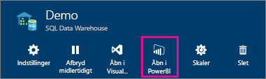
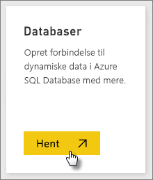
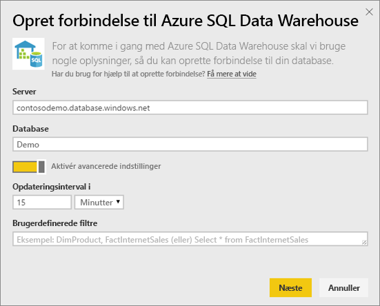
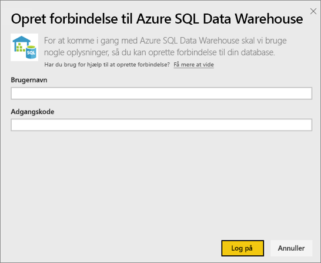

# Azure SQL Data Warehouse med DirectQuery

Med Azure SQL Data Warehouse med DirectQuery kan du oprette dynamiske rapporter, der er baseret på data og målinger, du allerede har i Azure SQL Data Warehouse. Med DirectQuery sendes forespørgsler tilbage til dit Azure SQL Data Warehouse i realtid, når du udforsker dataene. Forespørgsler i realtid, kombineret med skalaen for SQL Data Warehouse, gør det muligt for brugere at oprette dynamiske rapporter på få minutter med terabytes af data. Desuden kan brugere med indførelsen af knappen **Åbn i Power BI** oprette direkte forbindelse fra Power BI til deres SQL Data Warehouse uden at skulle angive oplysninger manuelt.

Når du bruger SQL Data Warehouse-forbindelsen:

* Angiv det fuldt kvalificerede servernavn, når du opretter forbindelse (se flere oplysninger nedenfor)
* Kontrollér, at firewallreglerne for serveren er konfigureret til at "Tillade adgang til Azure-tjenester"
* Hver handling, f.eks. markering af en kolonne eller tilføjelse af et filter, vil direkte forespørge Data Warehouse
* Felterne er angivet til at opdatere ca. hver 15 minutter, og opdateringen skal ikke planlægges.  Opdateringen kan tilpasses i Avancerede indstillinger, når du opretter forbindelse.
* Spørgsmål og svar er ikke tilgængelige for DirectQuery-datasæt
* skemaændringer hentes ikke automatisk

Disse begrænsninger og noter kan ændres, efterhånden som vi fortsat forbedrer oplevelserne. Trinnene til at oprette forbindelse er beskrevet nedenfor.

## Brug knappen "Åbn i Power BI"

> [!Important]
> Vi har forbedret vores netværksmuligheder til Azure SQL Data Warehouse.  For at få den bedste oplevelse og oprette forbindelse til din Azure SQL Data Warehouse-datakilde kan du bruge Power BI Desktop.  Når du har bygget din model og rapport, kan du udgive den på Power BI-tjenesten.  Den direkte forbindelse til Azure SQL Data Warehouse i Power BI-tjenesten frarådes nu.

Den nemmeste måde at flytte mellem dit SQL Data Warehouse og Power BI er med knappen **Åbn i Power BI** på Azure-portalen. Med denne knap kan du nemt og problemfrit begynde at oprette nye dashboards i Power BI.

1. For at komme i gang skal du gå til din instans af SQL Data Warehouse på Azure-portalen. Bemærk, at SQL Data Warehouse i øjeblikket kun findes på Azure Portal.

2. Klik på knappen **Åbn i Power BI**

    

3. Hvis vi ikke kan logge dig på direkte, eller hvis du ikke har en Power BI-konto, skal du logge på.

4. Du sendes videre til SQL Data Warehouse-forbindelsessiden, hvor oplysningerne fra dit SQL Data Warehouse er udfyldt på forhånd. Angiv dine legitimationsoplysninger, og tryk på Tilslut for at oprette forbindelse.

## Opret forbindelse via Power BI

SQL Data Warehouse er også angivet på siden Power BI Hent data. 

1. Vælg **Hent data** nederst i navigationsruden.  

    

2. I **Databaser** skal du vælge **Hent**.

    

3. Vælg **SQL Data Warehouse** \> **Opret forbindelse**.

    

4. Angiv de nødvendige oplysninger for at oprette forbindelse. I sektionen **Find parametre** nedenfor kan du se, hvor disse data kan være placeret på Azure Portal.

    

    

    

   > [!NOTE]
   > Brugernavnet er en bruger, der er defineret i din Azure SQL Data Warehouse-forekomst.

5. Analysér datasættet ved at vælge det nye felt eller det nyoprettede dataset, der er angivet med en stjerne. Dette datasæt har samme navn som din database.

    

6. Du kan udforske alle tabellerne og kolonnerne. Hvis du markerer en kolonne, sendes en forespørgsel tilbage til datakilden og opretter dynamisk det visuelle element. Filtre skal også oversættes til forespørgsler tilbage til dit datawarehouse. Disse visuelle elementer kan gemmes i en ny rapport og fastgøres tilbage i dit dashboard.

    

## Find parameterværdier

Dit fulde gyldige servernavn og databasenavn kan findes på Azure-portalen. Bemærk, at SQL Data Warehouse i øjeblikket kun findes på Azure Portal.

> [!NOTE]
> Hvis din Power BI-lejer befinder sig i det samme område som Azure SQL Data Warehouse, er der ingen gebyrer for udgående data. Du kan se, hvor din Power BI-befinder sig, ved hjælp af [disse instruktioner](https://docs.microsoft.com/power-bi/service-admin-where-is-my-tenant-located).

[!INCLUDE [direct-query-sso](includes/direct-query-sso.md)]

## Næste trin

* [Hvad er Power BI?](fundamentals/power-bi-overview.md)  
* [Hent data til Power BI](service-get-data.md)  
* [Azure SQL Data Warehouse](/azure/sql-data-warehouse/sql-data-warehouse-overview-what-is/)

Har du flere spørgsmål? [Prøv at spørge Power BI-community'et](https://community.powerbi.com/)
