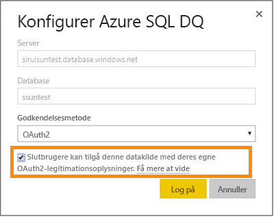

# Azure SQL Database med DirectQuery
Få mere at vide om, hvordan du kan oprette direkte forbindelse til Azure SQL Database og oprette rapporter, der bruger livedata. Du kan beholde dine data ved kilden i stedet for i Power IB.

Med DirectQuery sendes forespørgsler tilbage til din Azure SQL Database, mens du udforsker dataene i rapportvisning. Denne oplevelse foreslås til brugere, der kender de databaser og enheder, de opretter forbindelse til.

**Bemærk!**

* Angiv det fuldt gyldige servernavn, når du opretter forbindelse (se yderligere oplysninger nedenfor)
* Kontrollér, at firewallreglerne for databasen er konfigureret til at "[Tillade adgang til Azure-tjenester](https://msdn.microsoft.com/library/azure/ee621782.aspx)".
* Hver handling, f.eks. markering af en kolonne eller tilføjelse af et filter, vil sende en forespørgsel tilbage til databasen
* Felterne opdateres ca. hver time (opdateringen skal ikke planlægges). Dette kan tilpasses i Avancerede indstillinger, når du opretter forbindelse.
* Spørgsmål og svar er ikke tilgængelige for DirectQuery-datasæt
* Skemaændringer hentes ikke automatisk

Disse begrænsninger og noter kan ændres, efterhånden som vi fortsat forbedrer oplevelserne. Trinnene til at oprette forbindelse er beskrevet nedenfor. 

## Power BI Desktop og DirectQuery
For at kunne oprette forbindelse til Azure SQL Database med DirectQuery skal du bruge Power BI Desktop. Denne metode sikrer yderligere fleksibilitet og funktioner. De rapporter, der oprettes ved hjælp af Power BI Desktop, kan derefter publiceres til Power BI-tjenesten. Du kan få mere at vide om at oprette forbindelse til [Azure SQL Database med DirectQuery](desktop-use-directquery.md) i Power BI Desktop. 

## Enkeltlogon

Når du har publiceret et datasæt med Azure SQL DirectQuery til tjenesten, kan du aktivere enkeltlogon (SSO) via Azure Active Directory (Azure AD) OAuth2 for dine slutbrugere. 

Du aktiverer SSO ved at gå til indstillinger for datasæt, åbne fanen **Datakilder** og markere feltet SSO.

Når indstillingen SSO er aktiveret, og dine brugere får adgang til rapporter, som er bygget på datakilden, sender Power BI deres godkendte Azure AD-legitimationsoplysninger i forespørgslerne til Azure SQL-databasen. På den måde kan Power BI overholde de sikkerhedsindstillinger, der er konfigureret på datakildeniveauet.

Indstillingen SSO gælder for alle datasæt, der bruger denne datakilde. Den påvirker ikke den godkendelsesmetode, der bruges til import af scenarier.

## Find parameterværdier
Dit fulde gyldige servernavn og databasenavn kan findes i Azure Portal.

## Næste trin
[Brug DirectQuery i Power BI Desktop](desktop-use-directquery.md)  
[Kom i gang med Power BI](service-get-started.md)  
[Hent data til Power BI](service-get-data.md)  
Har du flere spørgsmål? [Prøv at spørge Power BI-community'et](http://community.powerbi.com/)
