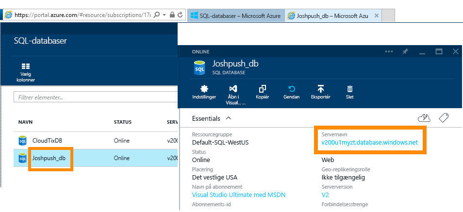
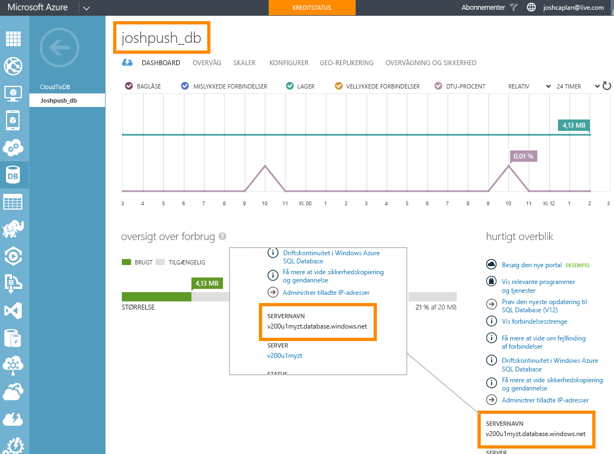

# Azure SQL Database med DirectQuery

Få mere at vide om, hvordan du kan oprette direkte forbindelse til Azure SQL Database og oprette rapporter, der bruger livedata. Du kan beholde dine data ved kilden i stedet for i Power IB.

Med DirectQuery sendes forespørgsler tilbage til din Azure SQL Database, mens du udforsker dataene i rapportvisning. Denne oplevelse foreslås til brugere, der kender de databaser og enheder, de opretter forbindelse til.

**Bemærk!**

* Angiv det fuldt gyldige servernavn, når du opretter forbindelse (se yderligere oplysninger nedenfor).
* Kontrollér, at firewallreglerne for databasen er konfigureret til "[Tillad adgang til Azure-tjenester](https://docs.microsoft.com/azure/sql-database/sql-database-networkaccess-overview#allow-azure-services)".
* Hver handling, f.eks. markering af en kolonne eller tilføjelse af et filter, vil sende en forespørgsel tilbage til databasen.
* Felterne opdateres ca. hver time (opdateringen skal ikke planlægges). Du kan tilpasse, hvor ofte der skal opdateres, i Avancerede indstillinger, når du opretter forbindelse.
* Spørgsmål og svar er ikke tilgængelig for DirectQuery-datasæt.
* Skemaændringer hentes ikke automatisk.

Disse begrænsninger og noter kan ændres, efterhånden som vi fortsat forbedrer oplevelserne. Trinnene til at oprette forbindelse er beskrevet nedenfor.

> [!Important]
> Vi har forbedret vores netværksmuligheder til Azure SQL Database.  For at få den bedste oplevelse og oprette forbindelse til din Azure SQL Database-datakilde kan du bruge Power BI Desktop.  Når du har bygget din model og rapport, kan du udgive den på Power BI-tjenesten.  Den direkte forbindelse til Azure SQL Database i Power BI-tjenesten frarådes nu.

## Power BI Desktop og DirectQuery

Hvis du vil oprette forbindelse til Azure SQL Database med DirectQuery, skal du bruge Power BI Desktop. Denne metode sikrer yderligere fleksibilitet og funktioner. De rapporter, der oprettes ved hjælp af Power BI Desktop, kan derefter publiceres til Power BI-tjenesten. Du kan få mere at vide om at oprette forbindelse til [Azure SQL Database med DirectQuery](desktop-use-directquery.md) i Power BI Desktop.

## Find parameterværdier

Du kan finde dit fulde gyldige servernavn og databasenavn på Azure Portal.

[!INCLUDE [direct-query-sso](includes/direct-query-sso.md)]

## Næste trin

* [Brug DirectQuery i Power BI Desktop](desktop-use-directquery.md)  
* [Hvad er Power BI?](fundamentals/power-bi-overview.md)  
* [Hent data til Power BI](service-get-data.md)  

Har du flere spørgsmål? [Prøv at spørge Power BI-community'et](https://community.powerbi.com/)
