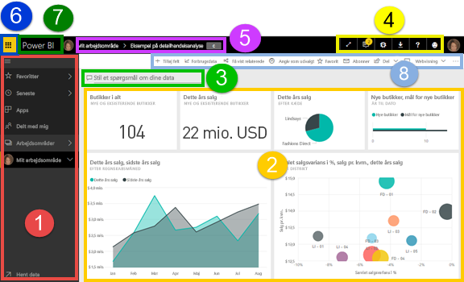
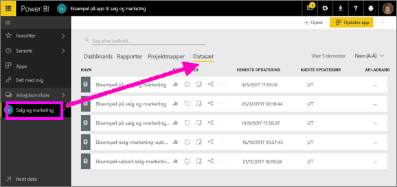
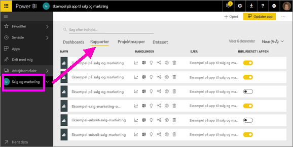
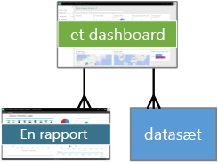
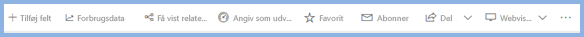

# Power BI – grundlæggende begreber for Power BI-tjenesten

Denne artikel forudsætter, at du har allerede har [tilmeldt dig Power BI-tjenesten](service-self-service-signup-for-power-bi.md) og [tilføjet nogle data](service-get-data.md).

Når du åbner Power BI-tjenesten, får du vist et ***dashboard***. Dashboards er noget, der adskiller Power BI-tjenesten fra Power BI Desktop.

De vigtigste funktioner i Power BI-tjenestens brugergrænsefladen er følgende:

1. navigationsrude (venstre)
2. canvas (i dette tilfælde dashboard med felter)
3. Boks med spørgsmål og svar
4. ikonknapper, herunder hjælp og feedback
5. dashboardtitel (navigationssti, dvs. brødkrummer)
6. Office 365-appstarter
7. Power BI-startknap
8. Navngivne ikonknapper

Vi vil gå i dybden med dette senere, men lad os først se på nogle Power BI-begreber.

Du kan også vælge at se denne video, før du læser resten af denne artikel.  I videoen gennemgår Will de grundlæggende begreber og giver en præsentation af Power BI-tjenesten.

<iframe width="560" height="315" src="https://www.youtube.com/embed/B2vd4MQrz4M" frameborder="0" allowfullscreen></iframe>

## Power BI-begreber
De fire overordnede elementer i Power BI er: ***dashboards***, ***rapporter***, ***projektmapper*** og ***datasæt***. Og de er alle organiseret i ***arbejdsområder***. Det er vigtigt at forstå arbejdsområder, før vi går videre til de fire overordnede elementer, så lad os starte der. 

## Arbejdsområder
Arbejdsområder er objektbeholdere til dashboards, rapporter, projektmapper og datasæt i Power BI. Der er to typer arbejdsområder: *Mit arbejdsområde* og *apparbejdsområder*. Hvad er en *app*? En *app* i Power BI er en samling dashboards og rapporter, der er bygget til at levere vigtige metrikker til organisationen. Apps er interaktive, men kan ikke redigeres. 

- *Mit arbejdsområde* er et personligt arbejdsområde til Power BI-kunder, hvor de kan arbejde med dit indhold. Kun du har adgang til dit Mit arbejdsområde. Du kan dele dashboards og rapporter fra Mit arbejdsområde. Hvis du vil samarbejde om dashboards og rapporter eller oprette en app, skal du arbejde i et apparbejdsområde.      
-  *Apparbejdsområder* bruges til at samarbejde og dele indhold med kolleger. Det er også de steder, hvor du opretter, publicerer og administrerer apps for din organisation. De er en form for midlertidige områder og beholdere for det indhold, der udgør en Power BI-app. Du kan føje kolleger til dine apparbejdsområder og samarbejde om dashboards, rapporter, projektmapper og datasæt. Alle medlemmer af apparbejdsområdet skal bruge Power BI Pro-licenser, men appforbrugeren (de kolleger, der har adgang til apps) behøver ikke nødvendigvis at have Pro-licenser.  

Du kan få mere at vide i afsnittet **Del dit arbejde** i indholdsfortegnelsen, som starter med [Hvordan skal jeg samarbejde og dele dashboards og rapporter](service-how-to-collaborate-distribute-dashboards-reports.md)

Lad os gå videre med Power BI-elementerne. Du kan ikke have dashboards og rapporter uden data (det vil sige, du kan have tomme dashboards og tomme rapporter, men de er ikke til meget nytte, før de har data), så lad os starte med **datasæt**.

## Datasæt
Et *datasæt* er en samling af data, som du *importerer* eller *opretter forbindelse* til. Med Power BI kan du oprette forbindelse til og importere alle mulige forskellige datasæt og samle dem alle sammen på ét sted.  

Datasæt er knyttet til *arbejdsområder*, og et enkelt datasæt kan være en del af mange arbejdsområder. Når du åbner et arbejdsområde, vises de tilknyttede datasæt under fanen **Datasæt**. Hvert angivet datasæt repræsenterer en enkelt datakilde, f.eks. en Excel-projektmappe på OneDrive, et lokalt SSAS-tabeldatasæt eller et Salesforce-datasæt. Der er mange forskellige understøttede datakilder, og vi tilføjer hele tiden nye. [Se listen over typer af datasæt, der kan bruges med Power BI](service-get-data.md).

I eksemplet nedenfor har jeg valgt apparbejdsområdet "Salg og marketing" og klikket på fanen for **datasæt**.

**ÉT** datasæt...

* kan bruges igen og igen i et enkelt eller i mange arbejdsområder.
* kan bruges i mange forskellige rapporter.
* Visualiseringer fra dette ene datasæt kan vises på mange forskellige dashboards.
  
  

Hvis du vil [oprette forbindelse til eller importere et datasæt](service-get-data.md), skal du vælge **Hent Data** (nederst på venstre navigationslinje) eller vælge plusikonet **+ Opret > Datasæt** (i øverste højre hjørne). Følg vejledningen for at oprette forbindelse til eller importere den specifikke kilde og føje datasættet til det aktive arbejdsområde. Nye datasæt markeres med en gul stjerne. Det arbejde, du udfører i Power Bi, ændrer ikke det underliggende datasæt.

Hvis du er [en del af et ***apparbejdsområde***](service-collaborate-power-bi-workspace.md), er datasæt, der er tilføjet af et medlem af arbejdsområdet, tilgængelige for de andre medlemmer af arbejdsområdet.

Datasæt kan opdateres, omdøbes, udforskes og fjernes. Brug et datasæt til at oprette en rapport fra bunden eller ved at køre [hurtig indsigt](service-insights.md).  Hvis du vil se, hvilke rapporter og dashboards der allerede bruger et datasæt, skal du vælge **Få vist relaterede**. Vælg et datasæt for at udforske det. Det, du rent faktisk gør, er at åbne datasættet i rapporteditoren, hvor du virkelig kan starte med at udforske dataene og oprette visualiseringer. Så lad os gå videre til næste emne: rapporter.

### Grav dybere
* [Power BI Premium – hvad er det?](service-premium.md)
* [Hent data til Power BI](service-get-data.md)
* [Eksempel på datasæt til Power BI](sample-datasets.md)

## Rapporter
En Power BI-rapport er en eller flere sider med visualiseringer (diagrammer og grafer, f.eks. kurvediagrammer, cirkeldiagrammer, træstrukturdiagrammer og mange, mange flere). Visualiseringer kaldes også ***visuelle elementer***. Alle visualiseringerne i en rapport stammer fra et enkelt datasæt. Rapporter kan oprettes fra bunden i Power BI, kan importeres med dashboards, som kolleger deler med dig, eller kan oprettes, når du opretter forbindelse til datasæt fra Excel, Power BI Desktop, databaser, SaaS-programmer og [apps](service-get-data.md).  Når du f.eks. opretter forbindelse til en Excel-projektmappe, der indeholder Power View-ark, opretter Power BI en rapport, der er baseret på de ark. Og når du opretter forbindelse til et SaaS-program, importerer Power BI en færdigbygget rapport.

Der er to forskellige tilstande, som du kan se og interagere med rapporter i: [Læsevisning og Redigeringsvisning](service-reading-view-and-editing-view.md).  Kun forfatteren af rapporten, medejerne og dem, der har tilladelse, har adgang til alle den udforskning, udformning, oprettelse og delingsfunktionen i ***Redigeringsvisning*** for denne rapport. Og de personer, de deler rapporten med, kan udforske og interagere med rapport ved hjælp af ***Læsevisning***.   

Når du åbner et arbejdsområde, vises de tilknyttede rapporter under fanen **Rapporter**. Hver rapport på listen repræsenterer én eller flere siders visualiseringer, der er baseret på et af de underliggende datasæt. Hvis du vil åbne en rapport, skal du blot markere den. 

Når du åbner en app, vises et dashboard.  Du kan få adgang til en underliggende rapport ved at vælge et dashboardfelt (mere om disse senere), der er fastgjort fra en rapport. Vær opmærksom på, at ikke alle felter er fastgjort fra rapporter, så du skal muligvis klikke på nogle felter for at finde en rapport. 

Rapporten åbnes som standard i Læsevisning.  Du skal blot vælge **Rediger rapport** for at åbne den i Redigeringsvisning (hvis du har de nødvendige tilladelser). 

I eksemplet nedenfor har jeg valgt apparbejdsområdet "Salg og marketing" og klikket på fanen for **rapporter**.

**ÉN** rapport...

* er inkluderet i et enkelt arbejdsområde.
* kan være knyttet til flere dashboards i det pågældende arbejdsområde (felter, der er fastgjort fra den ene rapport, kan blive vist på flere dashboards).
* kan oprettes ved brug af data fra et datasæt. (en lille undtagelse til dette er, at Power BI Desktop kan kombinere mere end et datasæt til en enkelt rapport, og at rapporten kan importeres til Power BI)
  
  

### Grav dybere
* [Rapporter i Power BI-tjenesten og Power BI Desktop](service-reports.md)
* [Rapporter i Power BI-mobilapps](mobile-reports-in-the-mobile-apps.md)

## Dashboards
Et *dashboard* er noget, du opretter **i Power BI-tjenesten**, eller noget en kollega opretter **i Power BI-tjenesten** og deler med dig. Det er et enkelt lærred, der indeholder ingen eller flere felter og widgets. Hvert felt, der er fastgjort fra en rapport eller fra [Spørgsmål og svar ](power-bi-q-and-a.md), viser en enkelt [visualisering](power-bi-report-visualizations.md), der blev oprettet fra et datasæt og fastgjort til dashboardet. Hele rapportsider kan også fastgøres til et dashboard som et enkelt felt. Der er mange forskellige måder at føje felter til dit dashboard; for mange til at dække i dette oversigtsemne. Du kan få mere at vide i [Dashboard-felter i Power BI](service-dashboard-tiles.md). 

Hvorfor opretter personer dashboards?  Her er blot nogle af årsagerne:

* for hurtigt at se alle de oplysninger, der er nødvendige for at træffe beslutninger
* for at overvåge de vigtigste oplysninger om virksomheden
* for at sikre, at alle kollegaer er på samme side og får vist og bruger de samme oplysninger
* for at overvåge tilstanden for et produkt eller en virksomhed, en afdeling eller marketingkampagne osv.
* for at oprette en tilpasset visning af et større dashboard – alle de målepunkter, der betyder noget for dig

Når du åbner et arbejdsområde, vises de tilknyttede dashboards under fanen **Dashboards**. Hvis du vil åbne et dashboard, skal du blot vælge det. Når du åbner en app, vises et dashboard.  Hvert enkelt dashboard repræsenterer en brugerdefineret visning af nogle undersæt af de underliggende datasæt.  Hvis du ejer dashboardet, har du også redigeringsadgang til den/de underliggende datasæt og rapporter.  Hvis dashboardet er delt med dig, kan du interagere med dashboardet og de underliggende rapporter, men kan ikke gemme ændringer.

Der er mange forskellige måder, som du eller en kollega kan [dele et dashboard](service-share-dashboards.md) på. Power BI Pro er påkrævet for at dele et dashboard og muligvis også for at få vist et delt dashboard.

> [!NOTE]
> Fastgørelse og felter dækkes mere detaljeret nedenfor under overskriften "Dashboard med felter".
> 

**ÉT** dashboard...

* er knyttet til et enkelt arbejdsområde
* kan vise visualiseringer fra mange forskellige datasæt
* kan vise visualiseringer fra mange forskellige rapporter
* kan vise visualiseringer, der er fastgjort fra andre funktioner (f.eks. Excel)
  
  

### Grav dybere
* [Opret et nyt tomt dashboard, og hent derefter nogle data](service-dashboard-create.md)
* [Dupliker et dashboard](service-dashboard-copy.md) 
* [Opret en telefonvisning af et dashboard](service-create-dashboard-mobile-phone-view.md)

## Projektmapper
Projektmapper er en særlig type datasæt. Hvis du har læst afsnittet om **datasæt** ovenfor, ved du stort set alt, du har brug for at vide om projektmapper. Men du undrer dig måske over, hvorfor Power BI nogle gange klassificerer en Excel-projektmappe som et **datasæt** og andre gange som en **projektmappe**. 

Når du bruger **Hent data** med Excel-filer, har du mulighed for at *importere* eller *oprette forbindelse* til filen. Når du vælger at oprette forbindelse, vises din projektmappe i Power BI på samme måde, som den ville blive vist i Excel Online. Men i modsætning til Excel Online får du nogle fantastiske funktioner, så du kan fastgøre elementer fra dine regneark direkte i dine dashboards.

Du kan ikke redigere din projektmappe i Power BI. Men hvis du har brug at foretage ændringer, kan du klikke på Rediger og derefter redigere din projektmappe i Excel Online eller åbne den i Excel på din computer. Alle ændringer, du foretager, gemmes i projektmappen på OneDrive.

### Grav dybere
* [Hent data fra Excel-projektmappefiler](service-excel-workbook-files.md)
* [Publicer på Power BI fra Excel 2016](service-publish-from-excel.md)

## Mit arbejdsområde
Vi har nu været omkring arbejdsområder og komponenter. Lad os se nærmere på Power BI-grænsefladen og gennemse de dele, der udgør landingssiden til Power BI-tjenesten.

### 1. **Navigationsrude** (venstre)
Brug navigationsruden til at finde og flytte mellem dine arbejdsområder og Power BI-komponenterne: dashboards, rapporter, projektmapper og datasæt.  

  

* Vælg **Hent Data** for at [føje datasæt, rapporter og dashboards til Power BI](service-get-data.md).
* Udvid og skjul navigationslinjen med dette ikon .
* Åbn eller administrer dit foretrukne indhold ved at vælge **Favoritter**.
* Få vist og åbn det indhold, du senest har besøgt, ved at vælge **Seneste**.
* Få vist, åbn eller slet en app ved at vælge **Apps**.
* Har en kollega delt indhold med dig? Vælg **Delt med mig** for at søge efter og sortere dette indhold for at finde det, du har brug for.
* Få vist og åbn dine arbejdsområder ved at vælge **Arbejdsområder**.

Klik én gang

* på et ikon eller overskriften for at åbne i indholdsvisning
* på en højre-pil (>) for at åbne en pop op-menu med favoritter, seneste og arbejdsområder 
* på en dobbeltvinkel for at få vist rullelisten **Mit arbejdsområde** med dashboards, rapporter, projektmapper og datasæt
* på et datasæt for at udforske det

### 2. **Canvas** 
Da vi har åbnet et dashboard, vises visualiseringsfelter på canvasområdet. Hvis vi f.eks. havde åbnet rapporteditoren, ville en rapportside været blevet vist på canvasområdet. 

Dashboards består af [felter](service-dashboard-tiles.md).  Felter oprettes i rapportens Redigeringsvisning, Spørgsmål og svar og andre dashboards og kan fastgøres fra Excel, SSRS og meget mere. En særlig type felt kaldet en [widget](service-dashboard-add-widget.md) føjes direkte til dashboardet. De felter, der vises på et dashboard, blev specifikt sat der af en rapportforfatter/-ejer.  Dét at føje et felt til et dashboard kaldes *fastgørelse*.

Du kan få mere at vide om dette i **Dashboards** (ovenfor).

### 3. **Boks med spørgsmål og svar**
Én måde at udforske dine data er at stille et spørgsmål og lade Power BIs Spørgsmål og svar give dig et svar i form af en visualisering. Spørgsmål og svar kan bruges til at føje indhold til et dashboard eller en rapport.

Spørgsmål og svar søger efter et svar i den/de datasæt, der har forbindelse til dashboardet.  Et forbundet datasæt er et datasæt, der har mindst ét felt, der er fastgjort til dette dashboard.

Så snart du begynder at skrive dit spørgsmål, fører Spørgsmål og svar dig til siden Spørgsmål og svar. Mens du skriver, hjælper Spørgsmål og svar dig med at stille det rette spørgsmål og finde det bedste svar med omformuleringer, autofyld, forslag og meget mere. Når du har en visualisering (svar), som du synes om, kan du fastgøre den til dashboardet. Du kan få mere at vide i [Spørgsmål og svar i Power BI](power-bi-q-and-a.md).

### 4. **Ikonknapper** 
Ikonerne øverst til højre er dine ressourcer til indstillinger, beskeder, downloads samt til at få hjælp fra og give feedback til Power BI-teamet. Vælg den dobbelte pil for at åbne dashboardet i **fuldskærmsvisning**.  

### 5. **Dashboardtitel** (navigationssti, dvs. brødkrummer)
Det er ikke altid nemt at finde ud af, hvilket arbejdsområde og dashboard der er aktivt, og Power BI opretter derfor en navigationssti for dig.  I dette eksempel vises arbejdsområdet (Mit arbejdsområde) og dashboardoverskriften (Retail Analysis Sample – Eksempel på detailhandelsanalyse).  Hvis vi har åbnet en rapport, føjes navnet på rapporten til slutningen af navigationsstien.  Hver del i stien er et aktivt hyperlink.  

Bemærk ikonet "C" efter dashboardtitlen. Dette dashboard er markeret med [dataklassifikationsmærket](service-data-classification.md) "fortrolig". Mærket angiver dataenes fortroligheds- og sikkerhedsniveau. Hvis din administrator har aktiveret dataklassificering, har hvert dashboard et standardmærkesæt. Dashboardejere skal ændre mærket, så det stemmer overens med deres dashboards korrekte sikkerhedsniveau.

### 6. **Office 365-appstarter**
Appstarteren giver nem adgang til alle dine Office 365-apps med et enkelt klik. Her kan du hurtigt starte din mail, dokumenter, kalender med mere. 

### 7. **Power BI-startside**
Hvis du vælger dette, åbnes dit [udvalgte dashboard](service-dashboard-featured.md) (hvis du har angivet et), i modsat fald åbnes det dashboard, som du sidst har fået vist.

   

### 8. **Navngivne ikonknapper**
Dette område på skærmen indeholder flere indstillinger til at interagere med indholdet (i dette tilfælde dashboardet).  Ud over de navngivne ikoner, som du kan se, vises der også indstillinger til at kopiere, udskrive og opdatere dashboardet og meget mere, når du vælger ellipsen.

   

## Næste trin
[Hvad er Power BI?](power-bi-overview.md)  
[Navigation: Navigation i Power BI-tjenesten](service-the-new-power-bi-experience.md)
[Power BI-videoer](videos.md)  
[Rapporteditoren – få en introduktion](service-the-report-editor-take-a-tour.md)

Har du flere spørgsmål? [Prøv at spørge Power BI-community'et](http://community.powerbi.com/)

