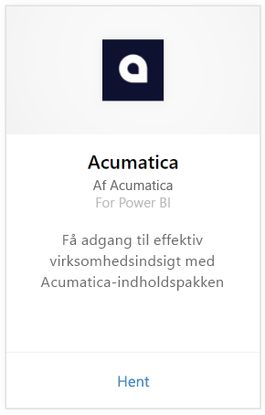
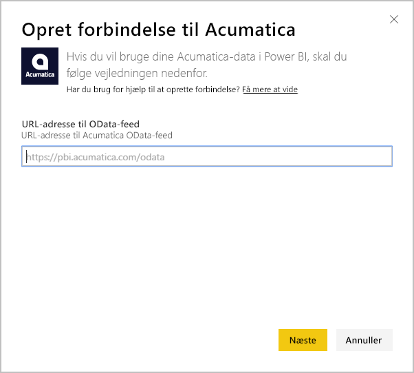
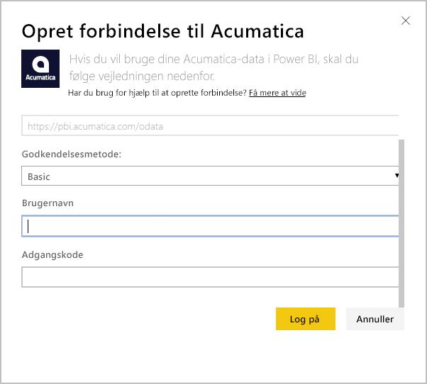
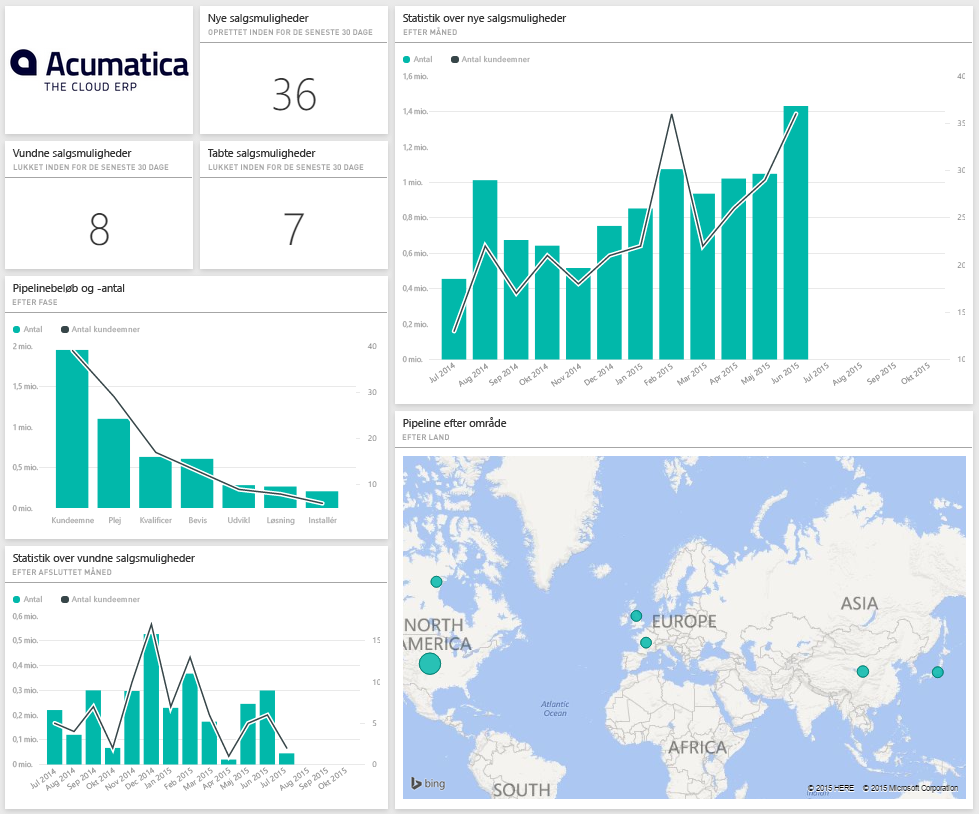
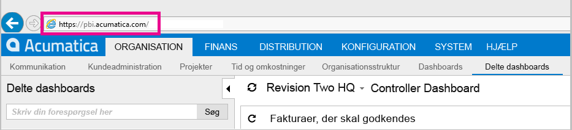

# Opret forbindelse til Acumatica med Power BI
Med Power BI Acumatica-indholdspakken kan du hurtigt få indsigt i dine data med salgsmuligheder. Power BI henter dine data, herunder salgsmuligheder og kunder og opretter derefter et standarddashboard og relaterede rapporter, der er baseret på disse data.

[!INCLUDE [include-short-name](./includes/service-deprecate-content-packs.md)]

Opret forbindelse til [Acumatica-indholdspakken](https://app.powerbi.com/getdata/services/acumatica), eller læs mere om [Acumatica-integrationen](https://powerbi.microsoft.com/integrations/acumatica) med Power BI.

>[!NOTE]
>Denne indholdspakke kræver Acumatica v5.2 eller nyere.

## Sådan opretter du forbindelse
1. Vælg **Hent data** nederst i navigationsruden.
   
   
2. Markér **Hent** i feltet **Tjenester**.
   
   
3. Vælg **Acumatica** \> **Hent**.
   
   
4. Angiv dit Acumatica OData-slutpunkt. Et OData-slutpunkt gør det muligt for et eksternt system at anmode om data fra Acumatica. Acumatica OData-slutpunktet er formateret som følger og skal bruge HTTPS:
   
     `https://[sitedomain]/odata/[companyname]`
   
   Firmanavnet er kun påkrævet, hvis du har en installation med flere firmaer. Der findes flere oplysninger om at finde denne parameter i kontoen til Acumatica nedenfor.
   
   
5. Som Godkendelsesmetode skal du vælge **Grundlæggende**. Angiv brugernavnet og adgangskoden fra din Acumatica-konto, og klik derefter på **Log på**.
   
    
6. Når Power BI har importeret dataene, vises der et nyt dashboard, en ny rapport og et nyt datasæt i navigationsruden. Nye elementer er markeret med en gul stjerne \*, som forsvinder, når den er valgt. Når dashboardet vælges, vises et layout svarende til det nedenfor:
   
    

**Hvad nu?**

* Prøv [at stille et spørgsmål i feltet Spørgsmål og svar](consumer/end-user-q-and-a.md) øverst i dashboard'et
* [Rediger felterne](service-dashboard-edit-tile.md) i dashboard'et.
* [Vælg et felt](consumer/end-user-tiles.md) for at åbne den underliggende rapport.
* Selvom dit datasæt opdateres dagligt, kan du ændre tidsplanen for opdatering eller prøve at opdatere det efter behov ved hjælp af **Opdater nu**

## Systemkrav
Denne indholdspakke kræver Acumatica v5.2 eller nyere. Bekræft versionen med administratoren af Acumatica.

## Søg efter parametre
**Acumatica OData-slutpunkt**

Acumatica OData-slutpunktet er formateret som følger og skal bruge HTTPS:

    https://[sitedomain]/odata/[companyname]

Programwebstedets domæne kan findes i browserens adresselinje, når du er logget på Acumatica. I eksemplet nedenfor er webstedsdomænet `https://pbi.acumatica.com`, så det OData-slutpunkt, der skal angives, skal være `https://pbi.acumatica.com/odata`.

 

Firmanavnet er kun påkrævet, hvis du har en installation med flere firmaer. Du kan finde disse oplysninger på logonsiden til Acumatica.

## Fejlfinding
Hvis du ikke kan logge på, skal du bekræfte, at det angivne Acumatica OData-slutpunkt er formateret korrekt.

    https://<application site domain>/odata/<company name>

Hvis du har problemer med at oprette forbindelse, bedes du bekræfte din version af Acumatica med din administrator. Denne indholdspakke kræver version 5.2 eller nyere.

## Næste trin
[Kom i gang med Power BI](service-get-started.md)

[Hent data i Power BI](service-get-data.md)

