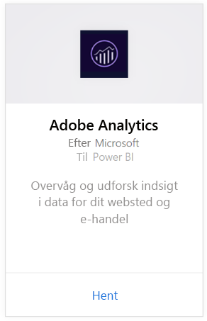
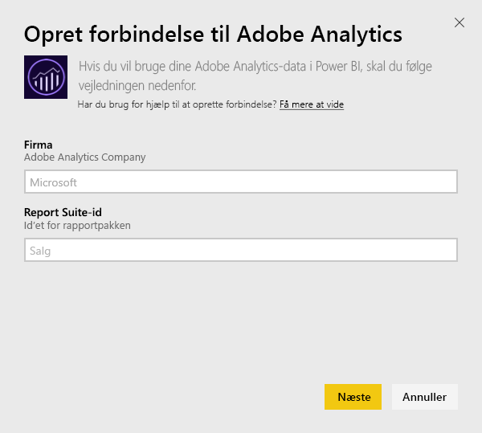
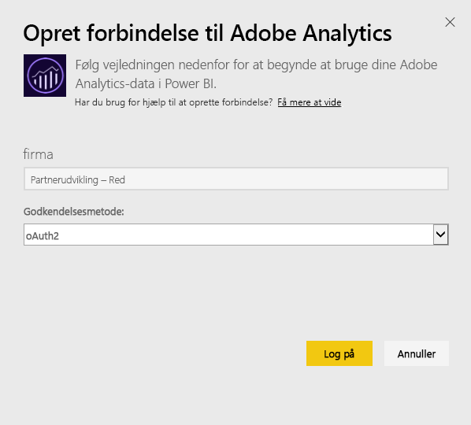
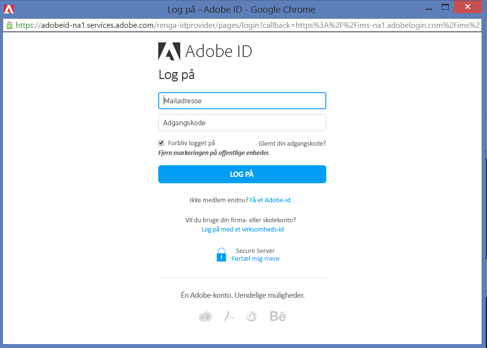
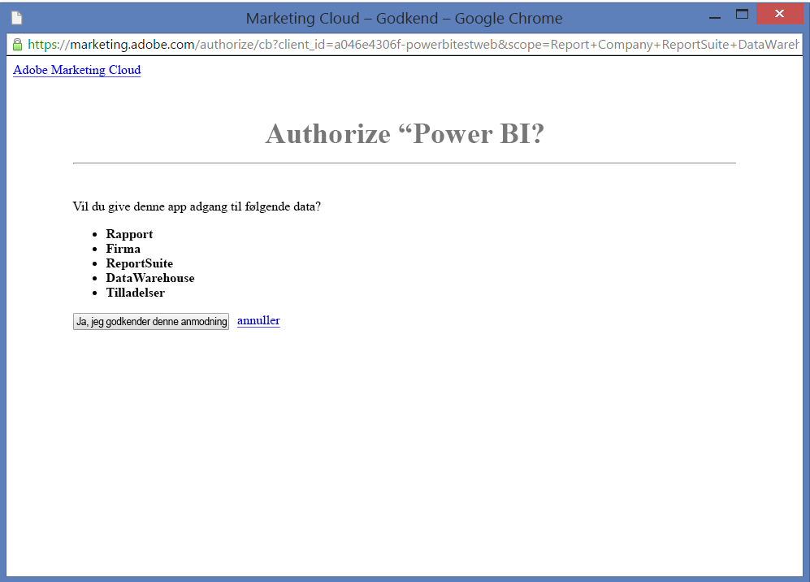
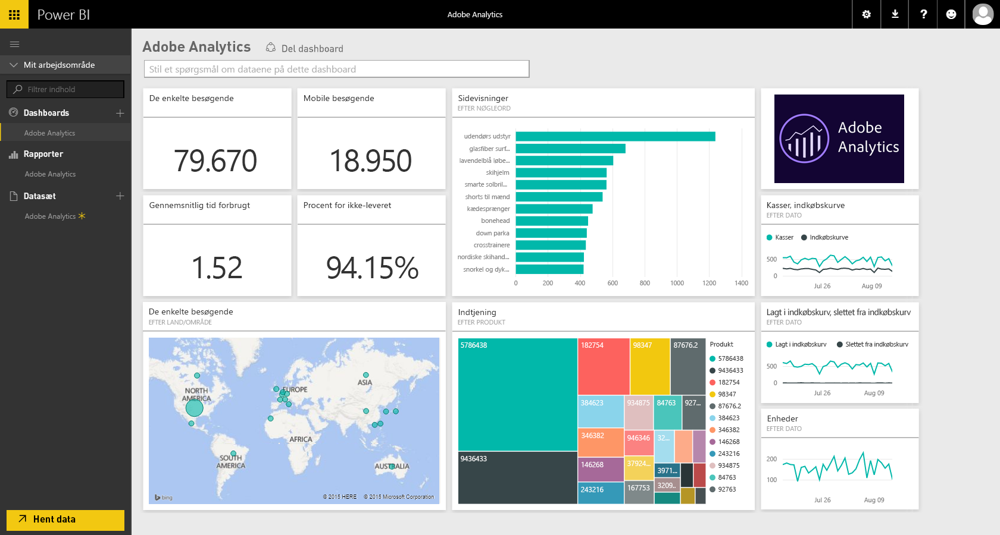
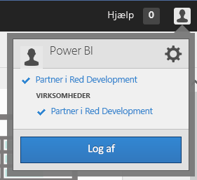
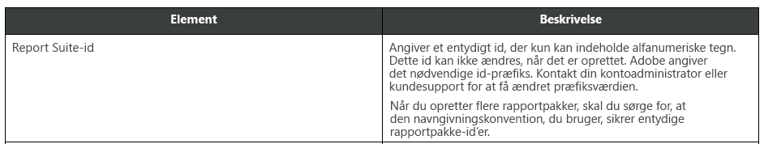

# Opret forbindelse til Adobe Analytics med Power BI
For at oprette forbindelse til Adobe Analytics via Power BI skal du starte med at oprette forbindelse til din Adobe Analytics Marketing Cloud-konto. Du får en app med et Power BI-dashboard og et sæt af Power BI-rapporter, der giver indsigt i trafikken på dit websted og brugerdimensioner. Dataene opdateres automatisk én gang dagligt. Du kan interagere med dashboards og rapporter, men du kan ikke gemme ændringer.

Opret forbindelse til [Adobe Analytics](https://app.powerbi.com/getdata/services/adobe-analytics), eller få mere at vide om [Adobe Analytics-integration](https://powerbi.microsoft.com/integrations/adobe-analytics) i Power BI.

## Sådan opretter du forbindelse
[!INCLUDE [powerbi-service-apps-get-more-apps](./includes/powerbi-service-apps-get-more-apps.md)]

1. Vælg **Adobe Analytics** \>  **Hent**.
   
   
2. Power BI opretter forbindelse til et bestemt Adobe Analytics-firma og et Report Suite-id (ikke Report Suite-navnet). Se detaljer om at [finde de pågældende parametre](#FindingParams) nedenfor.
   
   
3. Som **Godkendelsesmetode** skal du vælge **oAuth2** \> **Log på**. Når du bliver spurgt, skal du angive dine Adobe Analytics-legitimationsoplysninger. 
   
    
   
    
4. Klik på **Acceptér** for at give Power BI adgang til dine Adobe Analytics-data.
   
   
5. Importprocessen starter automatisk, når du har godkendt. 

## Få vist Adobe Analytics-dashboard og -rapporter
[!INCLUDE [powerbi-service-apps-open-app](./includes/powerbi-service-apps-open-app.md)]

      

[!INCLUDE [powerbi-service-apps-open-app](./includes/powerbi-service-apps-what-now.md)]

## Følgende er inkluderet
Power BI anvender Adobe Analytics-rapporterings-API'en til at definere og køre rapporter for følgende tabeller:

| **Tabelnavn** | **Kolonneoplysninger** |
| --- | --- |
| Produkter |elementer=  "product" (top 25)   metrikværdier="cartadditions", "cartremovals", "carts", "cartviews", "checkouts", "revenue", "units" |
| Browsere |elementer= "browser" (top 25)   metrikværdier="bounces", "bouncerate", "visitors", "visits", "uniquevisitors", "totaltimespent", "pageviews" |
| Sider |elementer= "page" (top 25)   metrikværdier="cartadditions", "cartremovals", "carts", "cartviews", "checkouts", "revenue", "units", "visits", "uniquevisitors", "pageviews", "bounces", "bouncerate", "totaltimespent" |
| JavaScript aktiveret |elementer=  "javascriptenabled”, “browser” (top 25) |
| Mobiloperativsystem |elementer= "mobileos"(top 25)  metrikværdier="bounces", "bouncerate", "visitors", "visits", "uniquevisitors", "totaltimespent", "cartadditions", "cartremovals", "checkouts", "revenue", "units", "pageviews" |
| Nøgleord for søgemaskiner |elementer= "searchengine" "searchenginekeyword"   metrikværdier="bounces", "bouncerate", "visitors", "visits", "entries", "uniquevisitors", "totaltimespent", "cartadditions", "cartremovals", "carts", "cartviews", "checkouts", "revenue", "units", "pageviews" |
| Søgemaskine til Produkter |elementer= "searchengine", "product"   metrikværdier="bounces", "bouncerate", "visitors", "visits", "entries", "uniquevisitors", "totaltimespent", "cartadditions", "cartremovals", "carts", "cartviews", "checkouts", "revenue", "units", "pageviews" |
| Sider med henvisning |elementer= "referrer" (top 15), “page" (top 10)   metrikværdier="bounces", "bouncerate", "visitors", "visits", "entries", "uniquevisitors", "totaltimespent", "cartadditions", "cartremovals", "carts", "cartviews", "checkouts", "revenue", "units", "pageviews" |
| Geografi/land for Sider |elementer= "geocountry" (Top 20), "page"   metrikværdier="bounces", "bouncerate", "visitors", "visits", "entries", "uniquevisitors", "totaltimespent", "cartadditions", "cartremovals", "carts", "cartviews", "checkouts", "revenue", "units", "pageviews" |
| Geografi/land for Produkt |elementer= "geocountry" (Top 20), "product"  metrikværdier="bounces", "bouncerate", "visitors", "visits", "entries", "uniquevisitors", "totaltimespent", "cartadditions", "cartremovals", "carts", "cartviews", "checkouts", "revenue", "units" |
| Opslag af land og område |elementer= "geocountry" (Top 200)   metrikværdier="bounces", "bouncerate", "visitors", "visits", "entries", "uniquevisitors", "totaltimespent", "cartadditions", "cartremovals", "carts", "cartviews", "checkouts", "revenue", "units" |
| Sprog |elementer= "language", "browser" (Top 25)   metrikværdier="bounces", "bouncerate", "visitors", "visits", "uniquevisitors", "totaltimespent", "pageviews", "cartadditions", "cartremovals", "checkouts", "carts", "cartviews" |
| Opslag for søgemaskiner |elementer= "searchengine" (top 100)   metrikværdier="bounces", "bouncerate", "visitors", "visits", "entries", "uniquevisitors", "totaltimespent", "cartadditions", "cartremovals", "carts", "cartviews", "checkouts", "revenue", "units" |
| Browseropslag |elementer= "browser" (top 25) |

## Systemkrav
Der kræves adgang til [Adobe Analytics](http://www.adobe.com/marketing-cloud/web-analytics.html), herunder adgang til de korrekte parametre, sådan som det er beskrevet nedenfor.

## Find parametre
**Firma**

Værdien Firma findes i øverste højre hjørne af din konto, når du er logget på. Værdien skelner mellem store og små bogstaver og mellemrum/ikke mellemrum. Angiv den præcis, som du ser den på din konto.

**Report Suite-id**

Suite-id oprettes, når Report Suite oprettes. Du kan kontakte din administrator for at identificere ID-værdien. Bemærk, at dette ikke er navnet på Report Suite.

Fra Adobe-[dokumentationen](https://marketing.adobe.com/resources/help/en_US/reference/new_report_suite.html):

## Fejlfinding
Hvis du får vist en fejl, når du har angivet dine legitimationsoplysninger, hvor der står, at du ikke har tilladelser, skal du bekræfte med din administrator, at du har adgang til Adobe Analytics-API'en. Bekræft også det angivne Adobe-id, som er knyttet til Marketing Cloud-organisationen (der er knyttet til et Adobe Analytics-firma).

Hvis du er kommet gennem skærmbilledet med legitimationsoplysninger, før der opstår en fejl, er det muligt, at rapporterne er for længe om at blive afsluttet. En almindelig fejl er i formatet *"Der kunne ikke hentes data fra Adobe Analytics-rapporten. Indhold omfattede &quot;henviser, side&quot;, den omtrentlige varighed var xx sekunder"*. Se afsnittet "Følgende er inkluderet", og sammenlign med størrelsen af din Adobe-forekomst. Det er desværre ikke muligt at omgå denne timeout i dag. Men vi overvejer opdateringer for bedre at kunne understøtte større forekomster. Giv feedback til Power BI-teamet på https://ideas.powerbi.com

## Næste trin
* [Hvad er apps i Power BI?](consumer/end-user-apps.md)
* [Hent data i Power BI](service-get-data.md)
* Har du flere spørgsmål? [Prøv at spørge Power BI-community'et](http://community.powerbi.com/)

