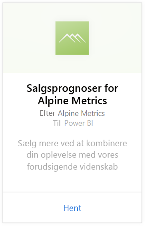
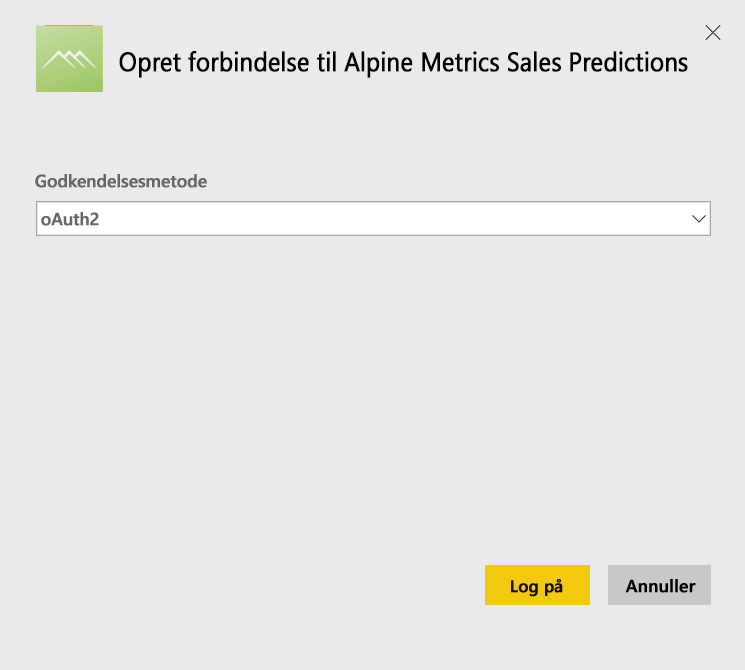
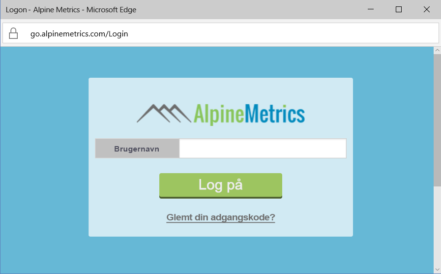

# Opret forbindelse til Alpine Metrics Sales Predictions med Power BI
Alpine Metrics leverer avanceret Predictive Sales-procesoptimering i clouden og efter behov til små og store salgsorganisationer. Alpine Metrics Sales Predictions-indholdspakken til Power BI indeholder målinger, som f.eks. potentielle og forventede salg og risici, så du får bedre indsigt i fremtiden for din virksomhed. 

Opret forbindelse til [Alpine Metrics Sales Predictions-indholdspakken](https://app.powerbi.com/getdata/services/alpine-metrics) til Power BI.

## Sådan opretter du forbindelse
1. Vælg Hent data nederst i venstre navigationsrude.  
   
    
2. I feltet **Tjenester** skal du vælge **Hent**.  
   
    
3. Vælg **AlpineMetrics Sales Predictions**, og vælg derefter **Hent**.  
   
    
4. Vælg **OAuth 2** og derefter **Log på**. Når du bliver spurgt, skal du angive dine legitimationsoplysninger til AlpineMetrics.
   
    
   
    
5. Når der er oprettet forbindelse, indlæses der automatisk et dashboard, en rapport og et datasæt. Når processen er fuldført, opdateres felterne med data fra din konto.
   
    

**Hvad nu?**

* Prøv [at stille et spørgsmål i feltet Spørgsmål og svar](power-bi-q-and-a.md) øverst i dashboard'et
* [Rediger felterne](service-dashboard-edit-tile.md) i dashboard'et.
* [Vælg et felt](service-dashboard-tiles.md) for at åbne den underliggende rapport.
* Dit datasæt vil være planlagt til daglig opdatering. Du kan dog ændre tidsplanen for opdatering eller forsøge at opdatere efter behov ved hjælp af **Opdater nu**

## Følgende er inkluderet
Indholdspakken indeholder data fra følgende tabeller:  

    - Konto    
    - Virksomhed    
    - Land    
    - Branche    
    - Salgsmulighed  
    - Person  
    - Prognose    
    - Prognoseoversigt    
    - Produkt  
    - Område    

## Systemkrav
Der kræves en Alpine Metrics-konto med rettigheder til ovenstående tabeller for at kunne instantiere denne indholdspakke.

## Næste trin
[Kom i gang med Power BI](service-get-started.md)

[Power BI – Grundlæggende begreber](service-basic-concepts.md)

