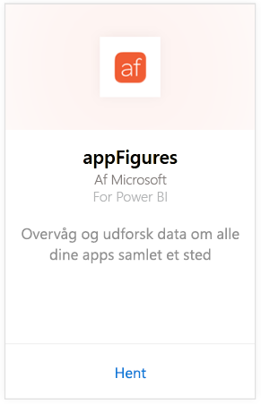
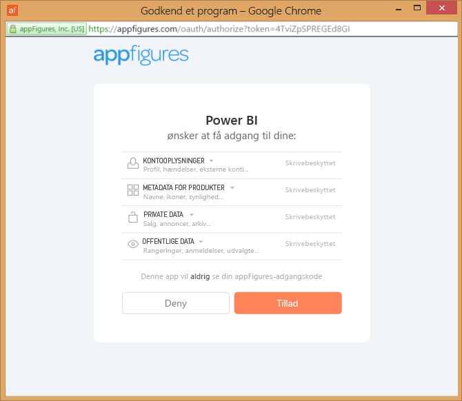
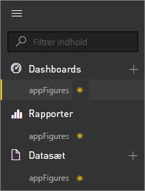
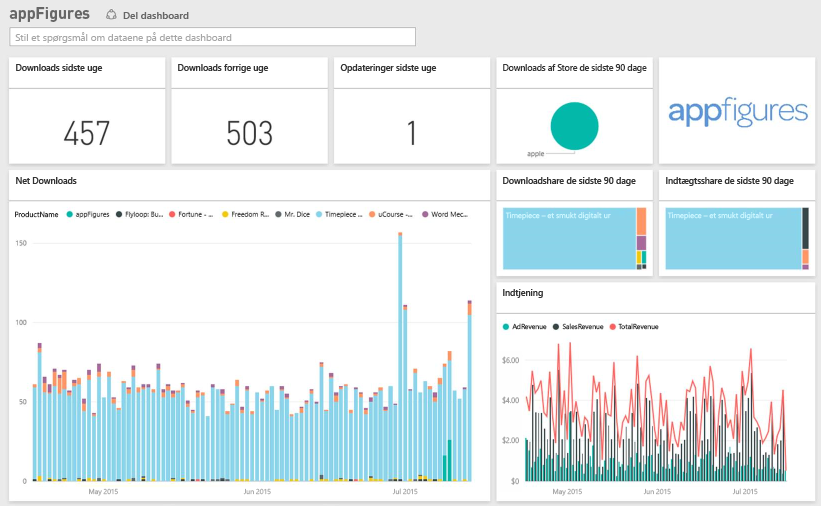
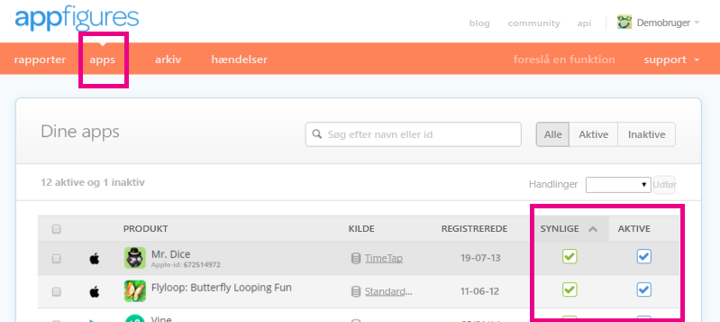

# Opret forbindelse til appFigures med Power BI
Med Power BI og appFigures-indholdspakken er det nemt at spore vigtige statistikker om dine apps. Power BI henter dine data, herunder appsalg, downloads og annoncestatistik, og opretter derefter et standarddashboard og relaterede rapporter, der er baseret på disse data.

Opret forbindelse til [appFigures-indholdspakken](https://app.powerbi.com/getdata/services/appfigures), eller læs mere om [appFigures-integrationen](https://powerbi.microsoft.com/integrations/appfigures) med Power BI.

## Sådan opretter du forbindelse
1. Vælg **Hent data** nederst i venstre navigationsrude.
   
   
2. Vælg **Hent** i feltet **Tjenester**.
   
   
3. Vælg **appFigures** \>  **Hent**.
   
   
4. Som **Godkendelsesmetode** skal du vælge **oAuth2** \> **Log på**. Når du bliver spurgt, skal du angive dine legitimationsoplysninger til appFigures og følge appFigures-godkendelsesprocessen.
   
   Første gang, du opretter forbindelse, beder Power BI dig om at tillade skrivebeskyttet adgang til din konto. Vælg **Tillad** for at starte importprocessen. Det kan tage nogle minutter afhængigt af mængden af data på din konto.
   
   
5. Når Power BI har importeret dataene, vises der et nyt dashboard, en rapport og et datasæt i venstre navigationsrude. Nye elementer er markeret med en gul stjerne \*:
   
    
6. Vælg appFigures-dashboardet. Dette er standarddashboardet, som Power BI opretter for at vise dine data. Du kan ændre dette dashboard for at vise dine data, som du ønsker.
   
    

**Hvad nu?**

* Prøv at [stille et spørgsmål i feltet Spørgsmål og svar](service-q-and-a.md) øverst i dashboardet
* [Rediger felterne](service-dashboard-edit-tile.md) i dashboardet.
* [Vælg et felt](service-dashboard-tiles.md) for at åbne den underliggende rapport.
* Dit datasæt vil være planlagt til daglig opdatering. Du kan dog ændre tidsplanen for opdatering eller forsøge at opdatere efter behov ved brug af **Opdater nu**

## Følgende er inkluderet
Følgende data er tilgængelige fra appFigures i Power BI.

| **Tabelnavn** | **Beskrivelse** |
| --- | --- |
| Lande |Denne tabel indeholder oplysninger om landenavn. |
| Datoer |Denne tabel indeholder datoer fra dags dato tilbage til den tidligste PublishDate for apps, der er aktiv og synlig i din appFigures-konto. |
| Hændelser |Denne tabel indeholder oplysninger om download, salg og annonceoplysninger for hver app efter land og for hver dag. Bemærk, at oplysninger om både app og køb i app findes i denne enkelte tabel – du kan bruge kolonnen <strong>Type</strong> til at skelne mellem dem. |
| Køb i app |Denne tabel indeholder data om de forskellig typer køb i appen, der er knyttet til aktive, synlige apps på din appFigures-konto. |
| Produkter |Denne tabel indeholder data om de forskellig apps, der er aktive og synlige på din appFigures-konto. |

## Fejlfinding
Hvis data fra nogle af dine apps ikke vises i Power BI, skal du kontrollere, at disse apps er synlige og aktive på fanen **Apps** på appFigures-webstedet.

## Næste trin
* [Kom i gang i Power BI](service-get-started.md)
* [Hent data i Power BI](service-get-data.md)

