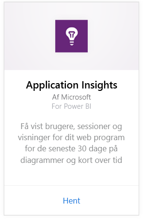
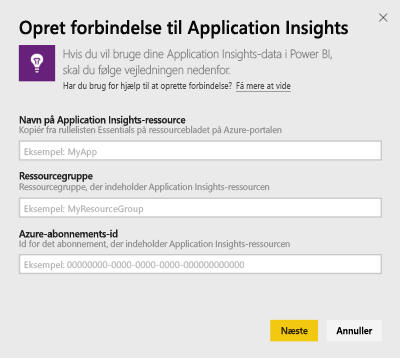
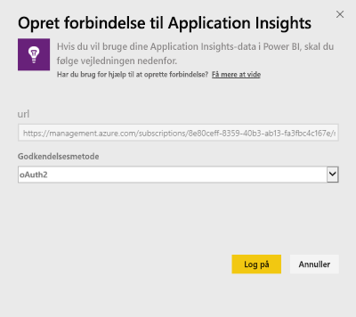
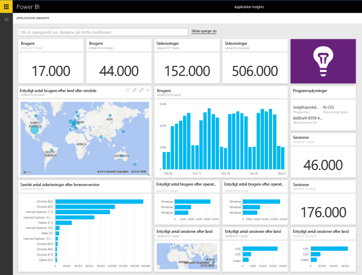
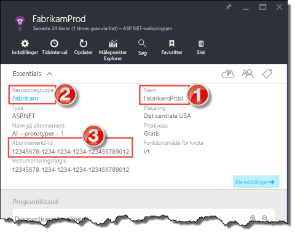
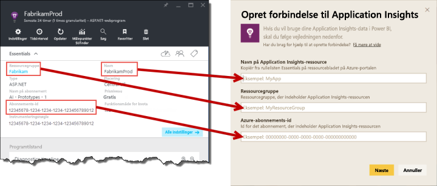

# Opret forbindelse til Application Insights med Power BI
Brug Power BI til at oprette effektive brugerdefinerede dashboards fra telemetrien [Application Insights](https://azure.microsoft.com/documentation/articles/app-insights-overview/). Få oplysninger om din apptelemetri på nye måder. Kombiner målepunkter fra flere apps eller komponenttjenester på ét dashboard. Denne første version af Power BI-indholdspakken til Application Insights indeholder widgets til målinger, der er relateret til almindeligt forbrug, f.eks. aktive brugere, sidevisning, sessioner, browser- og operativsystemversion samt geografisk fordeling af brugere på et kort.

Opret forbindelse til [Application Insights-indholdspakken til Power BI](https://app.powerbi.com/getdata/services/application-insights).

>[!NOTE]
>Adgang til Application Insights-oversigtsbladet for din app på Azure Preview-portalen er obligatorisk for at oprette forbindelse. Flere oplysninger om kravene nedenfor.

## Sådan opretter du forbindelse
1. Vælg **Hent data** nederst i venstre navigationsrude.
   
    
2. Vælg **Hent** i feltet **Tjenester**.
   
    
3. Vælg **Application Insights** > **Hent**.
   
    
4. Angiv oplysningerne om den app, du vil oprette forbindelse til, herunder **ressourcenavn til Application Insights**, **ressourcegruppe** og **abonnements-id**. Se [Find dine Application Insights-parametre](#FindingAppInsightsParams) nedenfor for at få flere oplysninger.
   
        
5. Vælg **Log på**, og følg på anvisningerne på skærmen for at oprette forbindelse.
   
    
6. Importprocessen starter automatisk. Når du er færdig, vises der en meddelelse, og der vises et nyt dashboard, en rapport og et datasæt i navigationsruden markeret med en stjerne.  Vælg dashboardet for at få vist de importerede data.
   
    

**Hvad nu?**

* Prøv [at stille et spørgsmål i feltet Spørgsmål og svar](power-bi-q-and-a.md) øverst i dashboard'et
* [Rediger felterne](service-dashboard-edit-tile.md) i dashboard'et.
* [Vælg et felt](service-dashboard-tiles.md) for at åbne den underliggende rapport.
* Dit datasæt vil være planlagt til daglig opdatering. Du kan dog ændre tidsplanen for opdatering eller forsøge at opdatere efter behov ved hjælp af **Opdater nu**

## Følgende er inkluderet
Application Insights-indholdspakken indeholder følgende tabeller og målepunkter:  

    ´´´
    - ApplicationDetails  
    - UniqueUsersLast7Days   
    - UniqueUsersLast30Days   
    - UniqueUsersDailyLast30Days  
    - UniqueUsersByCountryLast7Days  
    - UniqueUsersByCountryLast30Days   
    - PageViewsDailyLast30Days   
    - SessionsLast7Days   
    - SessionsLast30Days  
    - PageViewsByBrowserVersionDailyLast30Days   
    - UniqueUsersByOperatingSystemLast7Days   
    - UniqueUsersByOperatingSystemLast30Days    
    - SessionsDailyLast30Days   
    - SessionsByCountryLast7Days   
    - SessionsByCountryLast30Days   
    - PageViewsByCountryDailyLast30Days  
    ´´´ 

## Søgning efter parametre
Ressourcenavnet, ressourcegruppen og abonnements-id'et findes alt sammen på Azure-portalen. Når navnet vælges, åbnes en detaljeret visning, og du kan bruge Essentials-rullelisten til at finde alle de værdier, du har brug for.

Kopiér og indsæt disse i felterne i Power BI:

## Næste trin
[Kom i gang med Power BI](service-get-started.md)

[Hent data i Power BI](service-get-data.md)

