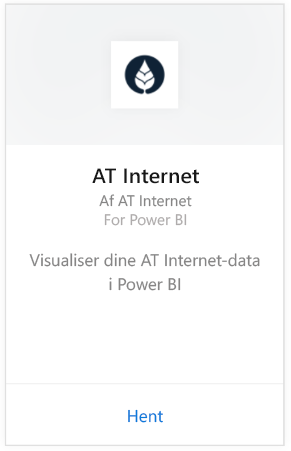
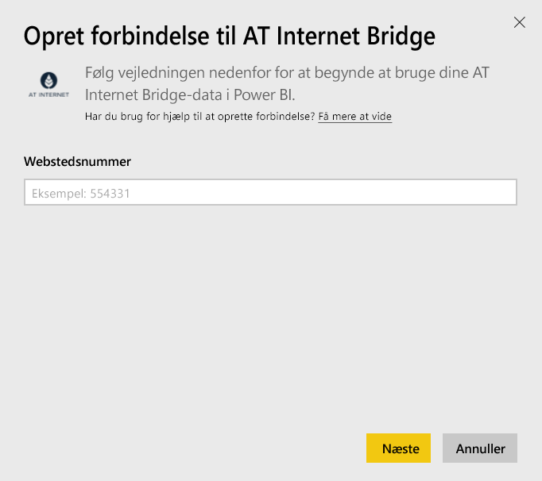
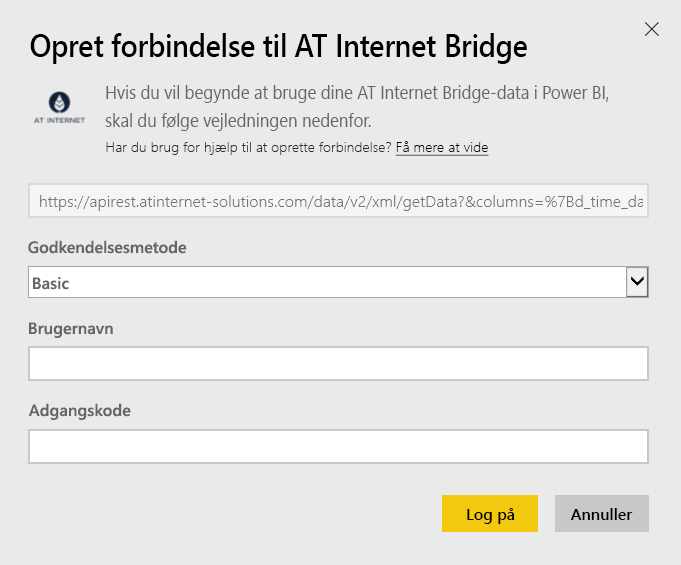

# Opret forbindelse til AT Internet Bridge med Power BI
Med AT Internet kan du hurtigt udtrække værdifulde oplysninger fra dine data, takket være den ensartede platform til digitale analyser, Analytics Suite. AT Internet Bridge-indholdspakken til Power BI indeholder data vedrørende besøg, datakilder, lokalisering og enheder til dit websted.

Opret forbindelse til [AT Internet Bridge-indholdspakken](https://app.powerbi.com/getdata/services/at-internet-bridge) til Power BI.

## Sådan opretter du forbindelse
1. Vælg **Hent data** nederst i venstre navigationsrude.
   
    
2. Markér **Hent** i feltet **Tjenester**.
   
    
3. Vælg **AT Internet Bridge** \> **Hent**.
   
   
4. Angiv det AT Internet Website-nummer, du ønsker at oprette forbindelse til.
   
   
5. Vælg **Basic** som godkendelsesmetoden, angiv dit brugernavn og din adgangskode til AT Internet, og klik på **Log på**.
   
   
6. Klik på **Tilslut** for at starte importprocessen. Når processen er færdig, vises et nyt dashboard samt rapport og model i navigationsruden. Vælg dashboardet for at få vist de importerede data.
   
    

**Hvad nu?**

* Prøv [at stille et spørgsmål i feltet Spørgsmål og svar](consumer/end-user-q-and-a.md) øverst i dashboard'et
* [Rediger felterne](service-dashboard-edit-tile.md) i dashboard'et.
* [Vælg et felt](consumer/end-user-tiles.md) for at åbne den underliggende rapport.
* Selvom dit datasæt opdateres dagligt, kan du ændre tidsplanen for opdatering eller prøve at opdatere det efter behov ved hjælp af **Opdater nu**

## Det følgende er inkluderet
Denne indholdspakke indeholder data fra de seneste 45 dage i følgende tabeller:  

    - Konvertering  
    - Enheder  
    - Lokalisering  
    - Datakilder  
    - Globale besøg  

## Næste trin
[Hvad er Power BI?](power-bi-overview.md)

[Grundlæggende begreber for designere i Power BI-tjenesten](service-basic-concepts.md)

