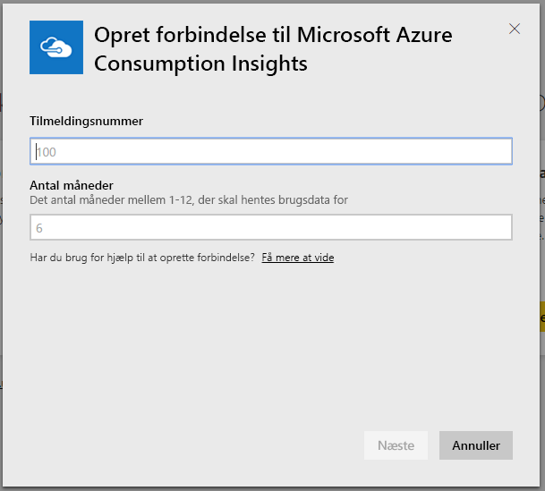
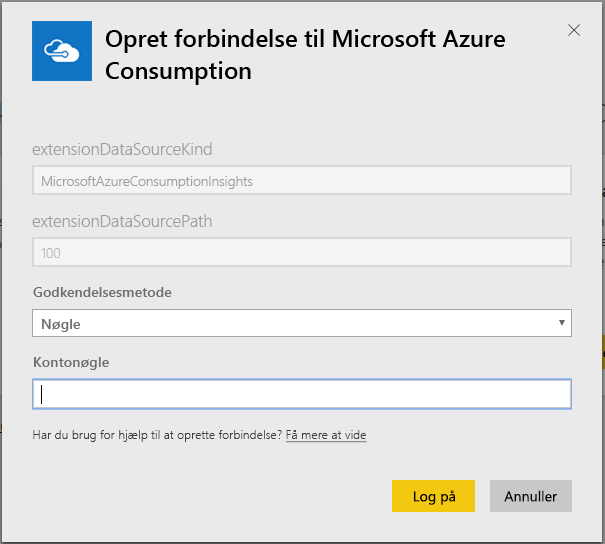
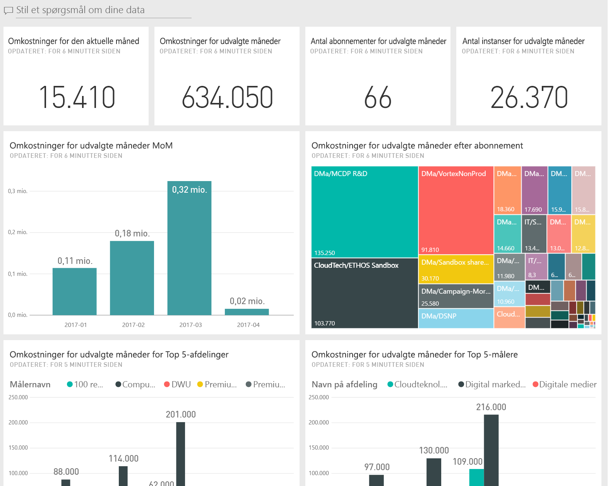
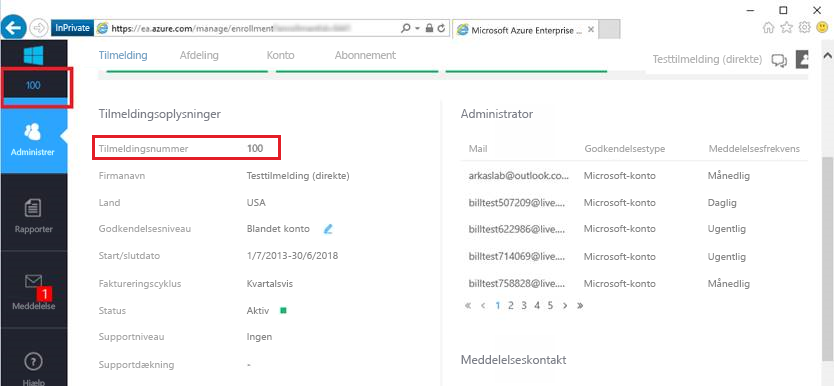
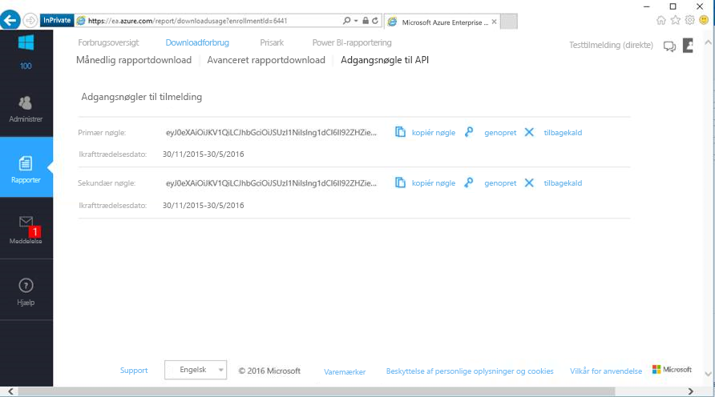

# Opret forbindelse til Microsoft Azure Consumption Insights med Power BI
Udforsk og overvåg dine Microsoft Azure-forbrugsdata i Power BI-tjenesten med Power BI-indholdspakken. Dataene opdateres automatisk én gang dagligt.

Opret forbindelse til [Microsoft Azure Consumption Insights-indholdspakken](https://app.powerbi.com/getdata/services/azureconsumption) til Power BI-tjenesten.

> [!NOTE]
> Hvis du vil have en mere tilpasset konfiguration, skal du prøve at bruge [Azure Consumption Insights-connectoren](desktop-connect-azure-consumption-insights.md) i Power BI Desktop.

## Sådan opretter du forbindelse
1. Vælg **Hent data** nederst i venstre navigationsrude i Power BI-tjenesten.
   
    
2. Markér **Hent** i feltet **Tjenester**.
   
   
3. Vælg **Microsoft Azure Consumption Insights** \> **Hent det nu**. 
   
   
4. Angiv den antal måneder, du vil importere data for, og dit Azure Enterprise-tilmeldingsnummer. Herunder kan du se detaljer om, hvordan du [finder de pågældende parametre](#FindingParams).
   
    
5. Angiv din Access-nøgle for at oprette forbindelse. Du kan finde din tilmeldingsnøgle på Azure EA-portalen. 
   
    
6. Importprocessen starter automatisk. Når processen er fuldført, vises et nyt dashboard samt en ny rapport og model i navigationsruden. Vælg dashboardet for at få vist de importerede data.
   
   

**Hvad nu?**

* Prøv [at stille et spørgsmål i feltet Spørgsmål og svar](consumer/end-user-q-and-a.md) øverst i dashboard'et
* [Rediger felterne](service-dashboard-edit-tile.md) i dashboard'et.
* [Vælg et felt](consumer/end-user-tiles.md) for at åbne den underliggende rapport.
* Selvom dit datasæt opdateres dagligt, kan du ændre tidsplanen for opdateringen eller prøve at opdatere det on-demand ved hjælp af **Opdater nu**

## Det følgende er inkluderet
Microsoft Azure Consumption Insights-indholdspakken indeholder månedlige rapporteringsdata for det månedsinterval, du angav, da du oprettede forbindelse. Intervallet er et fleksibelt vindue, så de inkluderede datoer bliver opdateret, når datasættet opdateres.

## Systemkrav
Indholdspakken kræver adgang til virksomhedsfunktioner på Azure Portal. 

## Søgning efter parametre
Power BI-rapportering er tilgængelig for EA-kunder af typen Direct, Partner og Indirect, som kan få vist faktureringsoplysninger. Herunder kan du finde oplysninger om hver af de værdier, der forventes i forbindelsesflowet.

**Antal måneder**

* Den antal måneder (1-36) med data fra i dag, som du vil importere.

**Tilmeldingsnummer**

* Dette er dit Azure Enterprise-tilmeldingsnummer, som du kan finde på startskærmen på [Azure Enterprise Portal](https://ea.azure.com/) under **Tilmeldingsoplysninger**.
  
    

**Access-nøgle**

* Du kan finde din adgangsnøgle på Azure Enterprise Portal under **Downloadforbrug** > **API-adgangsnøgle**.
  
    

**Yderligere hjælp**

* Hvis du har brug for yderligere hjælp til at konfigurere Power BI-pakken til Azure Enterprise, skal du logge på Azure Enterprise Portal og se API-hjælpefilen under **Hjælp**. Du kan også finde yderligere vejledning under **Rapporter** -> **Downloadforbrug** -> **API-adgangsnøgle**.
* Hvis du vil have en mere tilpasset konfiguration, skal du prøve at bruge [Azure Consumption Insights-connectoren](desktop-connect-azure-consumption-insights.md) i Power BI Desktop.

## Næste trin

[Azure Consumption Insights-connector](desktop-connect-azure-consumption-insights.md) i Power BI Desktop

[Hent data i Power BI](service-get-data.md)

