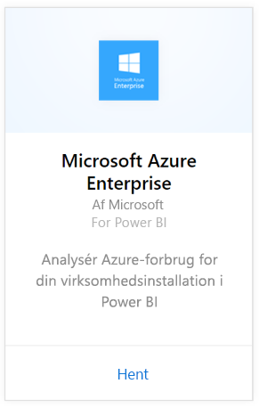
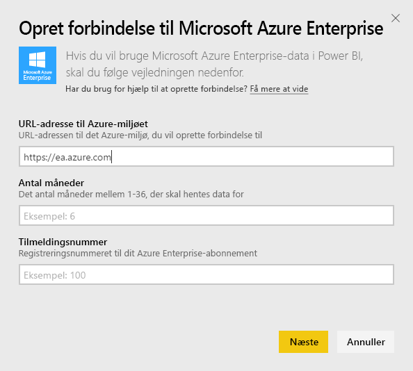
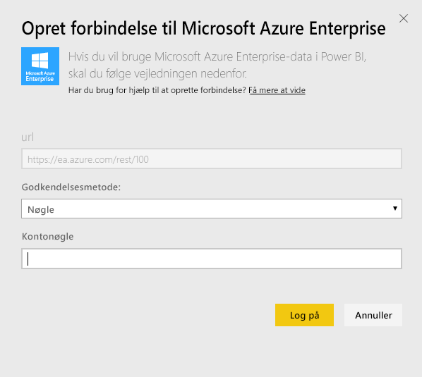
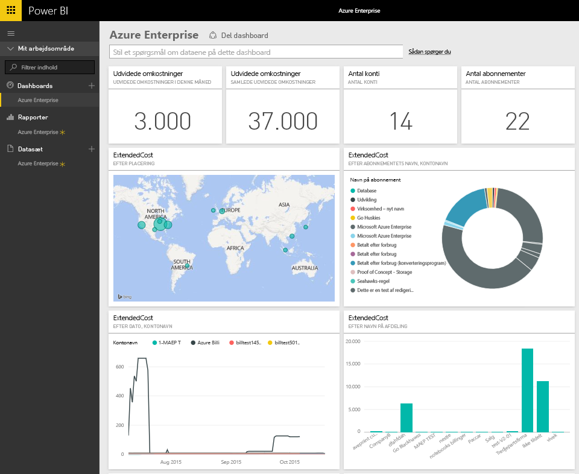
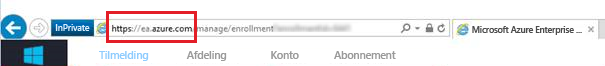
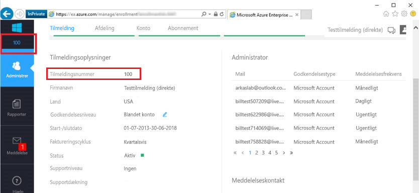
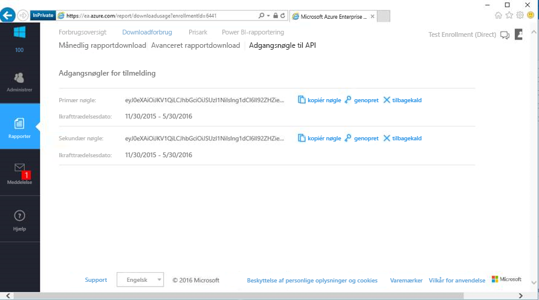

# Opret forbindelse til Microsoft Azure Enterprise med Power BI
Udforsk og overvåg dine Microsoft Azure Enterprise-data i Power BI med Power BI-indholdspakken. Dataene opdateres automatisk én gang dagligt.

Opret forbindelse til den [Microsoft Azure Enterprise-indholdspakken](https://app.powerbi.com/getdata/services/azure-enterprise) til Power BI.

## Sådan opretter du forbindelse
1. Vælg **Hent data** nederst i venstre navigationsrude.
   
    
2. Vælg **Hent** i feltet **Tjenester**.
   
   
3. Vælg **Microsoft Azure Enterprise** \> **Hent**.
   
   
4. Angiv URL-adressen til Azure-miljøet, det antal måneder, du vil importere data for, og dit Azure Enterprise-tilmeldingsnummer. URL-adressen til dit Azure-miljø er `https://ea.azure.com` eller `https://ea.windowsazure.cn`. Se detaljer om, hvordan du [finder de pågældende parametre](#FindingParams), nedenfor.
   
    
5. Angiv din Access-nøgle for at oprette forbindelse. Du finder nøglen til tilmelding på Azure EA Portal.
   
    
6. Importprocessen starter automatisk. Når processen er fuldført, vises et nyt dashboard samt en ny rapport og model i navigationsruden. Vælg dashboardet for at få vist de importerede data.
   
   

**Hvad nu?**

* Prøv [at stille et spørgsmål i feltet Spørgsmål og svar](power-bi-q-and-a.md) øverst i dashboard'et
* [Rediger felterne](service-dashboard-edit-tile.md) i dashboard'et.
* [Vælg et felt](service-dashboard-tiles.md) for at åbne den underliggende rapport.
* Dit datasæt vil være planlagt til daglig opdatering. Du kan dog ændre tidsplanen for opdatering eller forsøge at opdatere efter behov ved hjælp af **Opdater nu**

## Følgende er inkluderet
Azure Enterprise-indholdspakken indeholder månedlige rapporteringsdata for det interval af måneder, du angiver under forbindelsesflowet. Intervallet er et fleksibelt vindue, så de datoer, der medtages, bliver opdateret, når datasættet opdateres.

## Systemkrav
Indholdspakken kræver adgang til virksomhedsfunktioner på Azure Portal.

## Søg efter parametre
Power BI-rapportering er tilgængeligt for EA-kunder af typen Direct, Partner og Indirect, som kan få vist faktureringsoplysninger. Læs nedenfor, hvis du vil have oplysninger om at finde hver af de værdier, der forventes i forbindelsesflowet.

**URL-adresse til Azure-miljøet**

* Denne værdi er normalt https://ea.azure.com, men du kan kontrollere URL-adressen, når du logger på, for at bekræfte det.
  
    

**Antal måneder**

* Dette skal være et tal mellem 1-36, der repræsenterer det antal måneder (fra i dag), du vil importere data for.

**Tilmeldingsnummer**

* Dette er dit Azure Enterprise-tilmeldingsnummer, som findes på startskærmen på [Azure Enterprise Portal](https://ea.azure.com/) under "Enrollment Detail".
  
    

**Access-nøgle**

* Du finder din nøgle på Azure Enterprise Portal under "Download Usage" > "API Access Key"
  
    

**Yderligere hjælp**

* Hvis du vil have yderligere hjælp til at konfigurere Azure Enterprise Power BI-pakken, skal du logge på Azure Enterprise Portal for at få vist API-hjælpefilen under "Help" og yderligere oplysninger under Reports -> Download Usage -> API Access Key.

## Næste trin
[Kom i gang med Power BI](service-get-started.md)

[Hent data i Power BI](service-get-data.md)

