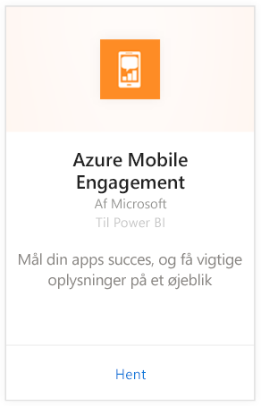
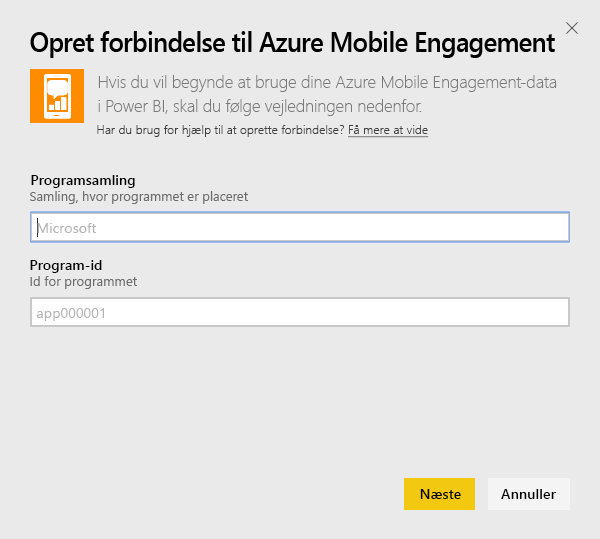
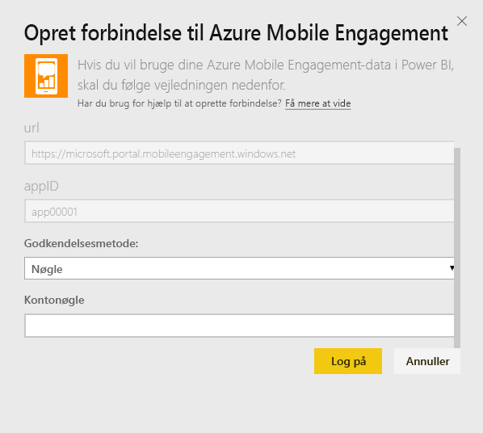
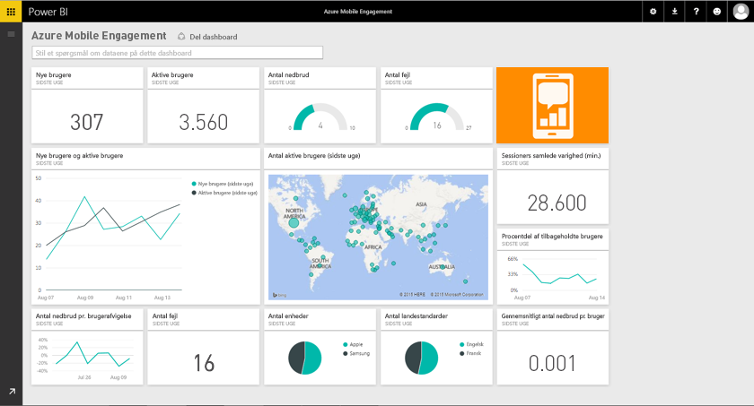

# Opret forbindelse til Azure Mobile Engagement med Power BI
Med Power BI Azure Mobile Engagement-indholdspakken kan du hurtigt få indsigt i dine appdata.

Opret forbindelse til [Azure Mobile Engagement-indholdspakken](https://app.powerbi.com/groups/me/getdata/services/azme) til Power BI.

## Sådan opretter du forbindelse
1. Vælg **Hent data** nederst i venstre navigationsrude.
   
    
2. Vælg **Hent** i feltet **Tjenester**.
   
    
3. Vælg **Azure Mobile Engagement** \> **Hent**.
   
     
4. Angiv gruppen af apps og appnavnet. Disse oplysninger finder du i din Azure Mobile Engagement-konto.
   
     
5. Som godkendelsesmetode skal du angive din nøgle og klikke på Log på.
   
    
6. Efter import af data i Power BI får du vist et nyt dashboard og datasæt samt en ny rapport i venstre navigationsrude. Nye elementer er markeret med en gul stjerne \*, som forsvinder, når du har valgt:
   
    

 **Hvad nu?**

* Prøv [at stille et spørgsmål i feltet Spørgsmål og svar](service-q-and-a.md) øverst i dashboardet
* [Rediger felterne](service-dashboard-edit-tile.md) i dashboardet.
* [Vælg et felt](service-dashboard-tiles.md) for at åbne den underliggende rapport.
* Dit datasæt vil være planlagt til daglig opdatering. Du kan dog ændre tidsplanen for opdatering eller forsøge at opdatere efter behov ved brug af **Opdater nu**

## Næste trin
[Kom i gang i Power BI](service-get-started.md)

[Hent data i Power BI](service-get-data.md)

