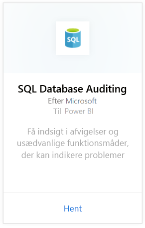
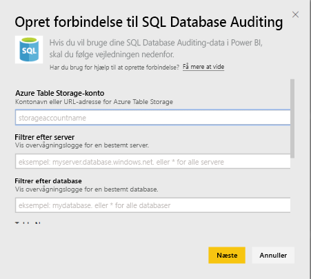
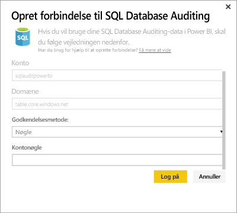

# SQL Database Auditing-indholdspakke til Power BI
Power BI-indholdspakken til Azure [SQL Database Auditing](http://azure.microsoft.com/documentation/articles/sql-database-auditing-get-started/) gør det muligt at forstå din databaseaktivitet og få indsigt i de afvigelser og uregelmæssigheder, der kunne være årsag til forretningsmæssige bekymringer eller give mistanke til brud på sikkerheden. 

Opret forbindelse til [SQL Database Auditing-indholdspakke](https://app.powerbi.com/getdata/services/sql-db-auditing) til Power BI.

>[!NOTE]
>Indholdspakken importerer data fra alle tabeller, der indeholder "AuditLogs" i navnet, og føjer dem til en samlet datamodeltabel ved navn "AuditLogs". De sidste 250.000 hændelser medtages, og dataene opdateres dagligt.

## Sådan opretter du forbindelse
1. Vælg **Hent data** nederst i venstre navigationsrude.
   
    
2. Vælg Hent i feltet Tjenester.
   
    
3. Vælg **SQL Database Auditing** \> **Hent**.
   
   
4. I vinduet Opret forbindelse til SQL Database Auditing:
   
   - Angiv kontonavnet til Azure Table Storage eller den URL-adresse, hvor dine logfiler lagres.
   
   - Angiv navnet på den SQL-server, som du vil bruge. Angiv "\*" for at indlæse overvågningslogger for alle servere.
   
   - Angiv navnet på den SQL-database, som du vil bruge. Angiv "\*" for at indlæse overvågningslogger for alle databaser.
   
   - Angiv navnet på den Azure-tabel, der indeholder de logfiler, du er interesseret i. Angiv "\*" for at indlæse overvågningslogger fra alle de tabeller, der har "AuditLogs" i deres navn.
   
   >[!IMPORTANT]
   >Af hensyn til ydeevnen er det en god ide altid at angive et specifikt tabelnavn, selvom alle overvågningslogger gemmes i en samlet tabel.
   
   - Angiv startdatoen for de overvågningslogger, som du er interesseret i. Angiv "\*" for at indlæse overvågningslogger med en kortere tidsgrænse eller "1d" for at indlæse overvågningslogger fra den sidste dag.
   
   - Angiv slutdatoen for de overvågningslogger, som du er interesseret i. Angiv "\*" for at indlæse overvågningslogger uden en øvre tidsgrænse.
   
   
5. Vælg **Nøgle** som godkendelsesmetode, og angiv din** kontonøgle** \> **Log på**.
   
   
6. Når Power BI har importeret dataene, vises der et nyt dashboard, en ny rapport og et nyt datasæt i venstre navigationsrude. Nye elementer er markeret med en gul stjerne \*.
   
   

**Hvad nu?**

* Prøv [at stille et spørgsmål i feltet Spørgsmål og svar](service-q-and-a.md) øverst på dashboardet
* [Rediger felterne](service-dashboard-edit-tile.md) på dashboardet.
* [Vælg et felt](service-dashboard-tiles.md) for at åbne den underliggende rapport.
* Dit datasæt vil være planlagt til daglig opdatering. Du kan dog ændre tidsplanen for opdatering eller forsøge at opdatere efter behov ved hjælp af **Opdater nu**

## Næste trin
[Hent data til Power BI](service-get-data.md)
[Kom i gang med Power BI](service-get-started.md)