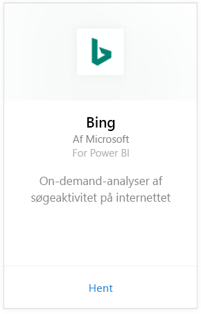
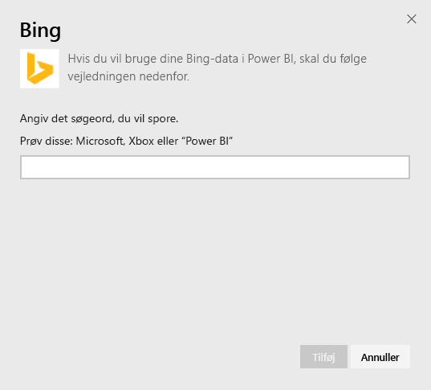
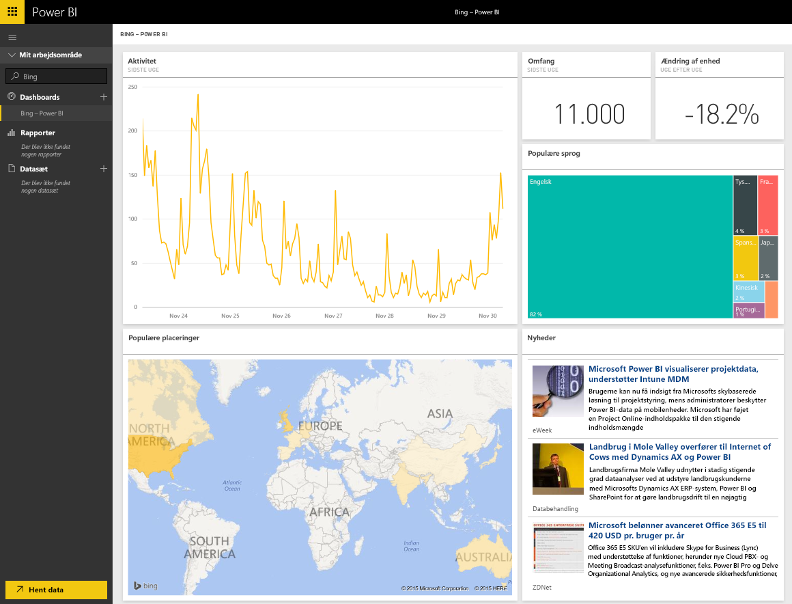

# Opret forbindelse til Bing med Power BI
Med Bing-indholdspakken kan du se analyseresultater omkring søgeaktivitet på internettet for en periode efter eget valg.

Opret forbindelse til [Bing-indholdspakken](https://app.powerbi.com/groups/me/getdata/services/bing) til Power BI.

>[!NOTE]
>Bing-felter opdateres automatisk ca. hvert 5. minut, og det eneste felt, der kan vælges, er feltet Nyheder, som fører dig til den tilknyttede nyhedsartikel. 

>[!NOTE]
>Felter fra Bing-indholdspakken gengives ikke i de mobile apps. Vi arbejder på at løse problemet.

1. Vælg **Hent data** nederst i venstre navigationsrude.
   
    
2. I feltet **Tjenester** skal du vælge **Hent**.
   
    
3. Vælg **Bing** > **Hent**.
   
    
4. Angiv det søgeord, du vil spore, og klik på Tilføj i dialogboksen til parametre.
   
        
5. Du vil kunne se et nyt element på listen over dashboards til venstre, der er navngivet 'Bing' og det søgeord, du har angivet. Bemærk, at ingen datasæt eller rapporter er knyttet til dette dashboard. Felterne kan tage et stykke tid at indlæse, men når indlæsningen er fuldført, får du vist et layout, der svarer til det nedenfor.
   
    

Herefter kan du begynde at udforske dine data og f.eks. fastgøre felter fra dette dashboard på andre dashboards i din konto.

