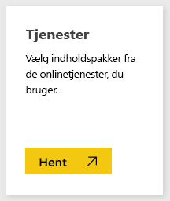
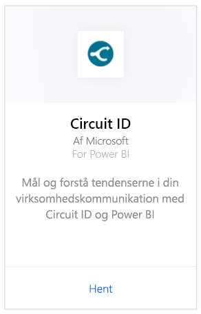
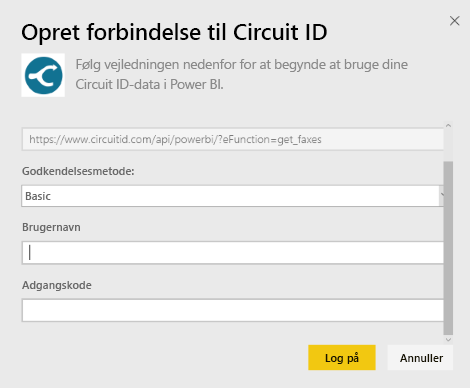
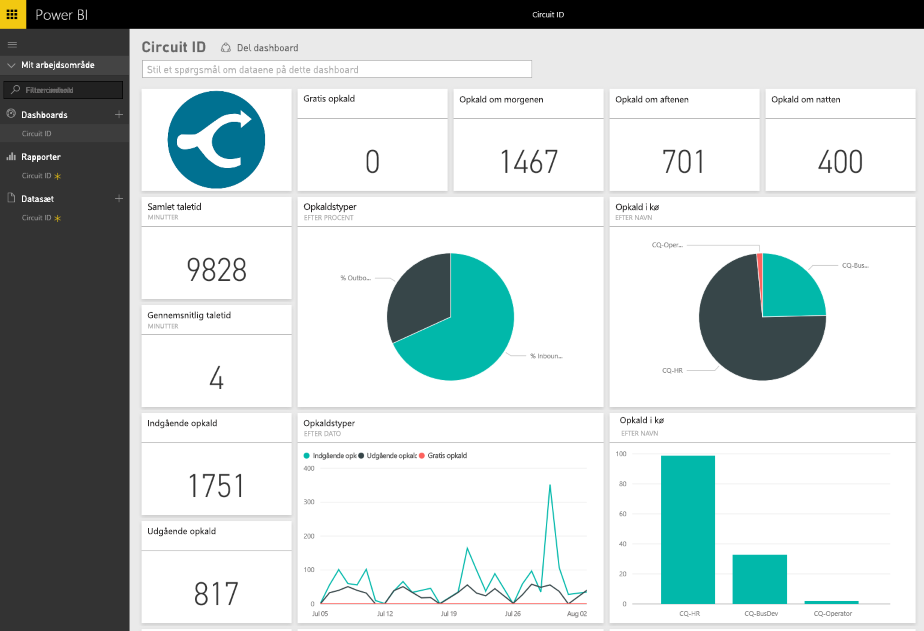

# Opret forbindelse til Circuit ID med Power BI
Du kan nemt analysere dine kommunikationsdata fra Circuit ID med Power BI. Power BI henter dine data og opretter derefter et standarddashboard og relaterede rapporter baseret på disse data. Når du har oprettet forbindelsen, kan du udforske dine data og tilpasse dashboardet efter dine behov. Dataene opdateres automatisk hver dag.

Opret forbindelse til [Circuit ID-indholdspakken](https://app.powerbi.com/getdata/services/circuitid) til Power BI.

## Sådan opretter du forbindelse
1. Vælg **Hent data** nederst i venstre navigationsrude.
   
    
2. Vælg **Hent** i feltet **Tjenester**.
   
    
3. Vælg **Circuit ID** \> **Hent**.
   
    
4. Som Godkendelsesmetode skal du vælge Basisgodkendelse og angive dit brugernavn og din adgangskode. Tryk derefter på Log på.
   
    
5. Når Power BI har importeret dataene, vises der et nyt dashboard, en rapport og et datasæt i venstre navigationsrude. Nye elementer er markeret med en gul stjerne.
   
    

**Hvad nu?**

* Prøv [at stille et spørgsmål i feltet Spørgsmål og svar](power-bi-q-and-a.md) øverst i dashboard'et
* [Rediger felterne](service-dashboard-edit-tile.md) i dashboard'et.
* [Vælg et felt](service-dashboard-tiles.md) for at åbne den underliggende rapport.
* Dit datasæt vil være planlagt til daglig opdatering. Du kan dog ændre tidsplanen for opdatering eller forsøge at opdatere efter behov ved hjælp af **Opdater nu**

## Næste trin
[Hvad er Power BI?](power-bi-overview.md)

[Hent data til Power BI](service-get-data.md)

