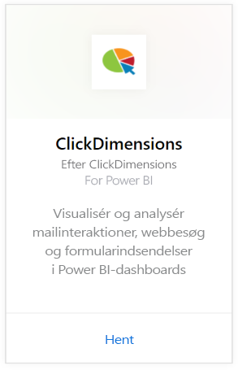
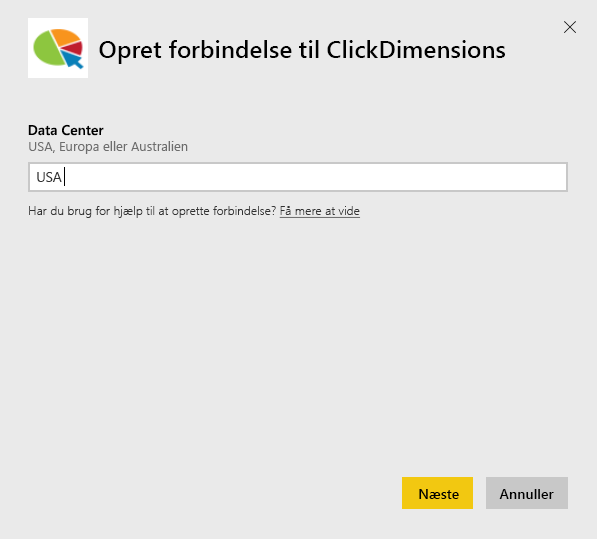
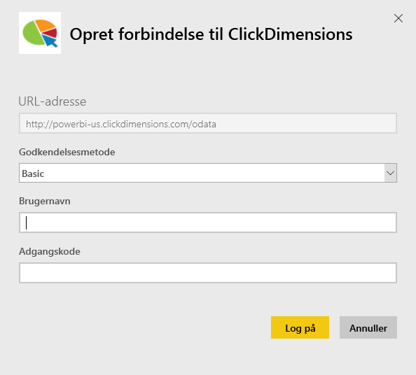
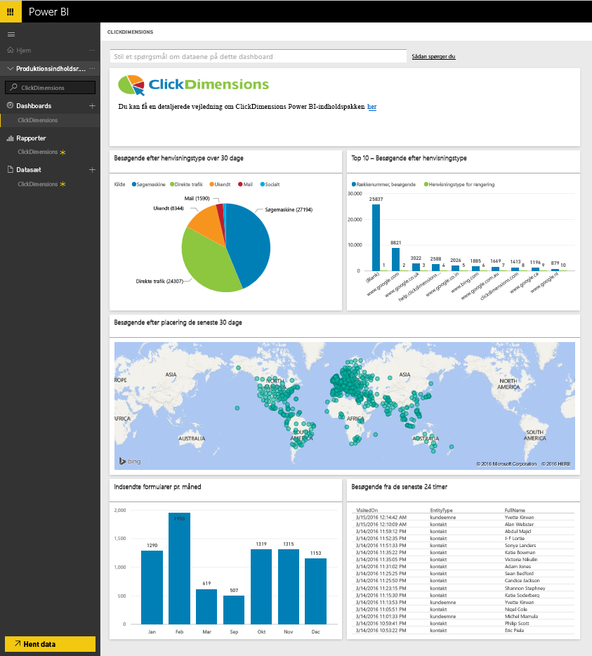
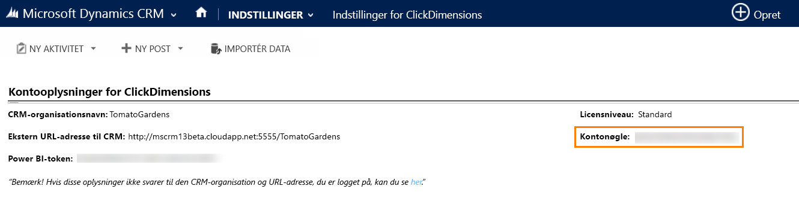
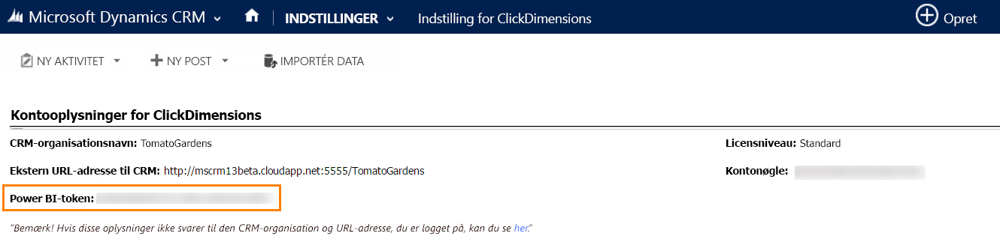

# Opret forbindelse til ClickDimensions med Power BI
Indholdspakken ClickDimensions til Power BI giver brugerne mulighed at anvende ClickDimensions-marketingdata i Power BI, så ledelsesteams får yderligere indsigt i succesen af deres salgs- og marketinginitiativer. Visualisér og analysér mailinteraktioner, webbesøg og formularindsendelser i Power BI-dashboards og -rapporter.

Opret forbindelse til [ClickDimensions-indholdspakken](https://app.powerbi.com/getdata/services/click-dimensions) til Power BI.

## Sådan opretter du forbindelse
1. Vælg **Hent data** nederst i venstre navigationsrude.
   
   
2. Vælg **Hent** i feltet **Tjenester**.
   
   
3. Vælg **ClickDimensions** \>  **Hent**.
   
   
4. Angiv placeringen af dit datacenter (USA, Europa eller Australien), og vælg **Næste**.
   
   
5. Som **Godkendelsesmetode** skal du vælge **Grundlæggende** \> **Log på**. Når du bliver spurgt, skal du angive dine ClickDimensions-legitimationsoplysninger. Se detaljer om at [finde de pågældende parametre](#FindingParams) nedenfor
   
    
6. Efter godkendelsen starter importprocessen automatisk. Når processen er fuldført, vises et nyt dashboard samt en ny rapport og model i navigationsruden. Vælg dashboardet for at få vist de importerede data.
   
     

**Hvad nu?**

* Prøv [at stille et spørgsmål i feltet Spørgsmål og svar](power-bi-q-and-a.md) øverst i dashboard'et
* [Rediger felterne](service-dashboard-edit-tile.md) i dashboard'et.
* [Vælg et felt](service-dashboard-tiles.md) for at åbne den underliggende rapport.
* Dit datasæt vil være planlagt til daglig opdatering. Du kan dog ændre tidsplanen for opdatering eller forsøge at opdatere efter behov ved hjælp af **Opdater nu**

## Systemkrav
For at oprette forbindelse til Power BI-indholdspakken skal du angive det datacenter, der svarer til din konto, og logge på med din ClickDimensions-konto. Hvis du ikke er sikker på, hvilket datacenter du skal angive, skal du spørge din administrator.

## Find parametre
Kontonøglen findes i CRM-indstillinger \> ClickDimensions-indstillinger. Kopiér Kontonøgle fra ClickDimensions-indstillinger, og sæt den ind i feltet Brugernavn.  

  

Kopiér Power BI-token fra ClickDimensions-indstillinger, og sæt det ind i feltet Adgangskode. Power BI-token findes i CRM-indstillinger \> ClickDimensions-indstillinger.  

  

## Næste trin
[Kom i gang med Power BI](service-get-started.md)

[Hent data i Power BI](service-get-data.md)

