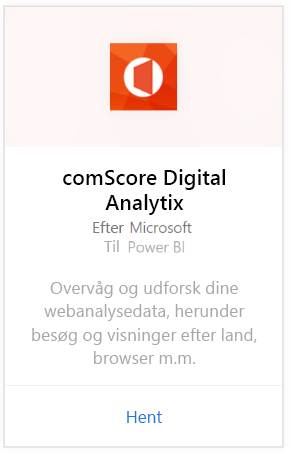
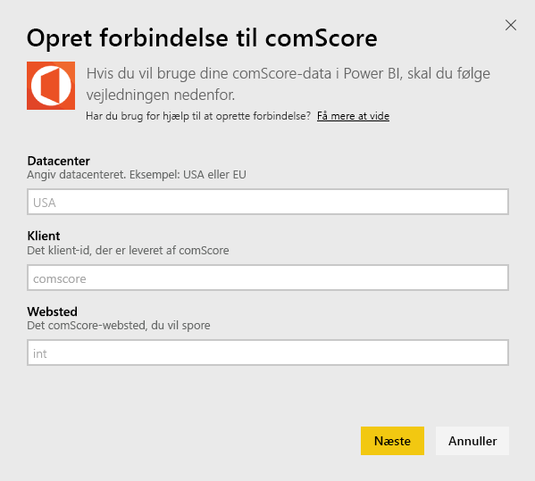
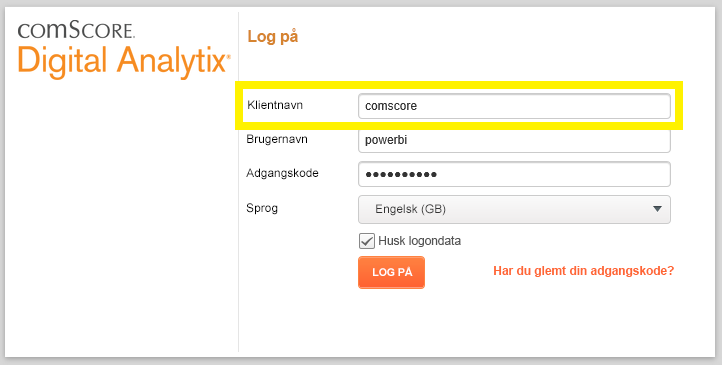

# Opret forbindelse til comScore Digital Analytix med Power BI
Visualiser og udforsk dine comScore Digital Analytix-data i Power BI med Power BI-indholdspakken. Dataene opdateres automatisk én gang dagligt.

Opret forbindelse til [comScore-indholdspakken](https://app.powerbi.com/getdata/services/comscore) til Power BI.

>[!NOTE]
>For at oprette forbindelse til indholdspakken skal du have en comScore DAx-brugerkonto og have adgang til comScore-API'en. Flere [detaljer](#Requirements) nedenfor.

## Sådan opretter du forbindelse
1. Vælg Hent data nederst i venstre navigationsrude.
   
   
2. Vælg **Hent** i feltet **Tjenester**.
   
   
3. Vælg **comScore Digital Analytix** \> **Hent**.
   
   
4. Angiv det datacenter, comScore-klient-id og websted, du vil oprette forbindelse til. Hvis du vil have mere at vide om, hvordan du finder disse værdier, skal du se [Sådan finder du dine comScore-parametre](#FindingParams) nedenfor.
   
   
5. Angiv dit brugernavn og din adgangskode til comScore for at oprette forbindelse. Få flere oplysninger om, hvordan du finder denne værdi, nedenfor.
   
   
6. Importprocessen starter automatisk. Når processen er fuldført, vises et nyt dashboard samt en ny rapport og model i navigationsruden. Vælg dashboardet for at få vist de importerede data.

**Hvad nu?**

* Prøv [at stille et spørgsmål i feltet Spørgsmål og svar](power-bi-q-and-a.md) øverst i dashboard'et
* [Rediger felterne](service-dashboard-edit-tile.md) i dashboard'et.
* [Vælg et felt](service-dashboard-tiles.md) for at åbne den underliggende rapport.
* Dit datasæt vil være planlagt til daglig opdatering. Du kan dog ændre tidsplanen for opdatering eller forsøge at opdatere efter behov ved hjælp af **Opdater nu**

## Systemkrav
Du skal have en comScore DAx-brugerkonto og adgang til comScore DAx-API'en for at oprette forbindelse. Kontakt din comScore DAx-administrator for at bekræfte din konto.

## Sådan finder du parametre
Få mere at vide om, hvordan du finder alle dine comScore-parametre, nedenfor.

**Datacenter**

Det datacenter, du opretter forbindelse til, bestemmes af den webadresse, du navigerer til i comScore.

Hvis du bruger https://dax.comscore.com, skal du angive "US", hvis du bruger https://dax.comscore.eu, skal du angive "EU".

 

**Klienten**

Klienten er det samme, som du angiver, når du logger på comScore DAx.

 

**Webstedet**

ComScore-webstedet afgør, hvilket websted du vil se dataene fra. Du kan finde listen over websteder fra din comScore-konto.

## Næste trin
[Kom i gang med Power BI](service-get-started.md)

[Hent data i Power BI](service-get-data.md)

