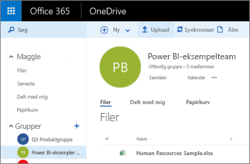
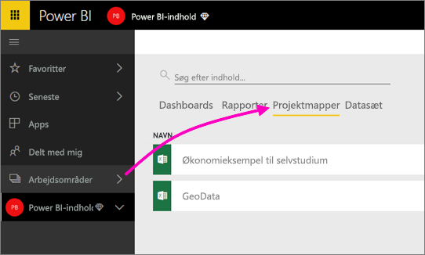

# Opret forbindelse til filer, der lagres i OneDrive til dit Power BI-apparbejdsområde
Når du har [oprettet et apparbejdsområde i Power BI](service-create-distribute-apps.md), kan du gemme dine Excel-, CSV- og Power BI Desktop-filer på OneDrive for Business til dit Power BI-apparbejdsområde. Du kan fortsætte med at opdatere de filer, du lagrer i OneDrive, og så afspejles opdateringerne automatisk i dine Power BI-rapporter og -dashboards baseret på filerne. 

Tilføjelse af filer i dit apparbejdsområde er en proces med to trin: 

1. Først skal du [uploade filer til OneDrive for Business](service-connect-to-files-in-app-workspace-onedrive-for-business.md#1-upload-files-to-the-onedrive-for-business-for-your-app-workspace) til dit apparbejdsområde.
2. Derefter skal du [oprette forbindelse til disse filer fra Power BI](service-connect-to-files-in-app-workspace-onedrive-for-business.md#2-import-excel-files-as-datasets-or-as-excel-online-workbooks).

> [!NOTE]
> Apparbejdsområder er kun tilgængelige med [Power BI Pro](service-free-vs-pro.md).
> 
> 

## 1 Upload filer til OneDrive for Business til dit apparbejdsområde
1. I Power BI-tjenesten skal du vælge pilen ud for Arbejdsområder > vælge ellipsen (**…**) ud for navnet på dit arbejdsområde. 
   
   
2. Vælg **Filer** for at åbne OneDrive for Business til dit apparbejdsområde i Office 365.
   
   > [!NOTE]
   > Hvis du ikke ser **Filer** i menuen til apparbejdsområdet, skal du vælge **Medlemmer** for at åbne OneDrive for Business til dit apparbejdsområde. Her skal du vælge **Filer**. Office 365 konfigurerer en OneDrive-lagerplacering til din apps gruppearbejdsområdefiler. Denne proces kan tage noget tid. 
   > 
   > 
3. Her kan du uploade dine filer til OneDrive for Business til dit apparbejdsområde. Vælg **Upload**, og gå til dine filer.
   
   

## 2 Importér Excel-filer som datasæt eller Excel Online-projektmapper
Nu hvor dine filer er i OneDrive for Business til dit apparbejdsområde, står du over for et valg. Du kan: 

* [Importere data fra Excel-projektmappen som et datasæt](service-get-data-from-files.md) og bruge dataene til at lave rapporter og dashboards, som du kan få vist i en webbrowser og på mobilenheder.
* Eller [oprette forbindelse til en hel Excel-projektmappe i Power BI](service-excel-workbook-files.md) og vise den præcis, som den vises i Excel Online.

### Importér eller opret forbindelse til filer i dit apparbejdsområde
1. Skift til apparbejdsområdet i Power BI, så navnet på apparbejdsområdet er i det øverste venstre hjørne. 
2. Vælg **Hent data** nederst i venstre navigationsrude. 
   
   
3. Vælg **Hent** i feltet **Filer**.
   
   
4. Vælg **OneDrive** - *navnet på dit apparbejdsområde*.
   
    
5. Markér den ønskede fil > **Opret forbindelse**.
   
    Det er her, du skal beslutte, om du vil [importere dataene fra Excel-projektmappen](service-get-data-from-files.md) eller [oprette forbindelse til hele Excel-projektmappen](service-excel-workbook-files.md).
6. Vælg **Importér** eller **Opret forbindelse**.
   
    
7. Hvis du vælger **Importér**, så vises projektmappen på fanen **Datasæt**. 
   
    
   
    Hvis du vælger **Opret forbindelse**, så er projektmappen på fanen **Projektmapper**.
   
    

## Næste trin
* [Opret apps og apparbejdsområder i Power BI](service-create-distribute-apps.md)
* [Importér data fra Excel-projektmapper](service-get-data-from-files.md)
* [Opret forbindelse til hele Excel-projektmapper](service-excel-workbook-files.md)
* Har du flere spørgsmål? [Prøv Power BI-community'et](http://community.powerbi.com/)
* Har du feedback? Besøg [Power BI Ideas](https://ideas.powerbi.com/forums/265200-power-bi)

