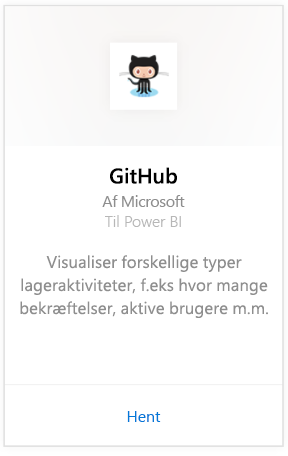
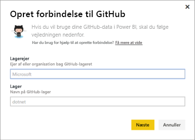
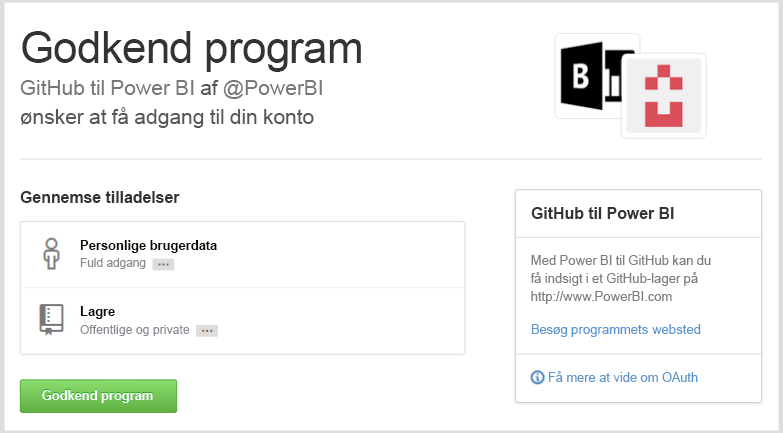
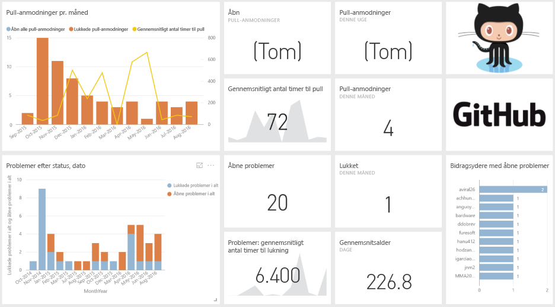
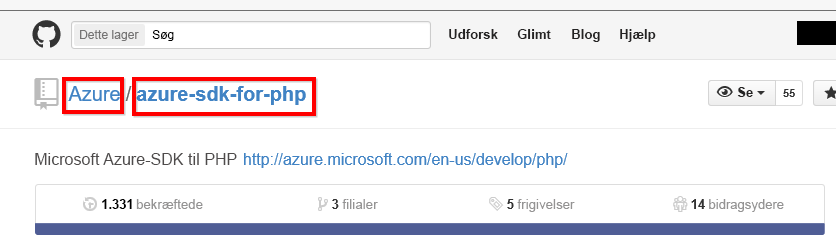

# Opret forbindelse til GitHub med Power BI
Med GitHub-indholdspakken til Power BI kan du få indsigt i et GitHub-lager med data om bidrag, problemer, pull-anmodninger og aktive brugere.

Opret forbindelse til [GitHub-indholdspakken](https://app.powerbi.com/getdata/services/github), eller læs mere om [GitHub-integrationen](https://powerbi.microsoft.com/integrations/github) med Power BI.

>[!NOTE]
>Indholdspakken kræver, at GitHub-kontoen har adgang til lageret. Flere oplysninger om kravene nedenfor.

## Sådan opretter du forbindelse
1. Vælg **Hent data** nederst i venstre navigationsrude.
   
    
2. I feltet **Tjenester** skal du vælge **Hent**.
   
    
3. Vælg **GitHub** \> **Hent**.
   
   
4. Angiv lagernavnet og lagerejeren. Herunder kan du se detaljer om, hvordan du [finder de pågældende parametre](#FindingParams).
   
   
5. Angiv dine GitHub-legitimationsoplysninger (dette trin kan springes over, hvis du allerede er logget på med din browser). 
6. Som **Godkendelsesmetode** skal du vælge **oAuth2** \> **Log på**. 
7. Følg skærmbillederne for Github-godkendelse. Giv GitHub til Power BI-indholdspakken tilladelse til GitHub-dataene.
   
   
   
   Dette forbinder Power BI med GitHub og gør det muligt for Power BI at oprette forbindelse til dataene.  Dataene opdateres én gang om dagen.
8. Når du opretter forbindelse til dit lager, importerer Power BI dataene. Der vises et nyt [GitHub-dashboard](https://powerbi.microsoft.com/integrations/github), en rapport og et datasæt i venstre navigationsrude. Nye elementer er markeret med en gul stjerne \*.
   
   

**Hvad nu?**

* Prøv [at stille et spørgsmål i feltet Spørgsmål og svar](consumer/end-user-q-and-a.md) øverst i dashboard'et
* [Rediger felterne](service-dashboard-edit-tile.md) i dashboard'et.
* [Vælg et felt](consumer/end-user-tiles.md) for at åbne den underliggende rapport.
* Selvom dit datasæt opdateres dagligt, kan du ændre tidsplanen for opdatering eller prøve at opdatere det efter behov ved hjælp af **Opdater nu**

## Det følgende er inkluderet
Følgende data er tilgængelige fra GitHub i Power BI:     

| Tabelnavn | Beskrivelse |
| --- | --- |
| Bidrag |Tabellen Bidrag giver de samlede tilføjelser, sletninger og bekræftelser, der er oprettet af bidragyderen, sammenlagt pr. uge. De 100 største bidragsydere er inkluderet. |
| Problemer |Angiver alle problemer i det valgte lager. Det indeholder beregninger som samlet og gennemsnitlig tid til at lukke et problem, samlet antal åbne problemer, samlet antal lukkede problemer. Denne tabel er tom, når der ikke er nogen problemer i lageret. |
| Pull-anmodninger |Denne tabel indeholder alle Pull-anmodningerne for lageret, og hvem der oprettede anmodningen. Den indeholder også beregninger om, hvor mange åbne, lukkede og samlede Pull-anmodninger der er, hvor lang tid det tog at udføre Pull-anmodningerne, og hvor lang tid den gennemsnitlige Pull-anmodning tog. Denne tabel er tom, når der ikke er nogen problemer i lageret. |
| Brugere |Denne tabel indeholder en liste over GitHub-brugere eller -bidragsydere, der har bidraget, arkiveret problemer eller løst Pull-anmodninger for det valgte lager. |
| Milepæle |Den har alle milepæle for det valgte lager. |
| DateTable |Denne tabel indeholder datoer fra i dag og fra tidligere år, der gør det muligt for dig at analysere dine GitHub-data efter dato. |
| ContributionPunchCard |Denne tabel kan bruges som et bidragshulkort for det valgte lager. Den viser anvendelser efter ugedag og klokkeslæt. Denne tabel er ikke forbundet til andre tabeller i modellen. |
| RepoDetails |Denne tabel indeholder oplysninger om det valgte lager. |

## Systemkrav
* Den GitHub-konto, der har adgang til lageret.  
* Tilladelse givet til Power BI til GitHub-appen under det første logon. Se flere oplysninger herunder om tilbagekaldelse af adgang.  
* Tilstrækkelige API-kald til at hente og opdatere dataene.  

### Annuller godkendelsen af Power BI
Hvis du vil annullere godkendelsen af forbindelsen mellem Power BI og dit GitHub-lager, kan du tilbagekalde adgangen i GitHub. Du kan finde flere oplysninger under dette emne i [GitHub Hjælp](https://help.github.com/articles/keeping-your-ssh-keys-and-application-access-tokens-safe/#reviewing-your-authorized-applications-oauth).

## Søg efter parametre
Du kan finde ejeren og lageret ved at kigge på lageret i selve GitHub:

Den første del, "Azure", er ejeren, og den anden del, "azure-sdk-for-php", er selve lageret.  Du kan se disse samme to elementer i lagerets URL-adresse:

    <https://github.com/Azure/azure-sdk-for-php> .

## Fejlfinding
Hvis det er nødvendigt, kan du kontrollere dine GitHub-legitimationsoplysninger.  

1. Gå til GitHub-webstedet i et andet browservindue, og log på GitHub. Du kan se, at du er logget på, i øverste højre hjørne af GitHub-webstedet.    
2. I GitHub skal du navigere til URL-adressen på det lager, du vil have adgang til i Power BI. Eksempel: https://github.com/dotnet/corefx.  
3. Når du er tilbage i Power BI, kan du prøve at oprette forbindelse til GitHub. Brug navnene på lageret og lagerejeren af det samme lager i dialogboksen Konfigurer GitHub.  

## Næste trin
* [Hvad er Power BI?](power-bi-overview.md)
* [Hent data](service-get-data.md)
