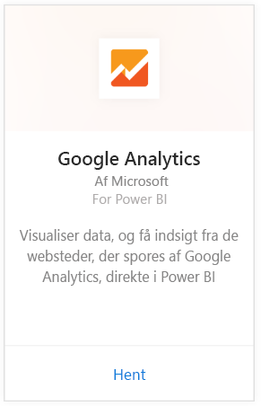
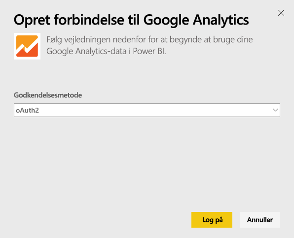
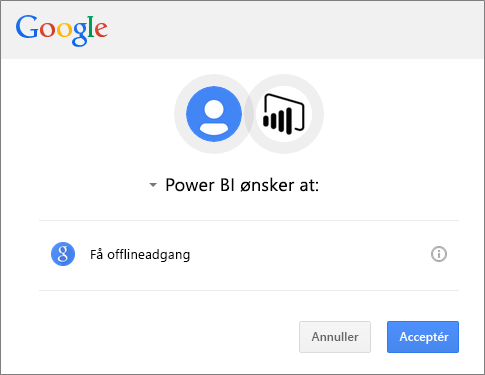
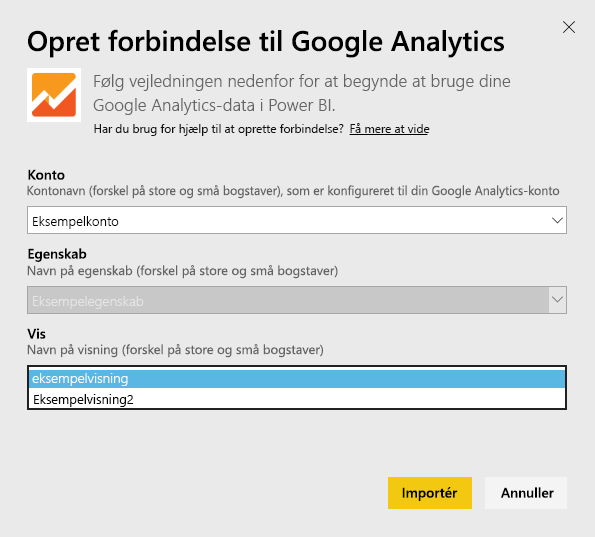
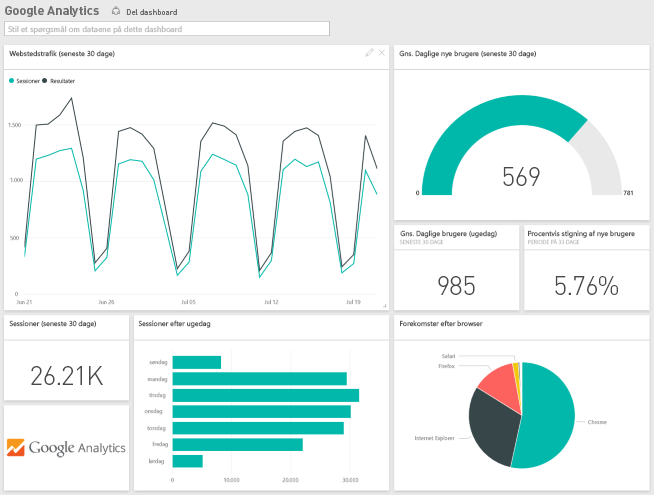

# Opret forbindelse til Google Analytics med Power BI
For at oprette forbindelse til Google Analytics via Power BI skal du starte med at oprette forbindelse til din Google Analytics-konto. Du får et Power BI-dashboard og et sæt af Power BI-rapporter, der giver indsigt i trafikken på dit websted og brugerdimensioner. Du kan interagere med dashboards og rapporter, men du kan ikke gemme ændringer. Dataene opdateres automatisk én gang dagligt.

Opret forbindelse til [Google Analytics](https://app.powerbi.com/getdata/services/google-analytics) til Power BI. Læs mere om [Google Analytics-integration](https://powerbi.microsoft.com/integrations/google-analytics) med Power BI.

Du kan oprette brugerdefinerede dashboards og rapporter ud fra [Google Analytics-connectoren](service-google-analytics-connector.md) i Power BI Desktop. Du skal blot oprette forbindelse til din Google Analytics-konto og oprette dine brugerdefinerede rapporter, som du kan publicere i Power BI-tjenesten.

## Sådan opretter du forbindelse
[!INCLUDE [powerbi-service-apps-get-more-apps](./includes/powerbi-service-apps-get-more-apps.md)]

1. Vælg **Google Analytics** \> **Hent**.
   
   
2. Når du bliver spurgt, skal du angive dine Google Analytics-legitimationsoplysninger. Vælg **oAuth 2** som Godkendelsesmetode, og klik på **Log på**. Følg Googles godkendelsesflow, som kan omfatte to-faktorgodkendelse, hvis det er konfigureret.
   
   
3. Klik på **Acceptér** for at give Power BI adgang til dine Google Analytics-data.
   
   
4. Power BI opretter forbindelse til en bestemt Google Analytics-visning. Vælg det kontonavn, egenskabsnavn og visningsnavn, du vil oprette forbindelse til. Disse oplysninger finder du i din Google Analytics-konto i øverste venstre hjørne eller på fanen **Hjem**. Se detaljer nedenfor. 
   
   
5. Klik på **Opret forbindelse** for at starte importprocessen. 

## Få vist Google Analytics-dashboard og -rapporter
[!INCLUDE [powerbi-service-apps-open-app](./includes/powerbi-service-apps-open-app.md)]

      

[!INCLUDE [powerbi-service-apps-open-app](./includes/powerbi-service-apps-what-now.md)]

## Systemkrav
Hvis du vil oprette forbindelse fra Power BI, skal du have en [Google Analytics](https://www.google.com/analytics/)-konto. Andre Google-konti, der ikke har en Google Analytics-konto tilknyttet, får vist en godkendelsesfejl.

## Fejlfinding
**Legitimationsoplysninger** Hvis du har flere Google-konti, skal du bruge et inkognito-vindue, eller et privat browservindue under oprettelse af forbindelsen for at sikre, at den korrekte konto anvendes.

Hvis du får en fejl, hvor der står, at dine legitimationsoplysninger er ugyldige, men at du godt kunne logge på Google, skal du bekræfte, om du har en [Google Analytics](https://www.google.com/analytics/)-konto.

**Parametre** Entydige navne er i øjeblikket påkrævet for parametrene. Hvis du får vist en fejl, hvor der står, at den værdi, du har valgt, er dubleret, skal du vælge en anden værdi eller ændre navnene i Google Analytics, så de er entydige. Vi arbejder aktivt for at forbedre dette.

>[!NOTE]
>Parametrene skelner mellem store og små bogstaver. Angiv dem præcis, sådan som de vises i din Google Analytics-konto.

Har du stadig problemer? Opret en supportanmodning for at få fat i Power BI-teamet:

* I Power BI-appen skal du vælge spørgsmålstegnet \> **Kontakt support.**
* Fra Power BI-supportwebstedet (hvor du læser denne artikel) skal du vælge **Kontakt Support** i højre side.

## Næste trin
* [Hvad er apps i Power BI?](service-install-use-apps.md)
* [Hent data i Power BI](service-get-data.md)
* Har du flere spørgsmål? [Prøv at spørge Power BI-community'et](http://community.powerbi.com/)

