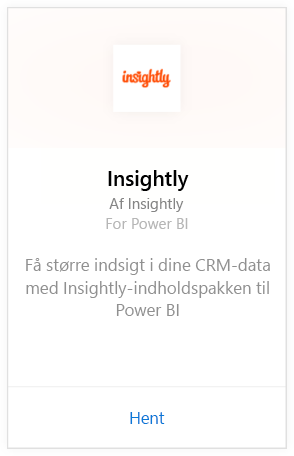
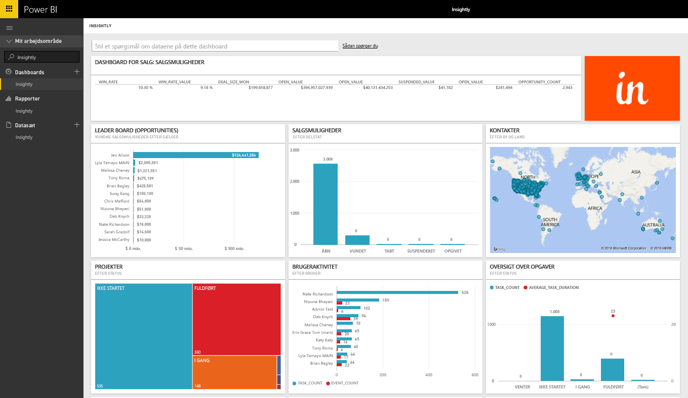
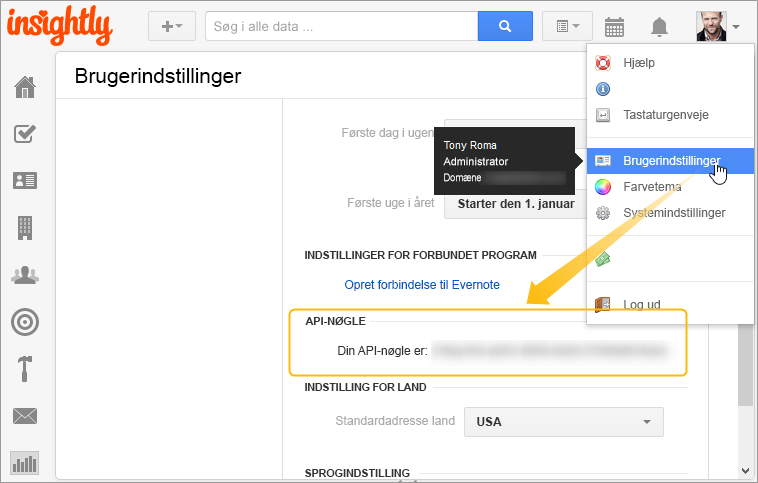

# Opret forbindelse til Insightly med Power BI
Visualiser og del dine Insightly CRM-data i Power BI med Insightly-indholdspakken. Opret forbindelse til Power BI vha. din Insightly API-nøgle for at få vist og oprette rapporter og dashboards på baggrund af dine CRM-data. Med Power BI kan du analysere dine data på helt nye måder, oprette effektive grafer og diagrammer og få vist kontakter, kundeemner og organisationer på et kort.

Opret forbindelse til [Insightly-indholdspakken](https://app.powerbi.com/getdata/services/insightly) til Power BI.

## Sådan opretter du forbindelse
1. Vælg **Hent data** nederst i venstre navigationsrude.
   
   
2. I feltet **Tjenester** skal du vælge **Hent**.
   
   
3. Vælg **Insightly** \>  **Hent**.
   
   
4. Vælg **Nøgle** som godkendelsestype, og angiv din Insight-API-nøgle, og vælg derefter **Log på**. Se nedenstående oplysninger om, hvordan du [finder det](#FindingParams).
   
   
5. Efter godkendelsen startes importprocessen automatisk. Når processen er fuldført, vises et nyt dashboard samt en ny rapport og model i navigationsruden. Vælg dashboardet for at få vist de importerede data.
   
     

**Hvad nu?**

* Prøv [at stille et spørgsmål i feltet Spørgsmål og svar](service-q-and-a.md) øverst i dashboardet
* [Rediger felterne](service-dashboard-edit-tile.md) i dashboardet.
* [Vælg et felt](service-dashboard-tiles.md) for at åbne den underliggende rapport.
* Dit datasæt vil være planlagt til daglig opdatering. Du kan dog ændre tidsplanen for opdatering eller forsøge at opdatere efter behov ved hjælp af **Opdater nu**

## Følgende er inkluderet
Indholdspakken indeholder følgende tabeller med felter fra de tilsvarende poster:

| Tabeller |  |  |  |
| --- | --- | --- | --- |
| Kontakter |Salgsmuligheder |Pipelinestadier |Fuldførelsesdato for opgave |
| Brugerdefinerede felter |Lukkedato for salgsmuligheder |Fuldførelsesdato for projekt |Opgaver |
| Hændelser |Prognosedato for salgsmuligheder |Projekter |Teams/medlemmer |
| Kundeemner |Organisationer |Mærker |Brugere |

Mange tabeller og rapporter inkluderer også entydige beregnede felter, f.eks.:  

* Tabeller med "grupperede" prognoselukkedatoer for salgsmuligheder, faktiske lukkedatoer for salgsmuligehder, fuldførelsesdatoer for projekter og fuldførelsesdatoer for opgaver, der kan analyseres efter måned, kvartal eller år.  
* Et vægtet værdifelt for salgsmuligheder (værdi for salgsmulighed * sandsynlighed for at vinde).  
* Felter med gennemsnit og samlet varighed for opgaver baseret på start- og fuldførelsesdatoer.  
* Rapporter med beregnede felter for vindingsfrekvens for salgsmuligheder (antal vundne/antal samlede salgsmuligheder) og værdi for vindingsfrekvens (værdien af vinding/værdien af samlede salgsmuligheder).  

## Systemkrav
Der kræves en Insightly-konto med adgang til Insightly-API'en. Synlighedstilladelser baseres på den API-nøgle, der bruges til at oprette forbindelse til Power BI. Alle Insightly-poster, der er synlige for dig, vil også være synlige i Power BI-rapporter og på dashboards, som du deler med andre.

## Søgning efter parametre
**API-nøgle**

Hvis du vil kopiere din API-nøgle fra Insightly, skal du vælge Brugerindstillinger i Insightly-profilmenuen og rulle ned. Denne tegnstreng bruges til at oprette forbindelse mellem dine data og Power BI.

## Fejlfinding
Dine data importeres via Insightly-API'en, som indeholder en daglig grænse, der er baseret på planniveauet for dit Insightly-abonnement. Grænserne er angivet i sektionen om frekvensgrænser/begrænsningsanmodninger i vores API-dokumentation: https://api.insight.ly/v2.2/Help#!/Overview/Introduction#ratelimit

De angivne rapporter bruger standardfelter fra Insightly og indeholder muligvis ikke din tilpasninger. Rediger rapporten for at få vist alle de tilgængelige felter.

## Næste trin
[Introduktion til Power BI](service-get-started.md)

[Hent data i Power BI](service-get-data.md)

