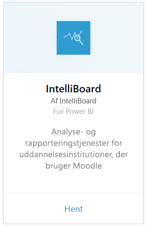
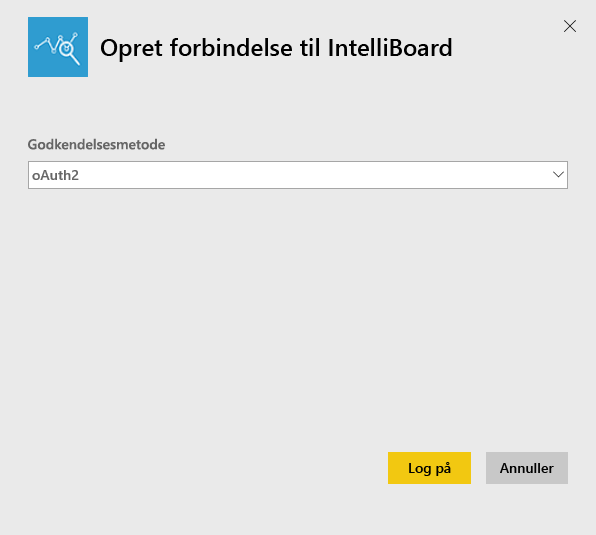
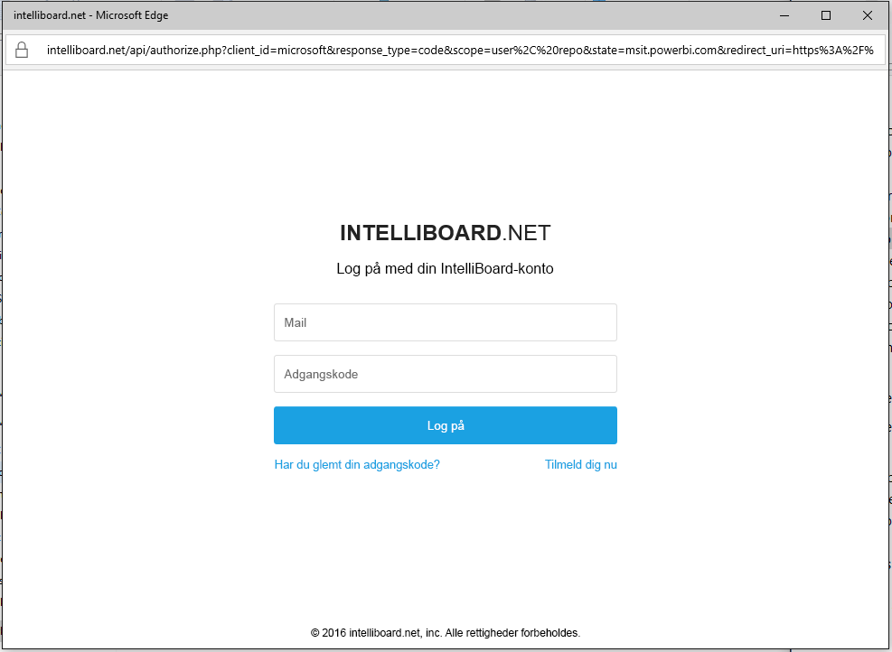
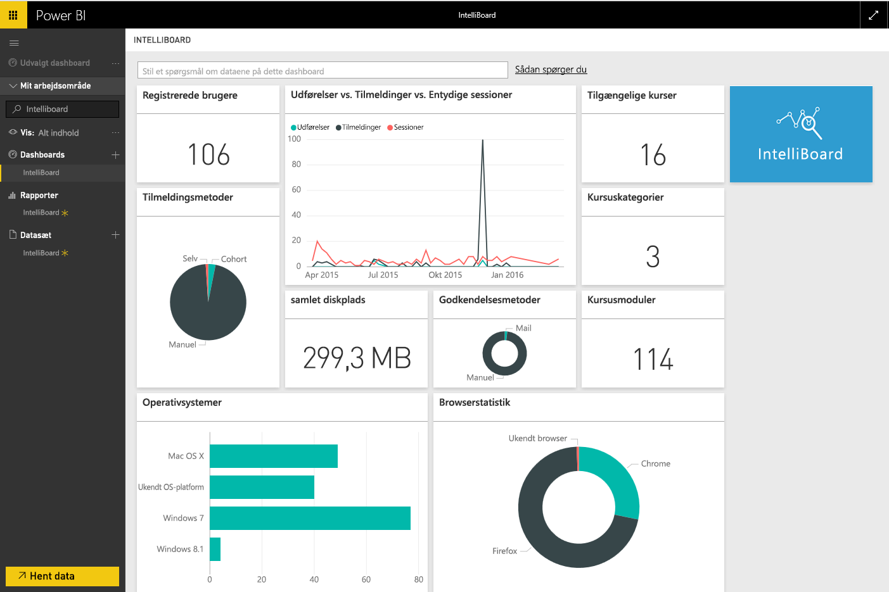

# Opret forbindelse til IntelliBoard med Power BI
IntelliBoard giver forenklet adgang til dine data i Moodle-systemet til læringsstyring via rapporteringstjenester. IntelliBoard-indholdspakken til Power BI indeholder yderligere analyse, herunder målinger af dine kurser, registrerede brugere, samlet ydeevne og din LMS-aktivitet.

Opret forbindelse til [IntelliBoard-indholdspakken](https://app.powerbi.com/getdata/services/intelliboard) til Power BI.

## Sådan opretter du forbindelse
1. Vælg **Hent data** nederst i venstre navigationsrude.  
   
    
2. I feltet **Tjenester** skal du vælge **Hent**.  
   
    
3. Vælg **IntelliBoard**, og vælg derefter **Hent**.  
   
    
4. Vælg **OAuth 2** og derefter **Log på**. Når du bliver spurgt, skal du angive dine legitimationsoplysninger til IntelliBoard.
   
    
   
    
5. Når der er oprettet forbindelse, indlæses der automatisk et dashboard, en rapport og et datasæt. Når det er fuldført, opdateres felterne med data fra din IntelliBoard-konto.
   
    

**Hvad nu?**

* Prøv [at stille et spørgsmål i feltet Spørgsmål og svar](power-bi-q-and-a.md) øverst i dashboard'et
* [Rediger felterne](service-dashboard-edit-tile.md) i dashboard'et.
* [Vælg et felt](service-dashboard-tiles.md) for at åbne den underliggende rapport.
* Dit datasæt vil være planlagt til daglig opdatering. Du kan dog ændre tidsplanen for opdatering eller forsøge at opdatere efter behov ved hjælp af **Opdater nu**

## Følgende er inkluderet
Indholdspakken indeholder data fra følgende tabeller:  

    - Activity  
    - Agents  
    - Auth  
    - Countries  
    - CoursesProgress  
    - Enrollments
    - Lang  
    - Platform  
    - Totals  
    - UsersProgress    

## Systemkrav
Der kræves en IntelliBoard-konto med rettigheder til overstående tabeller for at kunne instantiere denne indholdspakke.

## Næste trin
[Kom i gang med Power BI](service-get-started.md)

[Power BI – Grundlæggende begreber](service-basic-concepts.md)

