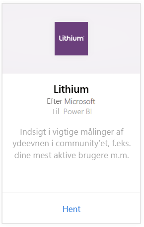
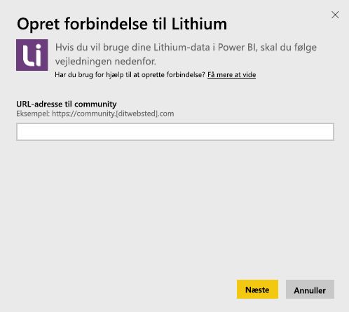
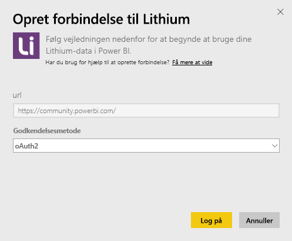
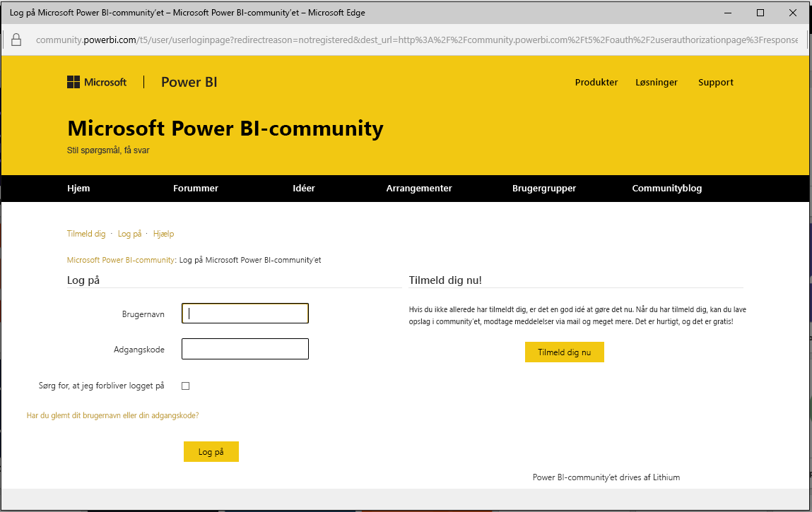
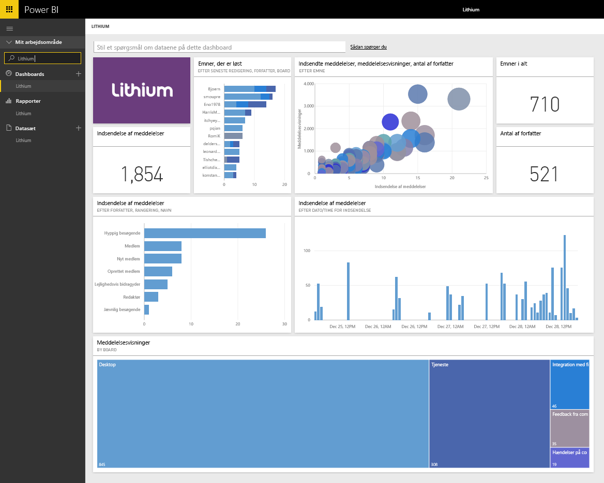

# Opret forbindelse til Lithium med Power BI
Lithium skaber tillidsforhold mellem verdens bedste varemærker og deres kunder, så alle kan få svar og dele deres oplevelser. Ved at forbinde Lithium-indholdspakken med Power BI kan du foretage vigtige målinger i dit onlinecommunity, som kan hjælpe med at fremme salget, reducere serviceomkostningerne og forbedre loyaliteten. 

Opret forbindelse til [Lithium-indholdspakken](https://app.powerbi.com/getdata/services/lithium) til Power BI.

>[!NOTE]
>Power BI-indholdspakken bruger Lithium-API'EN. For mange opkald til API'en kan resultere i yderligere gebyrer fra Lithium. Bekræft dette med din Lithium-administrator.

## Sådan opretter du forbindelse
1. Vælg **Hent data** nederst i venstre navigationsrude.
   
    
2. I feltet **Tjenester** skal du vælge **Hent**.
   
    
3. Vælg **Lithium** \> **Hent**.
   
   
4. Angiv URL-adressen til dit Lithium-community. Den vil være i formatet *https://community.dinside.com*.
   
   
5. Angiv dine legitimationsoplysninger til Lithium, når du bliver bedt om dem. Vælg **oAuth 2** som godkendelsesmetoden, og klik på **Log på** , og følg derefter logonflowet for Lithium.
   
   
   
   
6. Når logonflowet er fuldført, starter importprocessen. Når processen er fuldført, vises et nyt dashboard samt en ny rapport og model i navigationsruden. Vælg dashboardet for at få vist de importerede data.
   
    

**Hvad nu?**

* Prøv [at stille et spørgsmål i feltet Spørgsmål og svar](service-q-and-a.md) øverst i dashboardet
* [Rediger felterne](service-dashboard-edit-tile.md) i dashboardet.
* [Vælg et felt](service-dashboard-tiles.md) for at åbne den underliggende rapport.
* Dit datasæt vil være planlagt til daglig opdatering. Du kan dog ændre tidsplanen for opdatering eller prøve at opdatere efter behov ved brug af **Opdater nu**

## Systemkrav
Lithium-indholdspakken kræver et Lithium-community v15.9 eller højere. Kontakt Lithium-administratoren for at bekræfte dette.

## Næste trin
[Introduktion til Power BI](service-get-started.md)

[Power BI – Grundlæggende begreber](service-basic-concepts.md)

