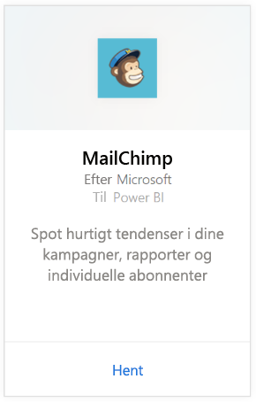
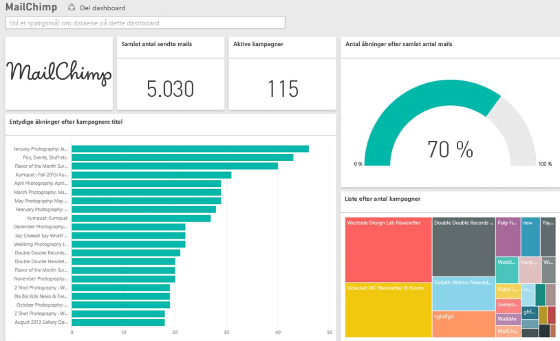

# Opret forbindelse til MailChimp med Power BI
Power BI-indholdspakken henter data fra din MailChimp-konto og opretter et dashboard, et sæt rapporter og et datasæt, så du kan udforske dine data. Hent analyser for at oprette [MailChimp-dashboards](https://powerbi.microsoft.com/integrations/mailchimp) og hurtigt spotte tendenser i dine kampagner, rapporter og individuelle abonnenter. Dataene er indstillet til daglig opdatering for at sikre, at de data, du overvåger, er opdaterede.

Opret forbindelse til [MailChimp-indholdspakken](https://app.powerbi.com/getdata/services/mailchimp) til Power BI.

## Sådan opretter du forbindelse
1. Vælg **Hent data** nederst i venstre navigationsrude.
   
    
2. Vælg **Hent** i feltet **Tjenester**.
   
   
3. Vælg **MailChimp** \> **Hent**.
   
   
4. Som Godkendelsesmetode skal du vælge **oAuth2** \> **Log på**.
   
    Når du bliver spurgt, skal du angive dine legitimationsoplysninger til MailChimp og følge godkendelsesprocessen.
   
    Første gang, du opretter forbindelse, vil du blive bedt om at give Power BI skrivebeskyttet adgang til din konto. Vælg **Tillad** for at starte importprocessen, som kan tage et par minutter, afhængigt af mængden af data på din konto.
   
    
5. Efter import af data i Power BI får du vist et nyt dashboard og datasæt samt en ny rapport i venstre navigationsrude. Dette er standarddashboardet, som Power BI oprettede for at vise dine data. Du kan ændre dette dashboard for at vise dine data, som du ønsker.
   
   

**Hvad nu?**

* Prøv [at stille et spørgsmål i feltet Spørgsmål og svar](service-q-and-a.md) øverst i dashboardet
* [Rediger felterne](service-dashboard-edit-tile.md) i dashboardet.
* [Vælg et felt](service-dashboard-tiles.md) for at åbne den underliggende rapport.
* Dit datasæt vil være planlagt til daglig opdatering. Du kan dog ændre tidsplanen for opdatering eller forsøge at opdatere efter behov ved brug af **Opdater nu**

## Næste trin
[Introduktion til Power BI](service-get-started.md)

[Power BI – Grundlæggende begreber](service-basic-concepts.md)

