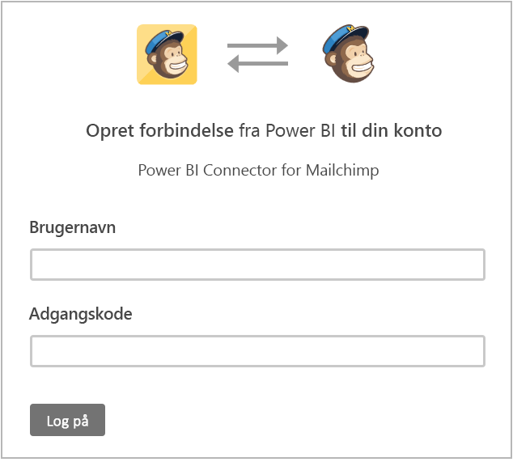
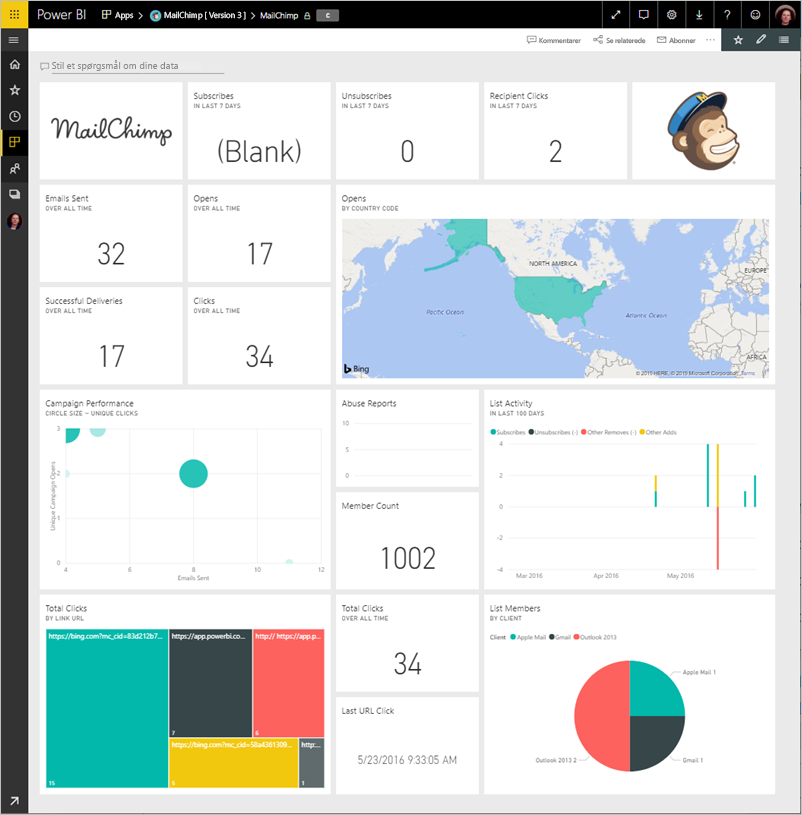
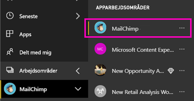
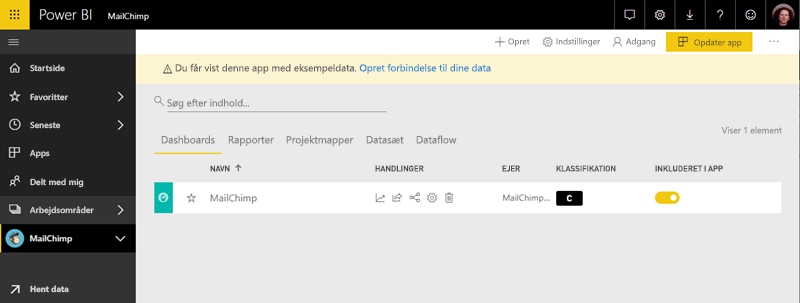

# Opret forbindelse til MailChimp med Power BI
Denne artikel fører dig gennem trække dine data fra din MailChimp-konto med en app i Power BI-skabelon. Appen skabelon opretter et arbejdsområde med et dashboard, et sæt af rapporter og et datasæt, så du kan udforske dine MailChimp-data. Hent analyser for at oprette [MailChimp-dashboards](https://powerbi.microsoft.com/integrations/mailchimp) og hurtigt spotte tendenser i dine kampagner, rapporter og individuelle abonnenter. Dataene opdateres dagligt, sikre, at de data, du overvåger er opdateret.

Når du har installeret appen skabelon, kan du ændre dashboardet og rapporten. Derefter kan du distribuere den som en app til kollegaer i din organisation.

Opret forbindelse til den [MailChimp skabelonapp](https://app.powerbi.com/getdata/services/mailchimp) til Power BI.

## Sådan opretter du forbindelse

[!INCLUDE [powerbi-service-apps-get-more-apps](./includes/powerbi-service-apps-get-more-apps.md)]

3. Vælg **MailChimp** \> **Hent det nu**.
4. I **installere denne App i Power BI?** Vælg **installere**.
4. I den **Apps** skal du vælge den **MailChimp** felt.

    

6. I **Kom i gang med din nye app**, skal du vælge **forbinde data**.

    

1. Som godkendelsesmetode skal du vælge **oAuth2** \> **Log på**.
   
    Når du bliver spurgt, skal du angive dine legitimationsoplysninger til MailChimp og følge godkendelsesprocessen.
   
    Første gang du opretter forbindelse, beder Power BI dig om at tillade skrivebeskyttet adgang til din konto. Vælg **Tillad** for at starte importprocessen. Det kan tage et par minutter, afhængigt af mængden af data i din konto.
   
    

5. Når Power BI har importeret dataene, åbner dashboardet MailChimp.
   
    

## Rediger og Distribuer din app

Du har installeret appen MailChimp-skabelon. Det betyder, at du har også oprettet MailChimp app-arbejdsområdet. Du kan ændre rapporten og dashboardet i arbejdsområdet, og derefter distribuere den som en *app* til kollegaer i din organisation. 

1. For at få vist hele indholdet af det nye MailChimp-arbejdsområde i venstre navigationslinje, skal du vælge **arbejdsområder** > **MailChimp**. 

    

    Denne visning er listen over indhold til arbejdsområdet. I det øverste højre hjørne skal du se **Opdater app**. Når du er klar til at distribuere din app til dine kollegaer, er, hvor du vil starte.

    

2. Vælg **rapporter** og **datasæt** at se de andre elementer i arbejdsområdet. 

    Læs om [distribuere apps](service-create-distribute-apps.md) til dine kollegaer.

## Næste trin

* [Opret nye arbejdsområder i Power BI](service-create-the-new-workspaces.md)
* [Installér og brug apps i Power BI](consumer/end-user-apps.md)
* [Power BI-apps til eksterne tjenester](service-connect-to-services.md)
* Har du spørgsmål? [Prøv at spørge Power BI-community'et](http://community.powerbi.com/)

