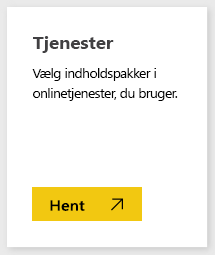
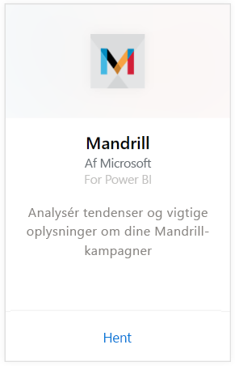
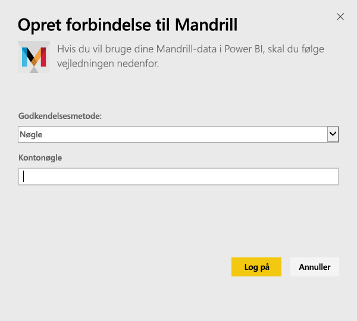
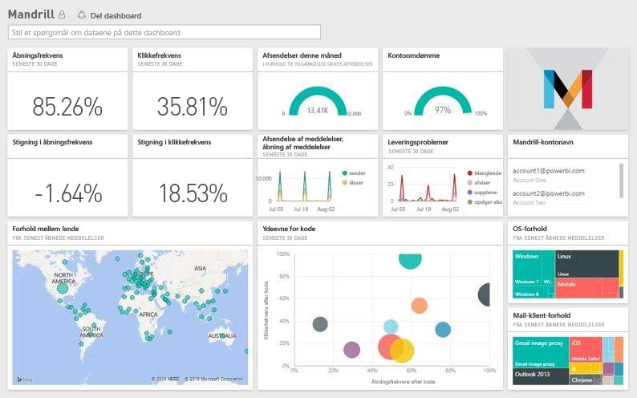

# Opret forbindelse til Mandrill med Power BI
Power BI-indholdspakken trækker data fra din Mandrill-konto og opretter et dashboard, et sæt rapporter og et datasæt, så du kan udforske dine data. Brug Mandrills analyser til hurtigt for at få overblik over dine nyhedsbreve eller din markedsføringskampagne. Dataene er indstillet til daglig opdatering for at sikre, at de data, du overvåger, er opdaterede.

Opret forbindelse til [Mandrill-indholdspakken til Power BI.](http://app.powerbi.com/getdata/services/mandrill)

## Sådan opretter du forbindelse
1. Vælg **Hent data** nederst i venstre navigationsrude.
   
    
2. Vælg **Hent** i feltet **Tjenester**.
   
    
3. Vælg **Mandrill** > **Hent**.
   
    
4. Vælg **Nøgle** som **Godkendelsesmetode**, og angiv din API-nøgle. Du kan finde nøglen under fanen **Indstillinger** i Mandrill-dashboardet. Vælg **Log på** for at starte importprocessen, som kan tage et par minutter, afhængigt af mængden af data på din konto.
   
    
5. Når Power BI har importeret dataene, vises der et nyt dashboard, rapport og datasæt i venstre navigationsrude. Dette er standarddashboardet, som Power BI oprettede for at vise dine data.
   
    

**Hvad nu?**

* Prøv [at stille et spørgsmål i feltet Spørgsmål og svar](power-bi-q-and-a.md) øverst i dashboard'et
* [Rediger felterne](service-dashboard-edit-tile.md) i dashboard'et.
* [Vælg et felt](service-dashboard-tiles.md) for at åbne den underliggende rapport.
* Dit datasæt vil være planlagt til daglig opdatering. Du kan dog ændre tidsplanen for opdatering eller forsøge at opdatere efter behov ved hjælp af **Opdater nu**

## Næste trin
[Kom i gang med Power BI](service-get-started.md)

[Power BI – Grundlæggende begreber](service-basic-concepts.md)

